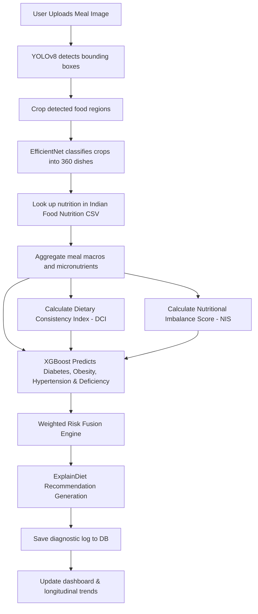

# DietRiskNet

**Vision-Language-Based Food Recognition and Personalized Disease-Risk-Aware Dietary Recommendation Using Longitudinal Meal Analysis**

DietRiskNet is a production-ready medical AI system that integrates computer vision models (YOLOv8 & EfficientNet) with clinical-grade classifiers (XGBoost) and a comprehensive nutrition database to identify meal items, aggregate nutritional metrics, and predict disease hazards.

---

## Technical Architecture & Flow



---

## Tech Stack

- **Backend:** FastAPI, Python, SQLAlchemy (PostgreSQL / SQLite fallback), Pydantic, JWT Auth, Uvicorn.
- **Frontend:** Next.js 15, React 19, TypeScript, Tailwind CSS v4, Framer Motion, React Query, Zustand, Recharts.
- **Machine Learning:** Ultralytics YOLOv8, PyTorch (EfficientNet), XGBoost, OpenCV, NumPy, Pandas.
- **Deployment:** Docker, Docker Compose.

---

## Directory Layout

```
DietRiskNet/
├── backend/
│   ├── database/        # Connection configuration and SQLAlchemy schemas
│   ├── routes/          # API endpoints routers
│   ├── schemas/         # Pydantic validation models
│   ├── services/        # Centralized business logic (Auth, ML, Nutrition, Predictions, Recs)
│   ├── trained_models/  # Core checkpoints (YOLO, EfficientNet, XGBoost, and configs)
│   ├── utils/           # Centralized logging, token auth, and PIL image utils
│   └── main.py          # App entrypoint
├── frontend/
│   ├── app/             # App Router pages (Dashboard, Log Meal, Profile, Research, etc.)
│   ├── components/      # UI Sidebar and Provider layers
│   ├── lib/             # Zustand state stores
│   └── services/        # Frontend API request handlers
├── nutrition/
│   └── indian_food_nutrition_processed.csv   # Mapped nutrition database
├── docker-compose.yml
├── requirements.txt
└── README.md
```

---

## Getting Started

### Prerequisites
1. **Python 3.10+** (already installed in path)
2. **Node.js LTS** (already installed in path)

### 1. Backend Service Setup (Local SQLite Fallback)
From the root project directory:
```bash
# Create virtual environment
python -m venv backend/.venv

# Activate virtual environment
# On Windows (PowerShell):
backend/.venv\Scripts\Activate.ps1
# On Linux/macOS:
source backend/.venv/bin/activate

# Install requirements
pip install -r requirements.txt

# Start FastAPI server
uvicorn backend.main:app --reload
```
API docs will be available at `http://localhost:8000/docs` (Swagger UI).

### 2. Frontend Web Application Setup
From a new terminal session in the `frontend` folder:
```bash
# Install packages
npm install

# Start Next.js development server
npm run dev
```
Open `http://localhost:3000` to interact with the application.

---

## Docker Deployment (PostgreSQL Production)

To orchestrate the database, backend services, and Next.js frontend in production:
```bash
# Start all containers in the background
docker-compose up -d --build
```
- Frontend: `http://localhost:3000`
- Backend Swagger Docs: `http://localhost:8000/docs`

---

## Verification & Testing

We include a test pipeline script `backend/tests/test_pipeline.py` which loads a real sample meal image, executes the full visual crops -> class lookup -> index -> prediction -> fusion -> recommend pipeline, and checks DB insert:
```bash
# Run verification script
python -m backend.tests.test_pipeline
```
