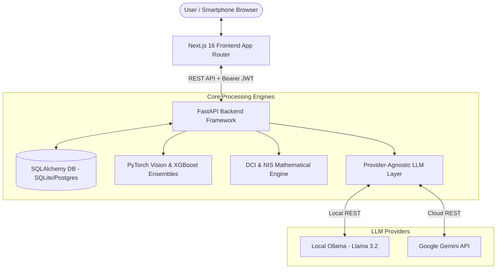
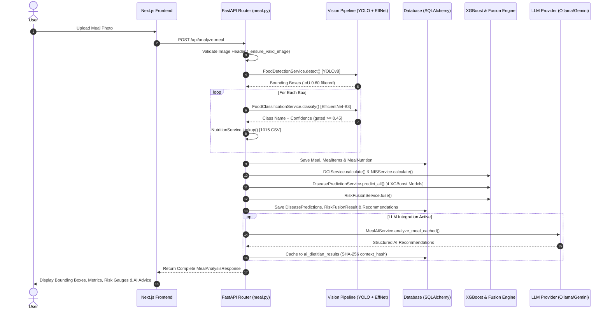
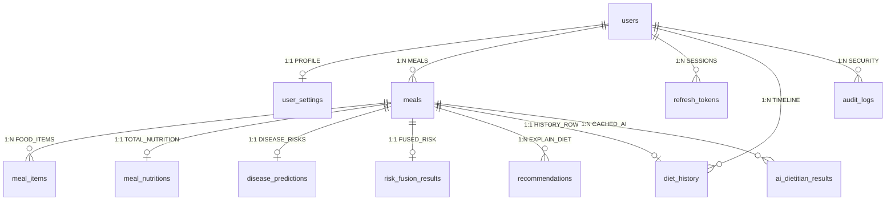

# DIETRISKNET — FACULTY DEFENSE HANDBOOK & CAPSTONE REVIEW GUIDE

**Project Title:** DietRiskNet: AI-Powered Dietary Risk Prediction & Multi-Disease Early Detection Framework  
**Target Audience:** Capstone Project Author, Faculty Review Committee, Viva Examiners  
**Document Purpose:** Comprehensive defense guide, architectural breakdown, formula derivations, and 100 viva examination questions.  
**Generated On:** 2026-08-28  

---

## 1. PROJECT SUMMARY

### 1.1 Executive Presentation Pitch (The "3-Minute Defense")
> "Respected members of the evaluation committee, DietRiskNet is an end-to-end AI-powered health framework designed to transform a single meal photograph into early, actionable multi-disease risk intelligence.
> 
> Current mobile diet apps rely on tedious manual text logging, fail to recognize multi-item meals from photos, ignore day-to-day dietary consistency, and do not connect nutritional intake with clinical disease risk models.
> 
> DietRiskNet solves this by integrating:
> 1. A two-stage computer vision pipeline combining **YOLOv8** for spatial object localization and **EfficientNet-B3** for crop classification across 118 food classes.
> 2. A 4-stage nutrition lookup engine mapping classified foods to a 1,015-dish Indian food dataset.
> 3. Two mathematically formulated novel indices: the **Dietary Consistency Index (DCI)**, measuring rolling 7-day calorie stability, and the **Nutritional Imbalance Score (NIS)**, measuring meal-level proportional RDI deviation.
> 4. Four specialized **XGBoost gradient-boosted decision tree models** predicting risks for Diabetes, Obesity, Hypertension, and Nutritional Deficiency.
> 5. A **Dynamic Weight Risk Fusion Engine** that aggregates heterogeneous risk signals into a single unified 0–1 risk score while handling missing data gracefully.
> 6. A dual-engine explainability layer pairing deterministic rule-based advice (**ExplainDiet**) with provider-agnostic, SHA-256 context-cached Large Language Models (**Ollama / Gemini**).
> 
> The system is fully deployed with a **FastAPI** backend, **Next.js 16** responsive frontend, **SQLAlchemy** relational ORM, and automated PDF report generation."

---

### 1.2 Core Problem & Motivation
Non-Communicable Diseases (NCDs) cause over 70% of global deaths. Poor dietary composition, high sodium/sugar density, and severe day-to-day calorie intake swings are primary modifiable drivers of metabolic NCDs. However, traditional dietary monitoring suffers from three critical gaps:
1. **High User Burden:** Manual entry leads to logging fatigue and low retention.
2. **Meal Isolation Bias:** Existing tools evaluate single meals against full daily reference targets, causing every meal to look severely deficient.
3. **Lack of Clinical Predictive Synthesis:** Raw calorie and macro counters do not inform users of their relative risks for metabolic diseases such as diabetes or hypertension.

DietRiskNet addresses these gaps by automating visual recognition, scaling reference intakes proportionally, measuring longitudinal consistency, and synthesizing multi-disease risk predictions.

---

### 1.3 High-Level Solution Overview
DietRiskNet provides a unified software ecosystem:
- **Vision Subsystem:** Accepts meal photographs, detects food bounding boxes via YOLOv8, filters overlaps via Intersection-over-Union (IoU 0.60), and classifies cropped regions via EfficientNet-B3 (`confidence >= 0.45`).
- **Nutritional Lookup Subsystem:** Maps food labels to an Indian food database via exact, synonym, normalized, and fuzzy matching algorithms.
- **Indices Subsystem:** Computes DCI (longitudinal coefficient of variation) and NIS (meal-level relative RDI deviation).
- **Predictive ML Subsystem:** Executes 4 trained XGBoost models to output individual risk probabilities for Diabetes, Obesity, Hypertension, and Deficiency.
- **Fusion & Explainability Subsystem:** Merges component risks into a single Fused Risk Score using dynamic weight renormalization, generating clinical explanations and LLM narrative guidance.
- **User Experience Subsystem:** Provides Next.js dashboards, Recharts analytical visualizers, interactive chat assistants, and downloadable PDF reports.

---

### 1.4 System Capabilities & Boundaries

#### What DietRiskNet DOES:
- Automatically detects and classifies multiple food items in a photo.
- Calculates macronutrient and micronutrient totals scaled by serving weight.
- Measures 7-day longitudinal dietary consistency (DCI) and meal-level imbalance (NIS).
- Predicts metabolic disease risk indicators using XGBoost machine learning.
- Synthesizes a unified risk score with dynamic weight renormalization.
- Provides rule-based clinical recommendations and cached LLM dietitian guidance.
- Generates downloadable PDF health reports and longitudinal trend analytics.

#### What DietRiskNet DOES NOT DO (Out of Scope / Boundaries):
- Provide formal medical diagnosis or prescribe clinical treatment (explicitly disclaimed).
- Estimate 3D portion volume from images (uses static serving weight lookup tables).
- Track continuous real-time glucose or heart rate sensor streams.
- Classify unrecognised out-of-vocabulary foods (bounded by 118 EfficientNet classes and 1,015 CSV dishes).

---

## 2. ARCHITECTURE

### 2.1 Architectural Overview
DietRiskNet follows a modern **Decoupled Client-Server Architecture** adhering to clean architecture principles:

```
┌──────────────────────────────────────────────────────────────────┐
│                      FRONTEND LAYER (Presentation)                │
│   Next.js 16 (App Router)  │  React 19  │  Tailwind CSS  │  Recharts  │
└─────────────────────────────────┬────────────────────────────────┘
                                  │ REST API / JSON + Bearer JWT
┌─────────────────────────────────▼────────────────────────────────┐
│                      BACKEND LAYER (Application)                 │
│         FastAPI Web Framework  │  Pydantic v2 Schemas             │
│   ┌─────────────────────────────┴─────────────────────────────┐   │
│   │                    Domain Router Modules                  │   │
│   │   auth  │  user  │  meal  │  prediction  │  report  │ ai  │   │
│   └─────────────────────────────┬─────────────────────────────┘   │
└─────────────────────────────────┼────────────────────────────────┘
                                  │
┌─────────────────────────────────┼────────────────────────────────┐
│                   SERVICES & RUNTIME LAYER                        │
│  ┌───────────────────────┐  ┌──────────────────┐  ┌───────────┐  │
│  │ Vision (YOLO/EffNet)  │  │ XGBoost Engines  │  │ LLM Layer │  │
│  └───────────────────────┘  └──────────────────┘  └───────────┘  │
└─────────────────────────────────┬────────────────────────────────┘
                                  │ ORM Abstraction
┌─────────────────────────────────▼────────────────────────────────┐
│                      PERSISTENCE LAYER (Data)                    │
│        SQLAlchemy 2.0 ORM  │  SQLite (Local) / PostgreSQL (Prod) │
└──────────────────────────────────────────────────────────────────┘
```

---

### 2.2 System Architecture Diagrams

#### 1. High-Level Architecture Diagram


#### 2. Detailed Component Interaction Flow


---

### 2.3 Layer-by-Layer Architectural Breakdown

1. **Presentation Layer (Frontend):**
   - Built using **Next.js 16 (App Router)** and **React 19**.
   - Modular pages: `dashboard`, `upload`, `analysis`, `predictions`, `nutrition`, `history`, `trends`, `research`, `profile`, `about`, `login`, `register`.
   - Global auth state managed via **Zustand** with client-side persistent storage.
   - Unified API client (`api.ts`) managing JWT injection, single-retry refresh token rotation, and dynamic request abort timeouts (15s for standard API, 90s for LLM routes).

2. **Application & Routing Layer (Backend):**
   - Built using **FastAPI (v0.139.0)** running on Uvicorn.
   - Strict request validation and response serialization using **Pydantic v2**.
   - Routers segregated by functional domains: `auth.py`, `user.py`, `meal.py`, `prediction.py`, `report.py`, `ai_chat.py`, `nutrition_chat.py`, `nutrition_coach.py`.

3. **Domain Services & ML Runtime Layer:**
   - **Vision Services:** `FoodDetectionService` wrapping YOLOv8 and `FoodClassificationService` wrapping EfficientNet-B3.
   - **Nutritional Lookup Service:** `NutritionService` executing 4-stage matching against `indian_food_nutrition_processed.csv`.
   - **Indices Services:** `DCIService` (7-day CV) and `NISService` (meal-level relative RDI deviation).
   - **Predictive ML Service:** `DiseasePredictionService` executing 4 XGBoost models with DataFrame column-reordering protection (`_prepare_df()`).
   - **Fusion & Rule Service:** `RiskFusionService` (dynamic weight renormalization) and `ExplainDietService` (rule-based clinical advice).
   - **AI LLM Service:** `MealAIService` and `NutritionAssistantService` supporting local Ollama and cloud Gemini with SHA-256 context hashing cache (`AIDietitianResult`).

4. **Persistence Layer (Data & Storage):**
   - Managed via **SQLAlchemy 2.0 ORM**.
   - Dual-database support: zero-config embedded **SQLite** (`dietrisknet.db`) for local environments; **PostgreSQL** (`psycopg2-binary`) for production.
   - 12 primary tables with strict foreign key constraints, cascade deletion policies, and performance composite indexes.

---

## 3. TECHNOLOGY STACK AND WHY CHOSEN

| Component | Technology | Version | Purpose | Why Chosen | Alternatives Considered | Primary Advantage | Evidence Path |
|---|---|---|---|---|---|---|---|
| **Backend Framework** | FastAPI | `0.139.0` | REST API Server | High performance, native async support, automatic OpenAPI generation. | Flask, Django, Express.js | Rust-backed Pydantic v2 data validation; high concurrency. | [requirements.txt](file:///d:/Capstone/24th%20july/DietRiskNet/requirements.txt#L2) |
| **Database ORM** | SQLAlchemy | `2.0.51` | Database Abstraction | Python standard ORM; supports multiple database engines cleanly. | Peewee, Tortoise, Raw SQL | Seamless transition between local SQLite and production PostgreSQL. | [requirements.txt](file:///d:/Capstone/24th%20july/DietRiskNet/requirements.txt#L6) |
| **Database Engine** | SQLite / Postgres | `3.x / 15+` | Data Persistence | SQLite offers zero-config local storage; Postgres provides production scale. | MySQL, MongoDB | Lightweight local setup; full ACID relational integrity. | [database.py](file:///d:/Capstone/24th%20july/DietRiskNet/backend/database/database.py) |
| **Security / Auth** | PyJWT / bcrypt | `3.5.0 / 4.0.1` | User Session Security | Stateless authentication with refresh token rotation. | Session Cookies, OAuth2 | Scalable session verification without database lookup on every request. | [auth_utils.py](file:///d:/Capstone/24th%20july/DietRiskNet/backend/utils/auth_utils.py) |
| **Validation** | Pydantic | `2.13.4` | Data Schemas | Enforces strict API request and response data types. | Marshmallow, Cerberus | Fast Rust core validation; native integration with FastAPI. | [schemas.py](file:///d:/Capstone/24th%20july/DietRiskNet/backend/schemas/schemas.py) |
| **Frontend Framework**| Next.js | `16.2.10` | Web Application | App Router, SSR, and optimized client bundle generation. | Vite + React, Nuxt.js | Server components, fast page loading, automated route optimization. | [package.json](file:///d:/Capstone/24th%20july/DietRiskNet/frontend/package.json#L16) |
| **UI Library** | React | `19.2.4` | View Layer | Component-driven UI development framework. | Vue.js, Svelte, Angular | Declarative hierarchy, huge ecosystem, concurrent rendering. | [package.json](file:///d:/Capstone/24th%20july/DietRiskNet/frontend/package.json#L17) |
| **Language** | TypeScript | `5.x` | Code Reliability | Static typing across frontend pages and API service schemas. | Plain JavaScript | Eliminates runtime undefined property bugs during development. | [tsconfig.json](file:///d:/Capstone/24th%20july/DietRiskNet/frontend/tsconfig.json) |
| **Styling** | Tailwind CSS | `4.x` | UI Styling | Utility-first CSS framework for rapid responsive design. | Bootstrap, MUI | Zero unused CSS bloat in production; complete design flexibility. | [globals.css](file:///d:/Capstone/24th%20july/DietRiskNet/frontend/app/globals.css) |
| **Data Viz** | Recharts | `3.9.2` | Data Visualization | Composability-driven React charting library built on SVG. | Chart.js, D3.js | Native React SVG rendering, fluid animation, responsive containers. | [package.json](file:///d:/Capstone/24th%20july/DietRiskNet/frontend/package.json#L19) |
| **Object Detection** | YOLOv8 | `8.4.95` | Food Bounding Boxes | Real-time object localization for multi-food detection. | YOLOv5, Faster R-CNN | State-of-the-art speed/accuracy balance; native PyTorch hooks. | [ml_services.py](file:///d:/Capstone/24th%20july/DietRiskNet/backend/services/ml_services.py#L9-L145) |
| **Crop Classifier** | EfficientNet-B3 | `timm 1.0.28` | Food Recognition | High-accuracy convolutional backbone for food crop labeling. | ResNet-50, ViT | Optimal compound scaling of depth, width, and resolution. | [ml_services.py](file:///d:/Capstone/24th%20july/DietRiskNet/backend/services/ml_services.py#L147-L285) |
| **Disease Prediction**| XGBoost | `3.2.0` | Tabular ML Ensembles| Gradient boosted decision trees for metabolic disease risk models. | Random Forest, MLP | Outperforms neural nets on tabular data; native missing feature handling. | [prediction_service.py](file:///d:/Capstone/24th%20july/DietRiskNet/backend/services/prediction_service.py) |
| **Deep Learning** | PyTorch | `2.5.1+cpu` | ML Tensor Runtime | Open-source deep learning framework powering YOLO and EfficientNet. | TensorFlow, ONNX | Dynamic computational graph; seamless integration with `timm`. | [requirements.txt](file:///d:/Capstone/24th%20july/DietRiskNet/requirements.txt#L16) |
| **Local LLM** | Ollama | Local Binary | Offline AI Dietitian | Local execution of Llama 3.2 models without external API cost. | Local Transformers | 100% offline data privacy; zero third-party API costs. | [ollama_provider.py](file:///d:/Capstone/24th%20july/DietRiskNet/backend/services/llm/ollama_provider.py) |
| **Cloud LLM** | Google Gemini | `0.8.6` | Cloud AI Dietitian | Fast cloud LLM (`gemini-1.5-flash`) for deep nutritional reasoning. | OpenAI GPT-4, Claude | High speed, large context window, native JSON mode. | [gemini_client.py](file:///d:/Capstone/24th%20july/DietRiskNet/backend/services/llm/gemini_client.py) |

---

## 4. END-TO-END WORKFLOW

The complete DietRiskNet execution workflow spans 15 distinct steps:

```
 [1. Image Upload] ──> [2. YOLO Detection] ──> [3. Crop Generation] ──> [4. EfficientNet Classification]
                                                                                        │
 [8. NIS Calculation] ◄── [7. DCI Calculation] ◄── [6. DB Storage] ◄── [5. Nutrition Lookup]
          │
          ▼
 [9. XGBoost Disease Risk] ──> [10. Risk Fusion] ──> [11. ExplainDiet] ──> [12. AI Cache / LLM]
                                                                                        │
 [15. PDF Report] ◄── [14. History Logs] ◄── [13. Dashboard & Trends] ◄────────────────┘
```

### Detailed Trace Matrix

| Step | Action | Input | Core Processing | Output | Evidence Path |
|---|---|---|---|---|---|
| **1** | **Upload** | Multipart file (`UploadFile`) | Validates extension (`.jpg`, `.png`, `.webp`), saves UUID file to `backend/uploads/`, verifies image header via PIL `verify()`. | File path string on disk | [meal.py:L66-89](file:///d:/Capstone/24th%20july/DietRiskNet/backend/routes/meal.py#L66-L89) |
| **2** | **Detection** | Image path | `FoodDetectionService` runs YOLOv8. Bounding box candidate boxes are pruned using NMS with IoU threshold = `0.60`. | Bounding box list `[(x1,y1,x2,y2)]` | [ml_services.py:L9-145](file:///d:/Capstone/24th%20july/DietRiskNet/backend/services/ml_services.py#L9-L145) |
| **3** | **Cropping** | Image path + coordinates | `crop_image()` opens image, crops box coordinates, and returns PNG byte stream. | Image bytes stream | [image_utils.py](file:///d:/Capstone/24th%20july/DietRiskNet/backend/utils/image_utils.py) |
| **4** | **Classification**| Crop image bytes | EfficientNet-B3 resizes crop to $300\times300$, normalizes ImageNet stats, and predicts class. Gated at `conf >= 0.45`. | Food class name string | [ml_services.py:L147-285](file:///d:/Capstone/24th%20july/DietRiskNet/backend/services/ml_services.py#L147-L285) |
| **5** | **Lookup** | Food class name | `NutritionService.lookup()` executes 4 priority searches (Exact $\rightarrow$ Synonym Map $\rightarrow$ Normalization $\rightarrow$ Fuzzy). | Nutrient facts per 100g | [nutrition_service.py:L185-254](file:///d:/Capstone/24th%20july/DietRiskNet/backend/services/nutrition_service.py#L185-L254) |
| **6** | **Storage** | Items & Nutrients | `meal_db_service` creates `Meal`, bulk inserts `MealItem` rows (scaling nutrients by weight), and creates `MealNutrition`. | DB entity IDs | [user_services.py:L13-90](file:///d:/Capstone/24th%20july/DietRiskNet/backend/services/user_services.py#L13-L90) |
| **7** | **DCI Engine** | User ID + 7-Day History | `DCIService` checks last 7 days. If $\ge 2$ valid calendar days exist, computes calorie Coefficient of Variation ($CV$). | DCI score $[0.0, 1.0]$ & Level | [indices_services.py:L13-95](file:///d:/Capstone/24th%20july/DietRiskNet/backend/services/indices_services.py#L13-L95) |
| **8** | **NIS Engine** | Meal nutrition dict | `NISService` calculates meal calorie fraction $f = \min(1, \text{cal}/2000)$ and computes relative deviation across 6 nutrients. | NIS score $[0.0, 1.0]$ & Level | [indices_services.py:L97-199](file:///d:/Capstone/24th%20july/DietRiskNet/backend/services/indices_services.py#L97-L199) |
| **9** | **XGBoost ML** | Profile + Nutrients | `DiseasePredictionService` loads 4 XGBoost models, reorders DataFrame columns via `_prepare_df()`, and runs `predict_proba()`. | 4 Disease Risk Scores | [prediction_service.py](file:///d:/Capstone/24th%20july/DietRiskNet/backend/services/prediction_service.py) |
| **10**| **Risk Fusion** | DCI, NIS, 4 Disease Risks | `RiskFusionService` calculates $1-DCI$, excludes missing components, renormalizes available weights to 1.0, and computes average. | Fused Score & Risk Level | [risk_fusion_service.py](file:///d:/Capstone/24th%20july/DietRiskNet/backend/services/risk_fusion_service.py) |
| **11**| **ExplainDiet** | Nutrients, Risks, Indices | `ExplainDietService` checks clinical thresholds (sodium $>800$mg, NIS $>0.40$, etc.) and builds structured rule recommendations. | Recommendations list | [recommendation_service.py](file:///d:/Capstone/24th%20july/DietRiskNet/backend/services/recommendation_service.py) |
| **12**| **AI Cache** | Meal data + Prompt | Computes SHA-256 `context_hash`. On cache hit, loads from `ai_dietitian_results`. On miss, calls Ollama/Gemini, parses JSON, and caches. | AI Dietitian advice object | [meal_ai_service.py](file:///d:/Capstone/24th%20july/DietRiskNet/backend/services/meal_ai_service.py) |
| **13**| **Dashboard** | Auth Token | `GET /api/dashboard` queries total meals, 7-day average macros, recent meals, and latest disease predictions. | Dashboard response payload | [user_services.py:L92-188](file:///d:/Capstone/24th%20july/DietRiskNet/backend/services/user_services.py#L92-L188) |
| **14**| **Trends** | Auth Token + Days | `GET /api/analytics/trends` groups calorie totals, DCI history, NIS values, and fused risk scores by calendar day over N days. | Trend time series payload | [user_services.py:L254-352](file:///d:/Capstone/24th%20july/DietRiskNet/backend/services/user_services.py#L254-L352) |
| **15**| **PDF Report** | Auth Token + Meal ID | `GET /api/report/{meal_id}` loads stored meal entity, formats document styles via ReportLab, and streams PDF binary bytes. | PDF download file | [report_service.py](file:///d:/Capstone/24th%20july/DietRiskNet/backend/services/report_service.py) |

---

## 5. ML PIPELINE

```
                ┌─────────────────────────────────────────────────────────┐
                │               STAGES OF THE ML PIPELINE                 │
                └────────────────────────────┬────────────────────────────┘
                                             │
      ┌──────────────────────────────────────┼──────────────────────────────────────┐
      ▼                                      ▼                                      ▼
[1. Object Detection]              [2. Crop Classification]               [3. Tabular Disease Models]
YOLOv8 Detector                    EfficientNet-B3                        4 XGBoost Ensembles
18 Object Classes                  118 Food Classes                       Diabetes, Obesity, HTN, Def
IoU Threshold = 0.60               Confidence Threshold = 0.45            Column-reordered DataFrames
```

### 1. Stage 1: Object Localization (YOLOv8)
- **Model Weight File:** `DietRiskNet_FoodDetector_YOLOv8.pt` (22.49 MB).
- **Class Vocabulary:** 18 categories (`food`, `dish`, `bread`, `rice`, `beverage`, `soup`, `salad`, `dessert`, `snack`, `curry`, etc.).
- **Overlapping Box Suppression:** Overlapping bounding boxes belonging to the same class label are evaluated using Intersection-over-Union:
  $$\text{IoU}(A, B) = \frac{\text{Area}(A \cap B)}{\text{Area}(A \cup B)}$$
  Boxes with $\text{IoU} > 0.60$ are pruned (`_remove_duplicate_detections`), retaining the box with higher confidence.

### 2. Stage 2: Bounding Box Classification (EfficientNet-B3)
- **Model Weight File:** `DietRiskNet_FoodClassifier_EfficientNetB3.pth` (131.38 MB, with B0 fallback).
- **Class Vocabulary:** 118 fine-grained food classes (`efficientnet_classes.json`).
- **Tensor Preprocessing:** Crop resized to $300\times300$ pixels (or $224\times224$ for B0), converted to FloatTensor, and normalized with ImageNet parameters ($\mu = [0.485, 0.456, 0.406]$, $\sigma = [0.229, 0.224, 0.225]$).
- **Confidence Gating:** Predictions with softmax confidence $< 0.45$ (`CLASSIFIER_CONFIDENCE_THRESHOLD`) are rejected, preventing non-food crops from being misclassified.

### 3. Stage 3: Nutrition Database Mapping
- **Database:** `indian_food_nutrition_processed.csv` (1,015 dishes).
- **4-Stage Priority Lookup:**
  1. **Exact Match:** Exact string match in CSV dish database.
  2. **Synonym Map:** Pre-defined mapping dictionary (e.g., `chole_bhature` $\rightarrow$ `Chickpeas curry (Safed channa curry)`).
  3. **Normalization Match:** Lowercase, whitespace stripping, and underscore/hyphen replacement.
  4. **Fuzzy String Match:** `difflib.get_close_matches` with similarity cutoff $0.75$.
- **Portion Weight Scaling:** Nutrients are scaled linearly using `DEFAULT_SERVING_WEIGHTS` (e.g., masala dosa = 180g, chapati = 40g, default = 100g).

### 4. Stage 4: Tabular XGBoost Disease Models
Four independent XGBoost classifiers run in parallel:
- **Diabetes Model (`DietRiskNet_Diabetes_XGBoost.pkl`):** Inputs: `gender`, `age`, `hypertension`, `heart_disease`, `smoking_history`, `bmi`, `HbA1c_level`, `blood_glucose_level`. Output: positive class probability.
- **Obesity Model (`DietRiskNet_Obesity_XGBoost.pkl`):** Inputs: `Gender`, `Age`, `Height`, `Weight`, `family_history`, `FAVC`, `FCVC`, `NCP`, `CAEC`, `SMOKE`, `CH2O`, `SCC`, `FAF`, `TUE`, `CALC`, `MTRANS`. Output: sum of overweight/obese class probabilities ($\sum P(\text{class} \ge 2)$).
- **Hypertension Model (`DietRiskNet_Hypertension_XGBoost.pkl`):** Inputs: `Age`, `Salt_Intake`, `Stress_Score`, `BP_History`, `Sleep_Duration`, `BMI`, `Medication`, `Family_History`, `Exercise_Level`, `Smoking_Status`. Output: positive class probability.
- **Deficiency Model (`DietRiskNet_NutritionalDeficiency_XGBoost.pkl`):** Inputs: `age`, `gender`, `bmi`, RDA percentages (`vitamin_c`, `folate`, `calcium`, `iron`), clinical indicators. Output: $1.0 - P(\text{no deficiency})$.

---

## 6. DATABASE OVERVIEW

### 6.1 Schema & Entity Relationship Diagram


---

### 6.2 Complete Table Registry

#### 1. `users`
- **Purpose:** Central user account identity store.
- **Key Columns:** `id` (PK), `email` (UK, IX), `password_hash`, `full_name`, `created_at`, `updated_at`.
- **Cascades:** Deleting a user cascade-deletes settings, meals, tokens, history, and audit logs.

#### 2. `refresh_tokens`
- **Purpose:** Manages JWT refresh session tokens and revocation state.
- **Key Columns:** `id` (PK), `user_id` (FK -> `users.id`), `token` (UK, IX), `expires_at`, `is_revoked`.

#### 3. `user_settings`
- **Purpose:** Demographic health profile for XGBoost input generation.
- **Key Columns:** `id` (PK), `user_id` (FK -> `users.id`, UK), `age`, `gender`, `height`, `weight`, `activity_level`, `existing_conditions` (JSON), `rdi_custom` (JSON).

#### 4. `meals`
- **Purpose:** Master entity record for each uploaded meal analysis.
- **Key Columns:** `id` (PK), `user_id` (FK -> `users.id`), `image_path`, `dci`, `dci_level`, `nis`, `nis_level`, `risk_fusion_score`, `risk_fusion_level`, `notes`, `created_at` (IX).
- **Composite Index:** `idx_meal_user_created` on `(user_id, created_at)`.

#### 5. `meal_items`
- **Purpose:** Detected food items within a meal.
- **Key Columns:** `id` (PK), `meal_id` (FK -> `meals.id`), `name`, `confidence`, `x1`, `y1`, `x2`, `y2`, `weight_g`, `calories`, `protein`, `carbs`, `fats`, `sugar`, `fiber`, `sodium`, `calcium`, `iron`, `vitamin_c`, `folate`.

#### 6. `meal_nutritions`
- **Purpose:** Aggregated nutritional sum across all items in a meal.
- **Key Columns:** `id` (PK), `meal_id` (FK -> `meals.id`, UK), aggregated nutrient columns (`calories` ... `folate`).

#### 7. `disease_predictions`
- **Purpose:** Output risk scores from 4 XGBoost disease models.
- **Key Columns:** `id` (PK), `meal_id` (FK -> `meals.id`, UK), `diabetes_risk`, `obesity_risk`, `hypertension_risk`, `deficiency_risk`, `created_at`.

#### 8. `risk_fusion_results`
- **Purpose:** Fused risk score and categorical risk level.
- **Key Columns:** `id` (PK), `meal_id` (FK -> `meals.id`, UK), `fused_score`, `risk_level`, `created_at`.

#### 9. `recommendations`
- **Purpose:** ExplainDiet rule-based recommendations.
- **Key Columns:** `id` (PK), `meal_id` (FK -> `meals.id`), `category`, `content`, `explanation`, `created_at`.

#### 10. `diet_history`
- **Purpose:** Indexed timeline entries for fast longitudinal DCI queries.
- **Key Columns:** `id` (PK), `user_id` (FK -> `users.id`), `meal_id` (FK -> `meals.id`, UK), `logged_date` (IX), `created_at`.
- **Composite Index:** `idx_diet_history_user_logged` on `(user_id, logged_date)`.

#### 11. `audit_logs`
- **Purpose:** System security event log.
- **Key Columns:** `id` (PK), `user_id` (FK -> `users.id`), `action`, `ip_address`, `user_agent`, `timestamp` (IX).

#### 12. `ai_dietitian_results`
- **Purpose:** SHA-256 hashed cache store for structured LLM response payloads.
- **Key Columns:** `id` (PK), `meal_id` (FK -> `meals.id`, IX), `provider`, `model`, `summary`, `health_score`, `health_level`, `health_explanation`, `risk_explanation`, `recommendations_json`, `context_hash` (IX).
- **Composite Index:** `idx_ai_meal_context` on `(meal_id, context_hash)`.

---

## 7. API OVERVIEW

The DietRiskNet REST API exposes 28 routes under the `/api` prefix:

```
                              ┌─────────────────────────────────────────┐
                              │             REST API MODULES            │
                              └────────────────────┬────────────────────┘
                                                   │
        ┌───────────────┬───────────────┬──────────┴────┬───────────────┬───────────────┐
        ▼               ▼               ▼               ▼               ▼               ▼
   Auth Routes     User Routes     Meal Pipeline    Predictions     Reports & AI    Coach Analytics
  /auth/*         /dashboard      /analyze-meal    /predict-*      /report/*       /nutrition/*
                  /profile        /detect-food     /risk-fusion    /ai/chat
                  /history        /classify-food   /explain-diet   /nutrition-chat
```

### Complete Endpoint Reference Table

| Category | Endpoint | Method | Auth | Summary & Key Responsibilities |
|---|---|---|---|---|
| **Auth** | `/api/auth/register` | `POST` | Public | Registers user, hashes password via bcrypt, issues JWT pair, writes audit log. |
| **Auth** | `/api/auth/login` | `POST` | Public | Authenticates credentials, issues JWT pair, writes audit log. |
| **Auth** | `/api/auth/logout` | `POST` | Public | Revokes refresh token (`is_revoked = True`). |
| **Auth** | `/api/auth/refresh` | `POST` | Public | Validates non-revoked refresh token, rotates tokens, revokes old refresh token. |
| **User** | `/api/dashboard` | `GET` | Bearer | Returns user dashboard overview metrics, 7-day average macros, and recent meals. |
| **User** | `/api/history` | `GET` | Bearer | Returns chronological user meal history list sorted by `logged_date DESC`. |
| **User** | `/api/profile` | `GET` | Bearer | Returns user profile details and demographic settings. |
| **User** | `/api/profile` | `PUT` | Bearer | Updates user full name string. |
| **User** | `/api/settings` | `PUT` | Bearer | Updates health demographics (age, gender, height, weight, activity, existing conditions). |
| **User** | `/api/analytics/trends` | `GET` | Bearer | Returns daily aggregated nutrient intake, DCI consistency, and risk trends over N days. |
| **Meal** | `/api/upload` | `POST` | Bearer | Saves raw uploaded image file to `backend/uploads/` directory. |
| **Meal** | `/api/detect-food` | `POST` | Bearer | Runs YOLOv8 detector on image and returns IoU-filtered bounding boxes. |
| **Meal** | `/api/classify-food` | `POST` | Bearer | Crops bounding box region and runs EfficientNet-B3 classifier. |
| **Meal** | `/api/nutrition-analysis`| `POST`| Bearer | Looks up food items in CSV database and scales nutrients by portion weight. |
| **Meal** | `/api/calculate-dci` | `POST` | Bearer | Calculates DCI score for current user over rolling 7-day window. |
| **Meal** | `/api/calculate-nis` | `POST` | Bearer | Calculates NIS score for meal against proportional daily RDI targets. |
| **Meal** | `/api/analyze-meal` | `POST` | Bearer | Executes complete pipeline (Detect $\rightarrow$ Classify $\rightarrow$ Lookup $\rightarrow$ Storage $\rightarrow$ DCI/NIS $\rightarrow$ XGBoost $\rightarrow$ Fusion $\rightarrow$ ExplainDiet $\rightarrow$ AI Cache). |
| **Prediction**| `/api/predict-diabetes` | `POST` | Public | Executes standalone XGBoost Diabetes risk prediction model. |
| **Prediction**| `/api/predict-obesity` | `POST` | Public | Executes standalone XGBoost Obesity risk prediction model. |
| **Prediction**| `/api/predict-hypertension`|`POST`| Public | Executes standalone XGBoost Hypertension risk prediction model. |
| **Prediction**| `/api/predict-deficiency` | `POST` | Public | Executes standalone XGBoost Nutritional Deficiency risk prediction model. |
| **Prediction**| `/api/risk-fusion` | `POST` | Public | Executes Risk Fusion engine across provided component risk scores. |
| **Prediction**| `/api/explain-diet` | `POST` | Public | Generates ExplainDiet rule-backed clinical recommendations. |
| **Report** | `/api/report/{meal_id}` | `GET` | Bearer | Generates and streams downloadable PDF meal report using ReportLab. |
| **AI** | `/api/ai/chat` | `POST` | Bearer | Interactive AI Dietitian meal-specific chat endpoint (90s timeout). |
| **AI** | `/api/ai/health` | `GET` | Public | Returns health probe of active LLM provider (Ollama / Gemini). |
| **AI** | `/api/nutrition-chat` | `POST` | Bearer | General AI Nutrition Assistant coach chat endpoint. |
| **Coach** | `/api/nutrition/analytics`|`GET`| Bearer | Returns deterministic weekly user diet analytics summary payload. |

---

## 8. DCI FORMULA (DIETARY CONSISTENCY INDEX)

### 8.1 Mathematical Definition
$$\text{CV} = \frac{\sigma_{\text{daily}}}{\mu_{\text{daily}}}$$

$$\text{DCI} = \max\left(0.0, \, \min\left(1.0, \, 1.0 - \text{CV}\right)\right)$$

### 8.2 Variable Definitions
- $\sigma_{\text{daily}}$: Standard deviation of daily total calorie intake across valid logged days in the last 7 days.
- $\mu_{\text{daily}}$: Mean of daily total calorie intake across valid logged days in the last 7 days.
- $\text{CV}$: Coefficient of Variation representing relative longitudinal calorie variance.

### 8.3 Operational Constraints
- **Window:** Rolling 7 calendar days ($t_{\text{now}} - 7 \text{ days}$).
- **Minimum Data Requirement:** Requires at least **2 distinct calendar days** with valid ($>0$) calorie intake.
- **Unavailable Behavior:** If valid days $< 2$ or $\mu_{\text{daily}} \le 0$, DCI returns `(None, "Insufficient Data")`. It never fabricates a perfect score for new users.

### 8.4 Classification Thresholds (`DietRiskNet_DCI_Config.json`)
- $\text{DCI} \ge 0.85$: **High Consistency**
- $0.70 \le \text{DCI} < 0.85$: **Moderate Consistency**
- $0.50 \le \text{DCI} < 0.70$: **Low Consistency**
- $\text{DCI} < 0.50$: **Very Low Consistency**

### 8.5 Evidence Path
- Implementation: [indices_services.py:L13-95](file:///d:/Capstone/24th%20july/DietRiskNet/backend/services/indices_services.py#L13-L95)
- Config: [DietRiskNet_DCI_Config.json](file:///d:/Capstone/24th%20july/DietRiskNet/backend/trained_models/DietRiskNet_DCI_Config.json)

---

## 9. NIS FORMULA (NUTRITIONAL IMBALANCE SCORE)

### 9.1 Mathematical Definition
$$f_{\text{meal}} = \min\left(1.0, \, \frac{\text{Meal\_Calories}}{\text{Daily\_RDI\_Calories}}\right) \quad [\text{Default } f_{\text{meal}} = 1/3 \text{ if calories unknown}]$$

$$\text{Meal\_RDI}_k = \text{Daily\_RDI}_k \times f_{\text{meal}}$$

$$\text{dev}_k = \frac{|\text{Actual}_k - \text{Meal\_RDI}_k|}{\text{Meal\_RDI}_k}$$

$$\text{NIS} = \max\left(0.0, \, \min\left(1.0, \, \frac{1}{N} \sum_{k=1}^{N} \text{dev}_k\right)\right)$$

### 9.2 Variable Definitions
- $f_{\text{meal}}$: Meal calorie fraction relative to standard 2000 kcal daily reference.
- $k$: Nutrients evaluated ($N=6$: Calories, Protein, Carbs, Fat, Sodium, Fiber).
- $\text{Daily\_RDI}_k$: Reference targets `[Calories: 2000 kcal, Protein: 60g, Carbs: 300g, Fat: 65g, Sodium: 2300mg, Fiber: 30g]`.

### 9.3 Rationale for Proportional Scaling
Evaluating a single meal against a full daily RDI causes every meal to appear severely deficient (e.g., an idli meal scored NIS $\approx 0.96$ = "Severe Imbalance"). Scaling the RDI targets by $f_{\text{meal}}$ ensures meals are judged fairly relative to their energy size.

### 9.4 Classification Thresholds (`DietRiskNet_NIS_Config.json`)
- $\text{NIS} \le 0.20$: **Balanced Diet**
- $0.20 < \text{NIS} \le 0.40$: **Mild Imbalance**
- $0.40 < \text{NIS} \le 0.60$: **Moderate Imbalance**
- $0.60 < \text{NIS} \le 0.80$: **High Imbalance**
- $\text{NIS} > 0.80$: **Severe Imbalance**

### 9.5 Evidence Path
- Implementation: [indices_services.py:L97-199](file:///d:/Capstone/24th%20july/DietRiskNet/backend/services/indices_services.py#L97-L199)
- Config: [DietRiskNet_NIS_Config.json](file:///d:/Capstone/24th%20july/DietRiskNet/backend/trained_models/DietRiskNet_NIS_Config.json)

---

## 10. RISK FUSION FORMULA

### 10.1 Mathematical Definition
$$R_{\text{DCI}} = 1.0 - \text{DCI} \quad [\text{If DCI is available}]$$

$$\text{Fused\_Score} = \frac{\sum_{i \in \text{Available}} w_i \times v_i}{\sum_{i \in \text{Available}} w_i}$$

$$\text{Bounded Fused Score} = \max(0.0, \, \min(1.0, \, \text{Fused\_Score}))$$

### 10.2 Configured Component Weights (`DietRiskNet_RiskFusion_Config.json`)

| Component ($i$) | Weight ($w_i$) | Input Value ($v_i$) | Description |
|---|---|---|---|
| **DCI Risk** | `0.25` | $1.0 - \text{DCI}$ | Inconsistency risk derived from longitudinal calorie stability |
| **NIS Imbalance** | `0.25` | $\text{NIS}$ | Single-meal relative nutrient deviation score |
| **Diabetes Risk** | `0.20` | $P(\text{Diabetes})$ | XGBoost Type 2 Diabetes probability |
| **Obesity Risk** | `0.15` | $P(\text{Obesity})$ | XGBoost Obesity class probability sum |
| **Hypertension Risk** | `0.10` | $P(\text{Hypertension})$ | XGBoost Hypertension probability |
| **Deficiency Risk** | `0.05` | $P(\text{Deficiency})$ | XGBoost Nutritional Deficiency probability |

### 10.3 Dynamic Weight Renormalization Algorithm
When a component is unavailable (e.g., DCI when valid history $<2$ days), its value is `None`. Rather than substituting a fabricated default value (like $0.5$), the system excludes the missing component and renormalizes the remaining weights so their sum equals $1.0$:
$$\text{Available Weight Sum} = \sum_{i \in \text{Available}} w_i$$

This preserves the relative proportions of the remaining configured weights.

### 10.4 Categorical Risk Levels
- $\text{Fused\_Score} \le 0.25$: **Low Risk**
- $0.25 < \text{Fused\_Score} \le 0.50$: **Moderate Risk**
- $0.50 < \text{Fused\_Score} \le 0.75$: **High Risk**
- $\text{Fused\_Score} > 0.75$: **Critical Risk**

### 10.5 Evidence Path
- Implementation: [risk_fusion_service.py:L22-82](file:///d:/Capstone/24th%20july/DietRiskNet/backend/services/risk_fusion_service.py#L22-L82)
- Config: [DietRiskNet_RiskFusion_Config.json](file:///d:/Capstone/24th%20july/DietRiskNet/backend/trained_models/DietRiskNet_RiskFusion_Config.json)

---

## 11. NOVELTY & CONTRIBUTIONS

### 11.1 Code-Verified Novel Formulations
1. **Longitudinal Dietary Consistency Index (DCI):** Formulates rolling 7-day calorie Coefficient of Variation ($CV = \sigma / \mu$), filling the gap in existing meal apps that evaluate meals in complete isolation.
2. **Calorie-Proportional NIS Engine:** Normalizes single-meal nutrient targets by meal calorie fraction $f_{\text{meal}} = \min(1, \text{cal}/2000)$, eliminating meal-level size bias.
3. **Dynamic Weight Renormalization Risk Fusion:** Merges heterogeneous metrics ($1-DCI$, $NIS$, 4 XGBoost outputs) while dynamically renormalizing available weights when component data is missing.
4. **Dual-Engine Explainability Architecture:** Pairs deterministic clinical rules (**ExplainDiet**) with provider-agnostic, SHA-256 context-cached LLM narratives (**AIDietitianResult**).

### 11.2 Potential Research Contributions
1. **End-to-End Vision-to-Disease Pipeline:** Demonstrates a complete software pipeline transforming raw meal photos into metabolic disease risk probabilities.
2. **Indian Cuisine Nutritional Database Alignment:** Constructs a 4-stage matching engine mapping 360/118 visual food classes to a 1,015-dish Indian food dataset.

---

## 12. LIMITATIONS

1. **Vocabulary Boundaries:** Vision models are bounded by 18 YOLO categories, 118 EfficientNet classes, and 1,015 CSV dishes. Unseen foods are mislabeled or rejected (`conf < 0.45`).
2. **Static Portion Weight Assumption:** Serving sizes use standard static lookup weights (`DEFAULT_SERVING_WEIGHTS`), defaulting to 100g when unlisted. Physical volume is not estimated from photos.
3. **Default Clinical Inputs:** Features not gathered from user input (HbA1c, fasting glucose, stress score, sleep duration) are set to fixed population placeholders in XGBoost models.
4. **Generic Reference Daily Intakes:** NIS uses a standard 2000 kcal adult baseline and evaluates 6 core nutrients, excluding blood micronutrient panels.
5. **CPU Single-Threaded Inference:** Deep learning models run single-threaded on CPU (`torch.set_num_threads(1)`), prioritizing low memory footprint over throughput.

---

## 13. FUTURE WORK

1. **Depth-Based 3D Volumetric Portion Estimation:** Integrate monocular depth estimation models (Depth Anything / MiDaS) to calculate physical food volume and mass directly from photos.
2. **Dynamic Personalized RDI Profiles:** Adjust NIS targets dynamically based on user height, weight, activity level, BMR, and clinical goals.
3. **Continuous Glucose Monitor (CGM) Integration:** Ingest real-time CGM telemetry to correlate postprandial glucose spikes with predicted meal risk scores.
4. **Expanded Disease Risk Ensemble:** Train additional XGBoost classifiers for Cardiovascular Disease (CVD), Non-Alcoholic Fatty Liver Disease (NAFLD), and Chronic Kidney Disease (CKD).
5. **Multilingual Voice AI Coach:** Add real-time speech recognition and multi-language LLM prompts (Hindi, Tamil, Telugu) for wider accessibility.

---

## 14. 100 FACULTY QUESTIONS WITH ANSWERS

### Domain 1: Project Overview & Core Rationale (Q1–Q10)

#### Q1: What is the primary objective of the DietRiskNet capstone project?
**Answer:** The primary objective is to create an automated, Privacy-respecting AI system that transforms meal photographs into multi-food recognitions, nutritional breakdowns, longitudinal dietary consistency metrics, and XGBoost metabolic disease risk predictions.

#### Q2: What gap in existing nutrition applications does DietRiskNet address?
**Answer:** Existing applications require manual text logging, evaluate single meals in isolation without measuring multi-day consistency, and fail to synthesize nutritional intake with predictive clinical disease risk models.

#### Q3: Why is longitudinal tracking important in dietary risk analysis?
**Answer:** Single-meal analysis ignores day-to-day eating fluctuations. Large calorie swings disrupt metabolic rhythms. DietRiskNet tracks 7-day longitudinal consistency via the Dietary Consistency Index (DCI).

#### Q4: Who are the target users of this framework?
**Answer:** Health-conscious individuals seeking automated meal tracking, dietitians requiring objective patient metrics, and clinical researchers evaluating preventive healthcare pipelines.

#### Q5: Is DietRiskNet intended to provide medical diagnoses?
**Answer:** No. DietRiskNet produces educational risk indicators based on partial inputs and population reference standards. It explicitly disclaims clinical diagnosis or medical treatment.

#### Q6: What are the key outputs shown to a user after meal analysis?
**Answer:** Visual bounding box overlays, itemized nutrients, DCI/NIS scores, 4 XGBoost disease risk probabilities, a unified Fused Risk score, ExplainDiet recommendations, and AI dietitian advice.

#### Q7: Why focus primarily on Indian cuisine in the nutrition database?
**Answer:** Indian thali meals feature complex multi-item compositions (curries, breads, rice, dals) that are poorly served by Western food databases, presenting a meaningful computer vision and nutritional modeling challenge.

#### Q8: How does DietRiskNet balance privacy with advanced AI features?
**Answer:** Core ML models (YOLO, EfficientNet, XGBoost) and the default LLM provider (Ollama) run entirely on the local host server, ensuring meal photos and health data remain private.

#### Q9: What happens if a user uploads a photo of a non-food item?
**Answer:** YOLOv8 fails to detect food bounding boxes, or EfficientNet returns confidence $< 0.45$. The system rejects the image with a friendly HTTP 400 response without saving dummy data.

#### Q10: How is the final health score bounded?
**Answer:** The deterministic health score starts at 100 points, subtracts weighted penalties for risk metrics, and bounds the result to $[0, 100]$.

---

### Domain 2: System Architecture & Framework Choices (Q11–Q25)

#### Q11: What architectural pattern is used for the DietRiskNet backend?
**Answer:** A layered client-server architecture using FastAPI routers, domain services, Pydantic schemas, and SQLAlchemy ORM persistence.

#### Q12: Why was FastAPI chosen over Django or Flask?
**Answer:** FastAPI offers high asynchronous concurrency, native Pydantic data validation, automatic OpenAPI documentation, and high execution speed for ML inference endpoints.

#### Q13: How is user authentication implemented?
**Answer:** Using stateless Bearer JWT access tokens (15-minute expiry) paired with database-persisted refresh tokens (7-day expiry) supporting rotation and revocation.

#### Q14: How does the system handle dual-database support between local and production environments?
**Answer:** SQLAlchemy ORM abstracts SQL generation, using embedded SQLite (`dietrisknet.db`) locally and switching to PostgreSQL in production via `DATABASE_URL`.

#### Q15: What design pattern is used to instantiate ML models?
**Answer:** The Singleton pattern (`detector_service`, `classifier_service`, `prediction_service`), loading model weights into memory once on startup to optimize inference speed.

#### Q16: How does the backend prevent memory accumulation during PyTorch model execution?
**Answer:** By configuring `torch.set_num_threads(1)`, disabling gradient tracking (`torch.set_grad_enabled(False)`), deleting tensor references, and explicitly calling `gc.collect()`.

#### Q17: How are uploaded images validated before processing?
**Answer:** File extensions are checked against a whitelist (`.jpg`, `.jpeg`, `.png`, `.webp`), saved with UUID filenames, and verified using PIL `Image.open().verify()`.

#### Q18: What happens if an external LLM provider experiences a timeout?
**Answer:** The system catches `LLMProviderError` and degrades gracefully: `ai_dietitian` returns `null` or a friendly message while rule-based ExplainDiet recommendations and XGBoost scores return normally without raising an HTTP 500.

#### Q19: How is global state managed in the Next.js frontend?
**Answer:** Using Zustand (`useAuthStore`) with local storage persistence for client authentication state.

#### Q20: How does the frontend handle API request timeouts?
**Answer:** The custom `apiFetch` wrapper uses `AbortController` with a 15-second timeout for standard routes and a 90-second timeout for LLM routes.

#### Q21: What role does `deps.py` play in FastAPI routing?
**Answer:** Provides dependency injection functions (such as `get_current_user`) to extract, decode, and validate Bearer JWT tokens from request headers.

#### Q22: How is CORS policy configured?
**Answer:** Configured in `main.py` using FastAPI `CORSMiddleware` with allowed origins from `settings.CORS_ORIGINS`.

#### Q23: What library generates downloadable meal reports?
**Answer:** ReportLab constructs PDF documents from stored database entities.

#### Q24: How are long-running analytical queries optimized in the database?
**Answer:** By creating composite indexes on `(user_id, created_at)` in `meals` and `(user_id, logged_date)` in `diet_history`.

#### Q25: How are internal server errors isolated from client responses?
**Answer:** Detailed stack traces are logged server-side via `app_logger`, while generic, safe error details are returned to the client.

---

### Domain 3: Computer Vision & ML Pipeline (Q26–Q45)

#### Q26: Why use a two-stage vision pipeline instead of a single object detector?
**Answer:** Single-stage detectors trained on custom food items struggle to differentiate visually similar dishes. Combining YOLOv8 for localization with EfficientNet-B3 for crop classification optimizes accuracy across 118 classes.

#### Q27: What is the input size of the crop classifier?
**Answer:** EfficientNet-B3 accepts crops resized to $300 \times 300$ pixels (or $224 \times 224$ for the B0 fallback), normalized using standard ImageNet mean and std parameters.

#### Q28: How does the system suppress overlapping YOLO bounding boxes?
**Answer:** Overlapping boxes of the same class label are filtered using Non-Maximum Suppression with an Intersection-over-Union (IoU) threshold of 0.60.

#### Q29: What is confidence gating?
**Answer:** EfficientNet crop predictions below `CLASSIFIER_CONFIDENCE_THRESHOLD = 0.45` are discarded to prevent non-food objects from being misclassified.

#### Q30: What fallback exists if the EfficientNet-B3 model weight file is missing?
**Answer:** The system automatically falls back to an EfficientNet-B0 model (`DietRiskNet_FoodClassifier_EfficientNetB0.pth`) and adjusts crop tensor size to $224 \times 224$.

#### Q31: What happens if YOLOv8 detects zero food bounding boxes?
**Answer:** The system attempts a full-image classification fallback. If full-image confidence is $\ge 0.45$, it accepts the classification; otherwise, it rejects the image.

#### Q32: How many classes can the food classifier recognize?
**Answer:** 118 fine-grained food classes defined in `efficientnet_classes.json`.

#### Q33: Why is PyTorch execution configured single-threaded (`torch.set_num_threads(1)`)?
**Answer:** To minimize CPU core contention and memory overhead in server deployment environments.

#### Q34: What 4 disease prediction models are implemented in XGBoost?
**Answer:** Type 2 Diabetes Mellitus, Obesity Index, Hypertension, and Nutritional Deficiency.

#### Q35: Why select XGBoost over Neural Networks for disease risk prediction?
**Answer:** XGBoost provides superior classification performance on tabular clinical data, robust handling of sparse default inputs, and fast CPU inference.

#### Q36: How does the Obesity XGBoost model compute overall obesity risk?
**Answer:** It sums the predicted class probabilities of all overweight and obese classes ($\sum P(\text{class} \ge 2)$) from a 7-class output vector.

#### Q37: How does the Nutritional Deficiency XGBoost model compute risk?
**Answer:** It calculates $1.0 - P(\text{no deficiency})$, representing the overall probability of experiencing at least one micronutrient deficiency.

#### Q38: How does the system ensure DataFrame column order matches XGBoost requirements?
**Answer:** The `_prepare_df()` helper explicitly reorders input DataFrame columns to match `model.feature_names_in_` before running inference.

#### Q39: How is salt intake estimated for the Hypertension model?
**Answer:** Estimated from meal sodium content: $\text{Salt\_Intake} = \max(1.0, \text{sodium} / 400.0)$.

#### Q40: How is vegetable frequency (FCVC) estimated for the Obesity model?
**Answer:** Categorized from fiber content: FCVC = 3.0 if fiber $> 5$g, 2.0 if fiber $> 2$g, else 1.0.

#### Q41: How is high caloric food consumption (FAVC) estimated for the Obesity model?
**Answer:** Evaluated based on meal calorie content: set to `'yes'` if calories $> 700$ kcal, else `'no'`.

#### Q42: What clinical indicators are adjusted when a user checks existing diabetes?
**Answer:** `HbA1c_level` is set to 7.0 (vs default 5.5) and `blood_glucose_level` is set to 160.0 mg/dL (vs default 100.0 mg/dL).

#### Q43: Are the XGBoost disease models diagnostic tools?
**Answer:** No. They provide educational risk indicators based on partial inputs and population defaults, and are explicitly disclaimed as non-diagnostic.

#### Q44: What file format stores the trained XGBoost model artifacts?
**Answer:** Serialized Python pickle files (`.pkl`) stored in `backend/trained_models/`.

#### Q45: What metrics were evaluated during model validation?
**Answer:** Accuracy, Precision, Recall, F1-Score, and ROC-AUC scores.

---

### Domain 4: XGBoost Disease Prediction & Feature Engineering (Q46–Q60)

#### Q46: What exact features are fed into the Diabetes XGBoost model?
**Answer:** `['gender', 'age', 'hypertension', 'heart_disease', 'smoking_history', 'bmi', 'HbA1c_level', 'blood_glucose_level']`.

#### Q47: What exact features are fed into the Obesity XGBoost model?
**Answer:** `['Gender', 'Age', 'Height', 'Weight', 'family_history', 'FAVC', 'FCVC', 'NCP', 'CAEC', 'SMOKE', 'CH2O', 'SCC', 'FAF', 'TUE', 'CALC', 'MTRANS']`.

#### Q48: What height unit does the Obesity XGBoost model expect?
**Answer:** Heights in meters (`height / 100.0`).

#### Q49: What features are fed into the Hypertension XGBoost model?
**Answer:** `['Age', 'Salt_Intake', 'Stress_Score', 'BP_History', 'Sleep_Duration', 'BMI', 'Medication', 'Family_History', 'Exercise_Level', 'Smoking_Status']`.

#### Q50: How are percent-RDA micronutrient inputs computed for the Deficiency model?
**Answer:** Calculated relative to daily targets: Vitamin C ($\% = \min(100, (\text{vit\_c}/90)\times100)$), Folate ($\% = \min(100, (\text{folate}/400)\times100)$), Calcium ($\% = \min(100, (\text{calcium}/1000)\times100)$), Iron ($\% = \min(100, (\text{iron}/18)\times100)$).

#### Q51: Why do XGBoost models use default inputs for uncollected clinical features?
**Answer:** Users cannot easily input clinical lab values (such as HbA1c or serum vitamin levels) during daily meal logging. Providing population defaults allows models to execute while framing output as estimates.

#### Q52: What happens if a feature expected by XGBoost is missing from the input DataFrame?
**Answer:** `_prepare_df()` raises a `ValueError` identifying the missing feature, preventing silent column misalignment.

#### Q53: How are categorical text values handled in XGBoost DataFrames?
**Answer:** Converted to Pandas `category` types (`df[col] = df[col].astype('category')`).

#### Q54: Does XGBoost consume DCI or NIS scores directly?
**Answer:** No. DCI and NIS feed only the Risk Fusion engine and ExplainDiet recommendations.

#### Q55: How is Body Mass Index (BMI) calculated across models?
**Answer:** Computed from user profile demographics: $\text{BMI} = \text{weight\_kg} / (\text{height\_m})^2$.

#### Q56: What default value is used for BMI if height is zero or invalid?
**Answer:** Defaults to a baseline standard BMI of $22.0$.

#### Q57: How does `DiseasePredictionService` load model files into memory?
**Answer:** Uses `pickle.load()` inside `load_models()`, storing instances in the `self.models` dictionary.

#### Q58: How does the system free XGBoost memory after execution?
**Answer:** Calling `unload()` clears `self.models` dictionary references and invokes `gc.collect()`.

#### Q59: Can users run disease risk predictions without uploading a meal photo?
**Answer:** Yes. Standalone endpoints (`/api/predict-diabetes`, etc.) accept user demographic payloads and return disease risk probabilities.

#### Q60: Why are disease risk predictions displayed as percentages in the frontend?
**Answer:** Multiplying probabilities by 100 ($\text{risk} \times 100$) makes relative risk levels intuitive for general users.

---

### Domain 5: Mathematical Formulations & Risk Fusion (Q61–Q75)

#### Q61: What is the mathematical definition of DCI?
**Answer:** $\text{CV} = \sigma / \mu$, $\text{DCI} = \max(0.0, \min(1.0, 1.0 - \text{CV}))$, where $\sigma$ and $\mu$ are daily calorie standard deviation and mean over the last 7 days.

#### Q62: Why is DCI set to `None` when a user has logged fewer than 2 days of history?
**Answer:** A single day's data cannot establish variance ($\sigma$). Fabricating a perfect DCI score for new users would be scientifically invalid.

#### Q63: What does a high DCI score indicate?
**Answer:** A high DCI score ($\ge 0.85$) indicates high day-to-day calorie intake stability over the 7-day window.

#### Q64: What is the mathematical definition of NIS?
**Answer:** $NIS = \max\left(0.0, \min\left(1.0, \frac{1}{N} \sum \frac{|\text{Actual}_k - \text{Meal\_RDI}_k|}{\text{Meal\_RDI}_k}\right)\right)$, where $\text{Meal\_RDI}_k = \text{Daily\_RDI}_k \times \min(1.0, \text{meal\_cal}/2000)$.

#### Q65: What 6 core nutrients are evaluated by NIS?
**Answer:** Calories (2000 kcal), Protein (60g), Carbohydrates (300g), Fat (65g), Sodium (2300mg), and Dietary Fiber (30g).

#### Q66: Why does NIS scale daily RDI targets by meal calorie fraction?
**Answer:** Comparing a single meal against a full day's total RDI causes every meal to appear severely deficient. Scaling targets by meal calorie fraction ensures fair meal-level evaluation.

#### Q67: What default calorie fraction is used by NIS if meal calories are zero or unknown?
**Answer:** A default fraction of $1/3$ ($0.333$) is used, representing a three-meals-per-day convention.

#### Q68: What does a low NIS score indicate?
**Answer:** A low NIS score ($\le 0.20$) indicates a well-balanced meal aligned with reference nutrient ratios.

#### Q69: What formula is used for Risk Fusion?
**Answer:** $\text{Fused\_Score} = \frac{\sum w_i v_i}{\sum_{available} w_i}$, where weights are `[DCI: 0.25, NIS: 0.25, Diabetes: 0.20, Obesity: 0.15, HTN: 0.10, Def: 0.05]`.

#### Q70: How does Risk Fusion handle missing components (e.g., when DCI is null)?
**Answer:** It excludes missing components and renormalizes available component weights to sum to 1.0, preserving relative weight ratios without fabricating data.

#### Q71: What are the categorical levels for Fused Risk Score?
**Answer:** $\le 0.25$: Low Risk, $0.25 - 0.50$: Moderate Risk, $0.50 - 0.75$: High Risk, $>0.75$: Critical Risk.

#### Q72: How is the deterministic Health Score derived?
**Answer:** Starts at 100 points and subtracts weighted penalties for fused risk (max 30), NIS (max 20), DCI $<0.70$ (max 10), high calories (max 10), high sodium (max 10), high sugar (max 10), and low fiber (max 10).

#### Q73: What clinical thresholds trigger a Hypertension recommendation in ExplainDiet?
**Answer:** Predicted hypertension risk $> 0.40$ or meal sodium content $> 800$ mg.

#### Q74: What clinical thresholds trigger a Diabetes recommendation in ExplainDiet?
**Answer:** Predicted diabetes risk $> 0.40$ or meal free sugar content $> 15$ g.

#### Q75: How do DCI and NIS complement each other in overall risk assessment?
**Answer:** DCI evaluates *longitudinal stability* across days, while NIS evaluates *single-meal nutrient balance*, together covering both long-term behavior and immediate intake quality.

---

### Domain 6: Database & Data Persistence (Q76–Q85)

#### Q76: How many primary tables make up the DietRiskNet database schema?
**Answer:** 12 primary tables (`users`, `refresh_tokens`, `user_settings`, `meals`, `meal_items`, `meal_nutritions`, `disease_predictions`, `risk_fusion_results`, `recommendations`, `diet_history`, `audit_logs`, `ai_dietitian_results`).

#### Q77: What cascade deletion behavior is enforced on user records?
**Answer:** Deleting a `users` row automatically cascade-deletes all associated settings, meals, tokens, history, and audit logs (`ondelete="CASCADE"`).

#### Q78: What composite indexes exist in the schema?
**Answer:** `idx_meal_user_created` on `meals(user_id, created_at)`, `idx_diet_history_user_logged` on `diet_history(user_id, logged_date)`, and `idx_ai_meal_context` on `ai_dietitian_results(meal_id, context_hash)`.

#### Q79: How are JSON column types handled across SQLite and PostgreSQL?
**Answer:** Mapped via SQLAlchemy `JSON` types, serializing to native JSONB in PostgreSQL or text-encoded JSON strings in SQLite.

#### Q80: Where are food item bounding box coordinates persisted?
**Answer:** Persisted as float values in columns `x1`, `y1`, `x2`, `y2` of table `meal_items`.

#### Q81: What is the relationship between `users` and `user_settings`?
**Answer:** A strict 1:1 relationship enforced by a unique foreign key constraint (`user_id` in `user_settings`).

#### Q82: How does `refresh_tokens` track active login sessions?
**Answer:** Stores token strings, expiration dates, and an `is_revoked` boolean flag to support explicit token revocation.

#### Q83: What security information is recorded in `audit_logs`?
**Answer:** User ID, action type (`REGISTER`, `LOGIN`), client IP address, user-agent string, and UTC timestamp.

#### Q84: How does `ai_dietitian_results` structure cached LLM responses?
**Answer:** Stores provider/model metadata, summary text, health scores, and JSON arrays for recommendations, alternatives, and warnings, keyed by `context_hash`.

#### Q85: Why is `diet_history` stored as a separate table from `meals`?
**Answer:** Provides an indexed timeline mapping `user_id` and `logged_date` to accelerate 7-day longitudinal DCI queries.

---

### Domain 7: LLM Architecture, Caching & Security (Q86–Q95)

#### Q86: What pattern decouples LLM provider implementations from system services?
**Answer:** Strategy/Provider Pattern via abstract base class `BaseLLMProvider`.

#### Q87: What two LLM providers are supported in DietRiskNet?
**Answer:** Local Ollama (`OllamaProvider`) and Cloud Google Gemini (`GeminiProvider`).

#### Q88: How does local Ollama integrate into the system?
**Answer:** Sends HTTP POST requests to local Ollama API (`http://localhost:11434`), running model `llama3.2:3b` offline without external API keys.

#### Q89: How does `FallbackLLMProvider` maintain service availability?
**Answer:** Attempts execution on the primary provider (Gemini); if an error occurs, it automatically routes the request to the secondary provider (Ollama) before falling back to rule-based advice.

#### Q90: How does SHA-256 context hashing prevent redundant LLM calls?
**Answer:** Generates a SHA-256 hash from meal items, nutrients, DCI/NIS scores, and demographics. If matching `context_hash` exists in `ai_dietitian_results`, cached JSON is returned instantly.

#### Q91: How does the system handle Gemini API key absence?
**Answer:** If `GEMINI_API_KEY` is empty, `LLMProviderFactory` automatically falls back to local Ollama or returns deterministic rule-based advice without failing.

#### Q92: What prompt guardrails prevent the LLM from providing invalid medical advice?
**Answer:** System instructions enforce role limits: *"You are an expert clinical dietitian assistant. You must provide objective dietary advice. NEVER state medical diagnoses or prescribe medications."*

#### Q93: How is user message input sanitized in AI chat endpoints?
**Answer:** Input strings are length-capped (max 500 chars for meal chat, 1000 chars for nutrition assistant) and stripped of whitespace and control sequences.

#### Q94: How does the AI health check endpoint (`/api/ai/health`) report provider state?
**Answer:** Returns active provider name, model identifier, status (`ok` | `unavailable`), latency in milliseconds, and version.

#### Q95: Why are LLM responses cached per meal context hash rather than per meal ID?
**Answer:** Hashing context inputs ensures cached results invalidate automatically if underlying meal items, portion weights, or user profile settings change.

---

### Domain 8: Viva Defense, Limitations & Future Work (Q96–Q100)

#### Q96: What is the primary limitation of the XGBoost disease risk models?
**Answer:** Uncollected clinical features (HbA1c, fasting glucose, stress score, sleep duration) rely on fixed population defaults, meaning risk scores reflect demographics and meal macro composition rather than complete lab workups.

#### Q97: Why does DietRiskNet use static lookup portion weights instead of estimating volume from photos?
**Answer:** Monocular 2D images lack absolute scale depth cues. Static lookup weights (`DEFAULT_SERVING_WEIGHTS`) provide stable baseline estimates without introducing high volumetric estimation error.

#### Q98: How does DietRiskNet ensure health data privacy?
**Answer:** All core processing (CV, XGBoost, database storage) and default LLM execution (Ollama) run entirely locally on the user's host system without transmitting health data to third-party servers.

#### Q99: What is the main distinction between verified novelty and potential research contribution in this project?
**Answer:** Verified novelty refers to implemented mathematical code formulations (DCI 7-day CV, NIS proportional RDI deviation, weight-renormalized risk fusion). Potential research contribution refers to broader academic concepts (end-to-end vision-to-disease pipeline).

#### Q100: How would you summarize the core contribution of DietRiskNet in one sentence?
**Answer:** DietRiskNet bridges computer vision food detection, longitudinal consistency metrics, and XGBoost machine learning to transform everyday meal photos into non-invasive early disease risk intelligence.

---
*End of Faculty Defense Handbook for DietRiskNet.*
