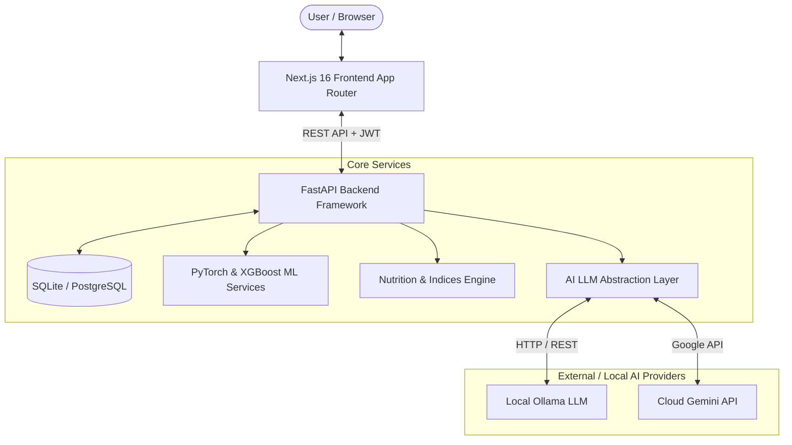
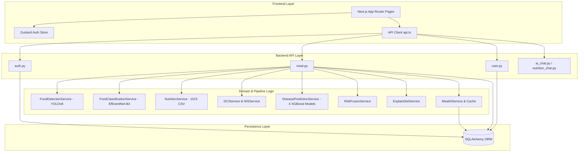
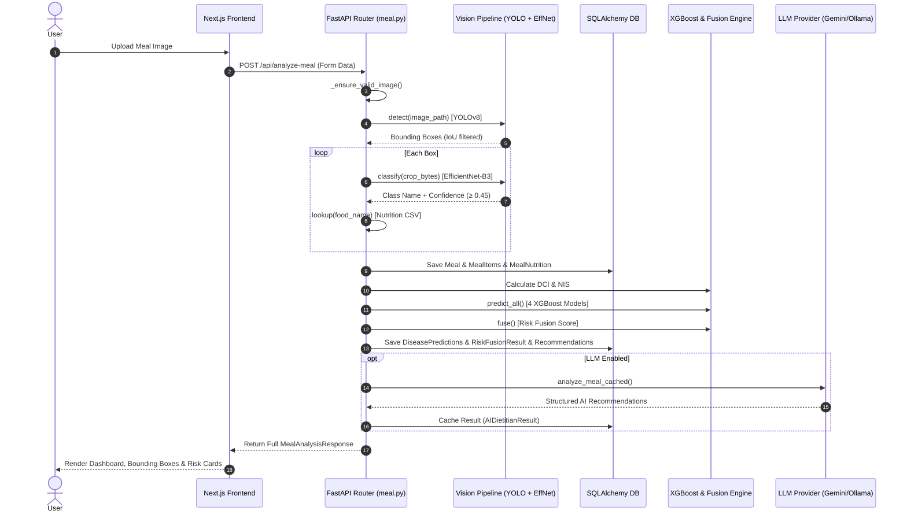

# DIETRISKNET MASTER KNOWLEDGE BASE & TECHNICAL AUDIT

**Project Title:** DietRiskNet: AI-Powered Dietary Risk Prediction & Multi-Disease Early Detection Framework  
**Document Status:** Complete Technical Master Knowledge Base & Verification Audit  
**Target Repository:** `DietRiskNet`  
**Generated On:** 2026-08-28  

---

## SECTION 1 — PROJECT OVERVIEW

### 1.1 Project Title
**DietRiskNet: AI-Powered Dietary Risk Prediction & Multi-Disease Early Detection Framework**

### 1.2 Problem Statement
Non-Communicable Diseases (NCDs) such as Type 2 Diabetes Mellitus, Obesity, Hypertension, and Nutritional Deficiencies constitute over 70% of global mortality. Malnutrition, poor macronutrient distribution, and extreme day-to-day dietary fluctuations are primary modifiable risk factors. Existing mobile dietary apps rely heavily on manual text logging, lack real-time computer vision food identification from photographs, fail to account for multi-day dietary consistency, and do not synthesize nutritional intake with personalized clinical disease prediction models.

### 1.3 Motivation
The primary motivation behind DietRiskNet is to construct an end-to-end, privacy-respecting, intelligent health system that seamlessly transforms a single meal photograph into:
1. Multi-food detection and multi-class classification,
2. Automatic nutritional decomposition mapped to an extensive Indian food dataset,
3. Mathematical formulation of novel dietary risk indices (Dietary Consistency Index and Nutritional Imbalance Score),
4. Predictive multi-disease risk modeling using machine learning ensembles (XGBoost),
5. Risk fusion and actionable, rule-backed dietary recommendations (ExplainDiet),
6. Interactive AI health coaching via local (Ollama) or cloud (Gemini) Large Language Models.

### 1.4 Objectives
- **Automate Visual Food Recognition:** Deploy a high-precision two-stage pipeline consisting of YOLOv8 for object localization and EfficientNet-B3 (with B0 fallback) for crop classification across 118 classes.
- **Nutritional Lookup & Aggregation:** Map classified items to a 1,015-dish Indian food dataset via an alias/synonym mapping engine, calculating scaled macronutrient and micronutrient profiles.
- **Formulate Novel Dietary Indices:** Implement longitudinal metric calculation algorithms—Dietary Consistency Index (DCI) based on rolling 7-day coefficient of variation, and Nutritional Imbalance Score (NIS) based on meal-level proportional RDI deviation.
- **Predict Multi-Disease Risks:** Run four specialized XGBoost models predicting risks for Diabetes, Obesity, Hypertension, and Nutritional Deficiency.
- **Synthesize Fused Risk:** Calculate a single, unified Risk Fusion score using dynamic weight renormalization for missing components.
- **Generate Rule-Backed & AI Explanations:** Pair deterministic rule-based advice with cached, provider-agnostic LLM narrative explanations.
- **Provide Comprehensive User Interface & Reporting:** Offer interactive dashboards, longitudinal trend visualizers, real-time AI chat, and downloadable PDF meal reports.

### 1.5 Scope
- **Domain Scope:** Focus on dietary habits, Indian cuisine compositions (1,015 dishes, 118 EfficientNet classes, 18 YOLO categories), and key metabolic NCD risks.
- **Technical Scope:** Full-stack deployment architecture comprising FastAPI backend, SQLAlchemy ORM, Next.js 16 frontend with React 19 and Tailwind CSS, PyTorch & XGBoost ML runtime, and local/cloud LLM abstraction.
- **Out of Scope (Verified in Codebase):** Clinical diagnosis, prescription of medical therapy, 3D volumetric portion measurement (portion sizes use pre-defined lookup weights), continuous blood biomarker sensor telemetry.

### 1.6 Expected Users
- **General Public / Health-Conscious Individuals:** Seeking automated meal tracking, disease risk awareness, and actionable dietary feedback.
- **Dietitians & Nutritionists:** Utilizing objective longitudinal metrics (DCI, NIS) and PDF reports to guide patient consultation.
- **Clinical & Preventive Health Researchers:** Evaluating vision-to-disease predictive pipelines and dietary risk fusion models.

### 1.7 Key Capabilities
- **Automated Two-Stage Computer Vision:** Detects food items in photos using YOLOv8, filters bounding box duplicates via IoU thresholding (0.60), crops regions, and classifies them with EfficientNet-B3 (`conf >= 0.45`).
- **Smart Synonym & Fuzzy Lookup:** Maps food names through exact match, alias dictionaries (e.g., `chole_bhature` -> `Chickpeas curry`), normalization, and fuzzy string matching.
- **Longitudinal Metric Engine (DCI):** Measures day-to-day calorie stability over a rolling 7-day window.
- **Meal-Level Imbalance Engine (NIS):** Computes calorie-proportional deviation from reference daily intakes across 6 core nutrients.
- **XGBoost Disease Ensembles:** Runs 4 trained gradient boosted tree models in parallel for Diabetes, Obesity, Hypertension, and Deficiency.
- **Dynamic Weight Risk Fusion:** Merges DCI, NIS, and 4 disease risks into a single 0–1 score, automatically renormalizing available component weights.
- **ExplainDiet Engine:** Generates clinical-grade rule-based advice explaining *why* a score was assigned.
- **Dual LLM Provider with Fallback:** Connects to local Ollama (default) or Google Gemini (optional), with automated SHA-256 context hash caching (`AIDietitianResult`).
- **Interactive Web App & Reports:** Offers responsive Next.js dashboards, Recharts analytics, full audit logging, and downloadable PDF reports powered by ReportLab.

### 1.8 Key Limitations (Verified in Codebase)
- **Static Serving Weights:** Portion weights use a fixed lookup table (`DEFAULT_SERVING_WEIGHTS`), defaulting to 100g when unlisted. Visual volume is not estimated from photos.
- **Limited Class Vocabulary:** Detector bounded by 18 YOLO classes; classifier bounded by 118 classes; nutrition lookup bounded by 1,015 CSV entries.
- **Clinical Default Inputs:** Features not gathered from user input (e.g., HbA1c, fasting glucose, stress score, sleep duration) are defaulted to fixed population placeholders in XGBoost pipelines.
- **Generic Daily RDI:** NIS uses a standard 2000 kcal adult RDI baseline (60g protein, 300g carbs, 65g fat, 2300mg sodium, 30g fiber) rather than dynamic clinical overrides.
- **CPU Single-Threaded Inference:** Torch and PyTorch models run single-threaded on CPU (`torch.set_num_threads(1)`) to preserve memory during deployment.

### 1.9 Real-World Relevance
DietRiskNet provides early, accessible preventive screening by turning ubiquitous smartphone camera images into actionable health intelligence. It allows users and healthcare providers to spot silent dietary patterns and metabolic risk escalations long before clinical symptom onset.

---

## SECTION 2 — SYSTEM ARCHITECTURE

### 2.1 End-to-End Workflow Trace
1. **User Action:** Uploads meal photograph via Next.js `/upload` frontend page.
2. **API Layer:** FastAPI endpoint `POST /api/analyze-meal` receives image, validates file header/extension, and stores file in uploads directory.
3. **Stage 1 Detection:** YOLOv8 model predicts bounding boxes, confidence scores, and class labels. Overlapping boxes of the same class with Intersection-over-Union (IoU) > 0.60 are removed.
4. **Stage 2 Classification & Gating:** Bounding boxes are cropped using PIL. EfficientNet-B3 (or B0 fallback) classifies each crop. Predictions below confidence `0.45` are discarded.
5. **Nutrition Mapping:** Food name is mapped through `NutritionService` priority lookup (Exact -> Synonym Map -> Normalization -> Fuzzy) to `indian_food_nutrition_processed.csv`. Nutrients are scaled by serving weight.
6. **Persistence:** Meal, MealItems, and MealNutrition records are written to the database using SQLAlchemy.
7. **DCI Calculation:** `DCIService` checks 7-day user history. If $\ge 2$ valid distinct calendar days exist, DCI is computed from calorie coefficient of variation. Otherwise, DCI is `None` ("Insufficient Data").
8. **NIS Calculation:** `NISService` calculates meal calorie fraction relative to 2000 kcal RDI and computes mean relative deviation across 6 nutrients.
9. **XGBoost Disease Prediction:** Demographic data (age, gender, height, weight, BMI, conditions) and meal nutrients pass to `DiseasePredictionService`. Four XGBoost models execute in feature-ordered sequence.
10. **Risk Fusion:** `RiskFusionService` combines DCI risk ($1-DCI$), NIS, and the 4 disease risks using weights `[0.25, 0.25, 0.20, 0.15, 0.10, 0.05]`. Missing components are excluded and weights renormalized.
11. **ExplainDiet Engine:** `ExplainDietService` checks thresholds (e.g., sodium > 800mg, NIS > 0.40) and returns structured category advice and clinical explanations.
12. **AI Dietitian (Cached LLM):** If Gemini or Ollama is enabled, `MealAIService` generates a prompt, checks SHA-256 `context_hash` in `ai_dietitian_results` table, returns cached result if hit, or queries LLM and saves result.
13. **Frontend Render:** Next.js `/analysis` page renders bounding boxes, nutrient breakdowns, DCI/NIS meters, XGBoost risk cards, ExplainDiet recommendations, and AI advice.

### 2.2 User Journey
```
[ Landing / Auth ] ──> [ Register / Login ] ──> [ Dashboard Overview ]
                                                        │
         ┌──────────────────────────────────────────────┴──────────────────────────────┐
         ▼                                              ▼                              ▼
  [ Upload Meal ]                                [ History Logs ]             [ Profile & Settings ]
         │                                              │                              │
         ▼                                              ▼                              ▼
 [ Processing Pipeline ]                        [ View Past Meal ]             [ Edit Demographics / RDI ]
         │                                              │
         ▼                                              ▼
 [ Analysis & Risk Visuals ] ──> [ AI Chat / Advice ] ──> [ Download PDF Report ]
```

### 2.3 Backend Architecture
Built with Python 3.11+ and **FastAPI**. Organized cleanly into layered architectural components:
- **Routers (`backend/routes/`):** API entry points (`auth`, `user`, `meal`, `prediction`, `report`, `ai_chat`, `nutrition_chat`, `nutrition_coach`).
- **Services (`backend/services/`):** Encapsulated business logic (`ml_services`, `prediction_service`, `nutrition_service`, `indices_services`, `risk_fusion_service`, `recommendation_service`, `meal_ai_service`, `report_service`).
- **LLM Abstraction (`backend/services/llm/`):** Polymorphic provider layer (`BaseLLMProvider`, `OllamaProvider`, `GeminiProvider`, `FallbackLLMProvider`, `LLMProviderFactory`).
- **Database & Models (`backend/database/`):** SQLAlchemy ORM models (`User`, `Meal`, `MealItem`, `MealNutrition`, `DiseasePrediction`, `RiskFusionResult`, `Recommendation`, `DietHistory`, `AuditLog`, `AIDietitianResult`).
- **Schemas (`backend/schemas/`):** Pydantic v2 data validation schemas.

### 2.4 Frontend Architecture
Built with **Next.js 16 (App Router)** and **React 19**:
- **App Router Pages (`frontend/app/`):** `dashboard`, `upload`, `analysis`, `predictions`, `nutrition`, `history`, `trends`, `research`, `profile`, `about`, `login`, `register`.
- **Global State (`frontend/lib/store.ts`):** Client-side authentication and session management via **Zustand** with persistent storage.
- **API Client (`frontend/services/api.ts`):** `apiFetch` wrapper providing automatic JWT bearer injection, single-retry refresh token rotation, timeout management (90s for LLM, 15s standard), and unified error parsing.
- **Component Library (`frontend/components/`):** Reusable UI components including `Sidebar`, `ProtectedRoute`, and specialized charts powered by **Recharts**.

### 2.5 Database Architecture
Relational database managed via **SQLAlchemy ORM** supporting **SQLite** (local default `dietrisknet.db`) and **PostgreSQL** (production configurable via `DATABASE_URL`). Includes 11 primary tables with cascade deletion rules, strict foreign keys, and composite indexes on `(user_id, created_at)` and `(meal_id, context_hash)`.

### 2.6 ML Pipeline Architecture
```
Photo Upload ──> YOLOv8 Detector ──> IoU NMS (0.60) ──> Crop Bounding Boxes
                                                               │
                                                               ▼
   Nutrition CSV Mapping ◄── Priority Lookup ◄── Gating (conf ≥ 0.45) ◄── EfficientNet-B3
            │
            ├───────────────────────┬───────────────────────┐
            ▼                       ▼                       ▼
      DCI Engine              NIS Engine            XGBoost Ensemble (4 Models)
  (7-Day CV Calorie)     (Meal RDI Deviation)    (Diabetes, Obesity, HTN, Def)
            │                       │                       │
            └───────────────────────┼───────────────────────┘
                                    ▼
                            Risk Fusion Engine
                        (Dynamic Weighted Average)
                                    │
                                    ▼
                         ExplainDiet & AI Dietitian
```

### 2.7 AI Assistant Architecture
- **Provider Interface:** `BaseLLMProvider` abstract base class defining `generate_json()`, `chat()`, and `health_check()`.
- **Factory & Fallback:** `LLMProviderFactory` instantiates `FallbackLLMProvider(primary=GeminiProvider(), fallback=OllamaProvider())` when `LLM_PROVIDER=gemini`.
- **Caching Mechanism:** Computes SHA-256 hash of meal items, nutrients, DCI/NIS, disease risks, and user demographics. Stores structured LLM response in `ai_dietitian_results`. Subsequent requests with matching context hash bypass LLM invocation.

### 2.8 System Architecture Diagrams

#### 1. High-Level System Architecture


#### 2. Detailed Component Architecture


#### 3. Component Interaction Sequence (Analyze Meal Flow)


---

## SECTION 3 — TECHNOLOGY STACK

| Technology | Version | Category | Purpose | Why Chosen | Alternatives Considered | Advantages | Limitations | Evidence Path |
|---|---|---|---|---|---|---|---|---|
| **FastAPI** | `0.139.0` | Backend | Web Framework | High performance, async support, native Pydantic OpenAPI validation. | Flask, Django, Express.js | Automatic OpenAPI docs, high concurrency, strict type checking. | Requires manual ORM setup compared to Django. | [requirements.txt](file:///d:/Capstone/24th%20july/DietRiskNet/requirements.txt#L2) |
| **SQLAlchemy** | `2.0.51` | Backend | Database ORM | Enterprise Python ORM supporting multiple SQL backends cleanly. | Peewee, Tortoise ORM, Raw SQL | Type safety, relationship cascades, seamless migration between SQLite/Postgres. | Learning curve for complex joining/aggregation. | [requirements.txt](file:///d:/Capstone/24th%20july/DietRiskNet/requirements.txt#L6) |
| **SQLite / PostgreSQL** | `3.x / 15+` | Database | Relational Store | Zero-config local embedded storage (SQLite) with seamless PostgreSQL driver (`psycopg2-binary 2.9.12`). | MySQL, MongoDB | Lightweight local development, strict relational integrity. | SQLite lacks native JSON index capabilities available in Postgres. | [database.py](file:///d:/Capstone/24th%20july/DietRiskNet/backend/database/database.py#L1-L20) |
| **JWT (python-jose)** | `3.5.0` | Backend | Security | Stateless, secure user session authentication. | Session Cookies, OAuth Tokens | Scalable, self-contained payload with expiration and refresh token rotation. | Cannot invalidate stateless access token before expiry without blacklist. | [auth_utils.py](file:///d:/Capstone/24th%20july/DietRiskNet/backend/utils/auth_utils.py) |
| **Pydantic** | `2.13.4` | Backend | Validation | Data parsing, validation, and schema generation for API endpoints. | Marshmallow, Cerberus | Fast Rust-backed core (v2), tight integration with FastAPI. | Strict schema coercion rules can reject minor type mismatches. | [schemas.py](file:///d:/Capstone/24th%20july/DietRiskNet/backend/schemas/schemas.py) |
| **Next.js** | `16.2.10` | Frontend | Web Framework | React framework providing App Router, SSR, and optimized client bundle generation. | Vite + React, Nuxt.js | Excellent developer experience, server components, automated route optimization. | Fast-evolving API surface across major releases. | [package.json](file:///d:/Capstone/24th%20july/DietRiskNet/frontend/package.json#L16) |
| **React** | `19.2.4` | Frontend | View Library | Component-driven UI framework powering modern web applications. | Vue.js, Svelte, Angular | VAST ecosystem, declarative component hierarchy, concurrent renderer. | Complex state management if unorganized. | [package.json](file:///d:/Capstone/24th%20july/DietRiskNet/frontend/package.json#L17) |
| **TypeScript** | `5.x` | Frontend | Programming Language | Static type safety across frontend components and API contracts. | Plain JavaScript | Catches type errors at build time, self-documenting code base. | Requires compilation step and explicit interfaces. | [tsconfig.json](file:///d:/Capstone/24th%20july/DietRiskNet/frontend/tsconfig.json) |
| **Tailwind CSS** | `4.x` | Frontend | Styling | Utility-first CSS framework for rapid responsive design. | Bootstrap, MUI, Styled Components | High performance, zero unused CSS in production build, fully customizable. | Class string bloat in HTML if un-factored. | [globals.css](file:///d:/Capstone/24th%20july/DietRiskNet/frontend/app/globals.css) |
| **Recharts** | `3.9.2` | Frontend | Data Visualization | Composability-driven React charting library built on SVG. | Chart.js, D3.js | React-native SVG rendering, responsive containers, fluid animations. | Can slow down with tens of thousands of dynamic DOM nodes. | [package.json](file:///d:/Capstone/24th%20july/DietRiskNet/frontend/package.json#L19) |
| **YOLOv8** | `8.4.95` | Machine Learning | Object Detection | Real-time object detection model for multi-food localization. | YOLOv5, Faster R-CNN, SSD | State-of-the-art speed/accuracy trade-off, native PyTorch export. | Requires fixed-resolution input tensors. | [ml_services.py](file:///d:/Capstone/24th%20july/DietRiskNet/backend/services/ml_services.py#L9-L146) |
| **EfficientNet-B3** | `timm 1.0.28` | Machine Learning | Image Classification | High-accuracy convolutional backbone for cropped food recognition. | ResNet-50, Vision Transformer | Compound scaling optimizing depth/width/resolution balance. | Higher memory footprint than B0. | [ml_services.py](file:///d:/Capstone/24th%20july/DietRiskNet/backend/services/ml_services.py#L147-L285) |
| **XGBoost** | `3.2.0` | Machine Learning | Tabular Risk Prediction | Gradient boosted decision trees for clinical metabolic risk modeling. | Random Forest, Logistic Regression | Superior accuracy on tabular medical data, built-in missing handling. | Strict column order requirements (`inplace_predict`). | [prediction_service.py](file:///d:/Capstone/24th%20july/DietRiskNet/backend/services/prediction_service.py) |
| **PyTorch** | `2.5.1+cpu` | Machine Learning | Deep Learning Engine | Open-source tensor machine learning framework powering YOLO and EfficientNet. | TensorFlow, ONNX Runtime | Dynamic computation graph, seamless integration with `timm` and `ultralytics`. | CPU execution is slower than CUDA GPU execution. | [requirements.txt](file:///d:/Capstone/24th%20july/DietRiskNet/requirements.txt#L16) |
| **Ultralytics** | `8.4.95` | Machine Learning | Detection Framework | Official SDK for YOLOv8 architecture loading and inference execution. | Custom PyTorch YOLO hooks | Convenient API wrapper handling pre/post-processing seamlessly. | Frequent library updates require strict version pinning. | [requirements.txt](file:///d:/Capstone/24th%20july/DietRiskNet/requirements.txt#L19) |
| **Ollama** | Local Binary | AI / LLM | Local LLM Engine | Privacy-focused local execution of Llama-based models without external API fees. | Local Transformers, vLLM | Runs entirely offline, zero API cost, high data privacy. | Requires local CPU/GPU RAM resources; higher response latency. | [ollama_provider.py](file:///d:/Capstone/24th%20july/DietRiskNet/backend/services/llm/ollama_provider.py) |
| **Google Gemini** | `google-generativeai 0.8.6` | AI / LLM | Cloud LLM Provider | Advanced cloud LLM (`gemini-1.5-flash` / `gemini-2.0-flash`) for deep nutritional analysis. | OpenAI GPT-4, Anthropic Claude | Extremely fast inference, high contextual reasoning capabilities. | Requires valid API key and active internet connection. | [gemini_client.py](file:///d:/Capstone/24th%20july/DietRiskNet/backend/services/llm/gemini_client.py) |
| **LLM Abstraction Layer** | Native Python | AI / Architecture | Provider Interface | Decouples system logic from specific LLM providers via a unified interface. | Direct API coupling | Enables instant switching between Ollama and Gemini with automated fallback. | Requires maintaining translation logic for structured JSON outputs. | [base.py](file:///d:/Capstone/24th%20july/DietRiskNet/backend/services/llm/base.py) |

---

## SECTION 4 — COMPLETE WORKFLOW

### Step 1: Image Upload
- **Inputs:** Multipart form-data containing `file` (`UploadFile`) and optional `notes` (`str`).
- **Processing:** Image extension checked against `[.jpg, .jpeg, .png, .webp]`. File copied to `backend/uploads/` with a unique UUID filename. `_ensure_valid_image()` verifies header integrity using PIL `Image.open().verify()`. Bad uploads are deleted.
- **Outputs:** Disk file path (e.g., `backend/uploads/e4a1b2...png`) and unique filename.
- **Evidence Path:** [meal.py](file:///d:/Capstone/24th%20july/DietRiskNet/backend/routes/meal.py#L66-L89)

### Step 2: YOLO Detection
- **Inputs:** Validated image file path.
- **Processing:** `FoodDetectionService` runs `YOLOv8` (`DietRiskNet_FoodDetector_YOLOv8.pt`). Bounding boxes extracted as `(x1, y1, x2, y2)` with confidence scores. Overlapping boxes of the same class label with Intersection-over-Union (IoU) > `0.60` are pruned via Non-Maximum Suppression (`_remove_duplicate_detections`).
- **Outputs:** Filtered list of detected objects with bounding box coordinates and detection confidence.
- **Evidence Path:** [ml_services.py](file:///d:/Capstone/24th%20july/DietRiskNet/backend/services/ml_services.py#L9-L145)

### Step 3: Crop Generation
- **Inputs:** Original image path and bounding box coordinates `(x1, y1, x2, y2)`.
- **Processing:** `crop_image()` opens the image, crops pixel coordinates, and encodes cropped region into byte stream (`BytesIO`) formatted as PNG.
- **Outputs:** Raw image bytes corresponding strictly to the bounding box region.
- **Evidence Path:** [image_utils.py](file:///d:/Capstone/24th%20july/DietRiskNet/backend/utils/image_utils.py)

### Step 4: EfficientNet Classification
- **Inputs:** Crop image bytes.
- **Processing:** Crop resized to $300 \times 300$ (for EfficientNet-B3) or $224 \times 224$ (for B0 fallback), converted to tensor, and normalized with ImageNet statistics ($\mu=[0.485, 0.456, 0.406]$, $\sigma=[0.229, 0.224, 0.225]$). Softmax probabilities computed over 118 classes. If classification confidence $< 0.45$ (`CLASSIFIER_CONFIDENCE_THRESHOLD`), the item is discarded to prevent false positives.
- **Outputs:** Predicted food class name and classification confidence score.
- **Evidence Path:** [ml_services.py](file:///d:/Capstone/24th%20july/DietRiskNet/backend/services/ml_services.py#L147-L285)

### Step 5: Nutrition Lookup
- **Inputs:** Predicted food class name string.
- **Processing:** `NutritionService.lookup()` executes 4-stage search against `indian_food_nutrition_processed.csv`:
  1. Priority 1: Exact string match in CSV dish database.
  2. Priority 2: Alias / Synonym map (e.g., `butter_naan` -> `Naan`, `jalebi` -> `Gulab Jamun with khoya`).
  3. Priority 3: Deterministic normalization match (lowercase, remove underscores/special chars).
  4. Priority 4: Fuzzy string match (`difflib.get_close_matches` with cutoff `0.75`).
  If all fails, sets `nutrition_available = False` and returns zero placeholder dict without failing pipeline.
- **Outputs:** Unscaled per-100g nutritional facts dict (calories, carbs, protein, fats, sugar, fiber, sodium, calcium, iron, vitamin C, folate).
- **Evidence Path:** [nutrition_service.py](file:///d:/Capstone/24th%20july/DietRiskNet/backend/services/nutrition_service.py#L185-L254)

### Step 6: Meal Storage
- **Inputs:** Classified items list, scaled nutrient values (scaled using `DEFAULT_SERVING_WEIGHTS` or 100g default), user ID, and image path.
- **Processing:** `meal_db_service` creates `Meal` record, bulk inserts `MealItem` records with bounding box coordinates, and creates aggregated `MealNutrition` totals.
- **Outputs:** Saved database entity IDs (`meal.id`, `meal_item.id`, `meal_nutrition.id`).
- **Evidence Path:** [user_services.py](file:///d:/Capstone/24th%20july/DietRiskNet/backend/services/user_services.py#L13-L90)

### Step 7: DCI Calculation
- **Inputs:** User ID, DB session, current meal nutrition dict.
- **Processing:** `DCIService` queries user meals over the preceding 7 days. Aggregates daily calorie intake across distinct calendar days with valid intake ($>0$). If fewer than 2 distinct valid days exist, returns `(None, "Insufficient Data")`. Otherwise, calculates Coefficient of Variation $CV = \frac{\sigma}{\mu}$ and $DCI = \max(0, \min(1, 1 - CV))$.
- **Outputs:** Numerical DCI score $[0.0, 1.0]$ and consistency level string (High, Moderate, Low, Very Low).
- **Evidence Path:** [indices_services.py](file:///d:/Capstone/24th%20july/DietRiskNet/backend/services/indices_services.py#L13-L95)

### Step 8: NIS Calculation
- **Inputs:** Aggregated meal nutrition dict.
- **Processing:** `NISService` determines meal calorie fraction $f = \min\left(1.0, \frac{\text{meal\_calories}}{2000}\right)$ (defaulting to $f = 1/3$ if meal calories is zero/unknown). Computes relative nutrient deviation across 6 nutrients $dev_k = \frac{|\text{actual}_k - \text{daily\_rdi}_k \times f|}{\text{daily\_rdi}_k \times f}$. Scores $NIS = \max(0, \min(1, \text{mean}(dev)))$.
- **Outputs:** Numerical NIS score $[0.0, 1.0]$ and imbalance level string (Balanced, Mild, Moderate, High, Severe).
- **Evidence Path:** [indices_services.py](file:///d:/Capstone/24th%20july/DietRiskNet/backend/services/indices_services.py#L97-L199)

### Step 9: Disease Prediction
- **Inputs:** Demographics (age, gender, height, weight, BMI, existing conditions) and meal nutrition dict.
- **Processing:** `DiseasePredictionService` loads 4 trained XGBoost models (`.pkl`). Prepares single-row Pandas DataFrames, enforcing exact trained column ordering via `_prepare_df()`. Runs `predict_proba()` for:
  1. Diabetes (binary positive class probability)
  2. Obesity (multi-class probability sum of overweight/obese classes)
  3. Hypertension (binary positive class probability)
  4. Deficiency (1 minus probability of no deficiency class)
- **Outputs:** Risk dictionary containing 4 individual disease risk probabilities $[0.0, 1.0]$.
- **Evidence Path:** [prediction_service.py](file:///d:/Capstone/24th%20july/DietRiskNet/backend/services/prediction_service.py)

### Step 10: Risk Fusion
- **Inputs:** DCI score, NIS score, and 4 disease risk probabilities.
- **Processing:** `RiskFusionService` calculates consistency risk $(1 - DCI)$. Identifies available non-null components among `[DCI risk, NIS, Diabetes, Obesity, Hypertension, Deficiency]`. Sums configured weights of available components and computes normalized weighted average $Fused = \frac{\sum w_i v_i}{\sum w_i}$.
- **Outputs:** Fused score $[0.0, 1.0]$ and risk level string (Low, Moderate, High, Critical).
- **Evidence Path:** [risk_fusion_service.py](file:///d:/Capstone/24th%20july/DietRiskNet/backend/services/risk_fusion_service.py)

### Step 11: ExplainDiet
- **Inputs:** Meal nutrition dict, disease predictions dict, DCI, NIS, and user history summary.
- **Processing:** `ExplainDietService` evaluates deterministic clinical rules (e.g., sodium > 800mg, sugar > 15g, calories > 800 kcal, fiber < 2g, NIS > 0.40, DCI < 0.70). Appends rule objects with category, recommendation content, and clinical rationale explanation.
- **Outputs:** List of recommendation dicts detailing dietary modifications.
- **Evidence Path:** [recommendation_service.py](file:///d:/Capstone/24th%20july/DietRiskNet/backend/services/recommendation_service.py)

### Step 12: Nutrition Assistant & AI Dietitian
- **Inputs:** Persistent meal data, user profile, and optional chat message string.
- **Processing:** `MealAIService` or `NutritionAssistantService` constructs structured prompt. Generates SHA-256 context hash. Checks database table `ai_dietitian_results`. On hit, returns cached JSON. On miss, queries active LLM provider (Gemini or Ollama), parses JSON response, saves to database cache, and returns. On LLM failure, returns friendly fallback reply (HTTP 200).
- **Outputs:** Structured AI advice payload or free-text chat response string.
- **Evidence Path:** [meal_ai_service.py](file:///d:/Capstone/24th%20july/DietRiskNet/backend/services/meal_ai_service.py)

### Step 13: Dashboard
- **Inputs:** User authentication token.
- **Processing:** `GET /api/dashboard` queries latest meal, 7-day average calories/protein/carbs/fats, recent meals list, and latest disease prediction vector.
- **Outputs:** `DashboardResponse` JSON containing aggregated user statistics and recent meal logs.
- **Evidence Path:** [user_services.py](file:///d:/Capstone/24th%20july/DietRiskNet/backend/services/user_services.py#L92-L188)

### Step 14: Trends
- **Inputs:** User authentication token and `days` query parameter (default 30).
- **Processing:** `GET /api/analytics/trends` queries meal history over `days` parameter, grouping calorie totals, DCI history, NIS values, and fused risk scores by calendar day.
- **Outputs:** `LongitudinalTrendsResponse` containing daily trend series for charting.
- **Evidence Path:** [user_services.py](file:///d:/Capstone/24th%20july/DietRiskNet/backend/services/user_services.py#L254-L352)

### Step 15: History
- **Inputs:** User authentication token.
- **Processing:** `GET /api/history` executes joined query across `DietHistory`, `Meal`, `MealNutrition`, and `RiskFusionResult`, ordering by `logged_date DESC`.
- **Outputs:** List of formatted historical meal summaries including thumbnail image paths, item counts, total calories, and risk levels.
- **Evidence Path:** [user_services.py](file:///d:/Capstone/24th%20july/DietRiskNet/backend/services/user_services.py#L190-L252)

---

## SECTION 5 — DATABASE DOCUMENTATION

### 5.1 Tables & Schema Details

#### 1. `users`
- **Purpose:** Stores user core credentials and identity.
- **Columns:**
  - `id` (INTEGER, PK, Auto-increment, Index)
  - `email` (VARCHAR, Unique, Index, Non-nullable)
  - `password_hash` (VARCHAR, Non-nullable)
  - `full_name` (VARCHAR, Nullable)
  - `created_at` (DATETIME, Default: `utcnow`)
  - `updated_at` (DATETIME, Default: `utcnow`, OnUpdate: `utcnow`)
- **Relationships:** `settings` (1:1), `meals` (1:N), `refresh_tokens` (1:N), `diet_history` (1:N), `audit_logs` (1:N).

#### 2. `refresh_tokens`
- **Purpose:** Manages active JWT refresh token sessions and revocation.
- **Columns:**
  - `id` (INTEGER, PK, Index)
  - `user_id` (INTEGER, FK -> `users.id` ON DELETE CASCADE, Non-nullable)
  - `token` (VARCHAR, Unique, Index, Non-nullable)
  - `expires_at` (DATETIME, Non-nullable)
  - `is_revoked` (BOOLEAN, Default: `False`)
  - `created_at` (DATETIME, Default: `utcnow`)
- **Relationships:** `user` (N:1).

#### 3. `user_settings`
- **Purpose:** Stores demographic profiles and custom RDI overrides.
- **Columns:**
  - `id` (INTEGER, PK, Index)
  - `user_id` (INTEGER, FK -> `users.id` ON DELETE CASCADE, Unique, Non-nullable)
  - `age` (INTEGER, Default: `30`)
  - `gender` (VARCHAR, Default: `"Male"`)
  - `height` (FLOAT, Default: `170.0`)
  - `weight` (FLOAT, Default: `70.0`)
  - `activity_level` (VARCHAR, Default: `"Moderate"`)
  - `existing_conditions` (JSON, Default: `[]`)
  - `rdi_custom` (JSON, Nullable)
  - `created_at` (DATETIME, Default: `utcnow`)
  - `updated_at` (DATETIME, Default: `utcnow`, OnUpdate: `utcnow`)
- **Relationships:** `user` (1:1).

#### 4. `meals`
- **Purpose:** Primary entity record for an analyzed meal upload.
- **Columns:**
  - `id` (INTEGER, PK, Index)
  - `user_id` (INTEGER, FK -> `users.id` ON DELETE CASCADE, Non-nullable)
  - `image_path` (VARCHAR, Nullable)
  - `dci` (FLOAT, Nullable)
  - `dci_level` (VARCHAR, Nullable)
  - `nis` (FLOAT, Nullable)
  - `nis_level` (VARCHAR, Nullable)
  - `risk_fusion_score` (FLOAT, Nullable)
  - `risk_fusion_level` (VARCHAR, Nullable)
  - `notes` (VARCHAR, Nullable)
  - `created_at` (DATETIME, Default: `utcnow`, Index)
- **Relationships:** `user` (N:1), `items` (1:N), `nutrition` (1:1), `predictions` (1:1), `fusion_result` (1:1), `recommendations` (1:N), `history_entry` (1:1).
- **Indexes:** Composite index `idx_meal_user_created` on `(user_id, created_at)`.

#### 5. `meal_items`
- **Purpose:** Individual detected food items within a meal.
- **Columns:**
  - `id` (INTEGER, PK, Index)
  - `meal_id` (INTEGER, FK -> `meals.id` ON DELETE CASCADE, Non-nullable)
  - `name` (VARCHAR, Non-nullable)
  - `confidence` (FLOAT, Default: `1.0`)
  - `x1`, `y1`, `x2`, `y2` (FLOAT, Nullable) — YOLO bounding box pixel coordinates.
  - `weight_g` (FLOAT, Default: `100.0`)
  - `calories`, `protein`, `carbs`, `fats`, `sugar`, `fiber`, `sodium`, `calcium`, `iron`, `vitamin_c`, `folate` (FLOAT, Default: `0.0`)
- **Relationships:** `meal` (N:1).

#### 6. `meal_nutritions`
- **Purpose:** Aggregated nutritional sum across all items in a meal.
- **Columns:**
  - `id` (INTEGER, PK, Index)
  - `meal_id` (INTEGER, FK -> `meals.id` ON DELETE CASCADE, Unique, Non-nullable)
  - `calories`, `protein`, `carbs`, `fats`, `sugar`, `fiber`, `sodium`, `calcium`, `iron`, `vitamin_c`, `folate` (FLOAT, Default: `0.0`)
- **Relationships:** `meal` (1:1).

#### 7. `disease_predictions`
- **Purpose:** Output risk probabilities from 4 XGBoost models.
- **Columns:**
  - `id` (INTEGER, PK, Index)
  - `meal_id` (INTEGER, FK -> `meals.id` ON DELETE CASCADE, Unique, Non-nullable)
  - `diabetes_risk` (FLOAT, Default: `0.0`)
  - `obesity_risk` (FLOAT, Default: `0.0`)
  - `hypertension_risk` (FLOAT, Default: `0.0`)
  - `deficiency_risk` (FLOAT, Default: `0.0`)
  - `created_at` (DATETIME, Default: `utcnow`)
- **Relationships:** `meal` (1:1).

#### 8. `risk_fusion_results`
- **Purpose:** Unified fused risk score and categorical level.
- **Columns:**
  - `id` (INTEGER, PK, Index)
  - `meal_id` (INTEGER, FK -> `meals.id` ON DELETE CASCADE, Unique, Non-nullable)
  - `fused_score` (FLOAT, Default: `0.0`)
  - `risk_level` (VARCHAR, Default: `"Low"`)
  - `created_at` (DATETIME, Default: `utcnow`)
- **Relationships:** `meal` (1:1).

#### 9. `recommendations`
- **Purpose:** ExplainDiet rule-based advice entries.
- **Columns:**
  - `id` (INTEGER, PK, Index)
  - `meal_id` (INTEGER, FK -> `meals.id` ON DELETE CASCADE, Non-nullable)
  - `content` (VARCHAR, Non-nullable)
  - `explanation` (VARCHAR, Non-nullable)
  - `category` (VARCHAR, Default: `"General"`)
  - `created_at` (DATETIME, Default: `utcnow`)
- **Relationships:** `meal` (N:1).

#### 10. `diet_history`
- **Purpose:** User meal timeline tracking for DCI longitudinal analytics.
- **Columns:**
  - `id` (INTEGER, PK, Index)
  - `user_id` (INTEGER, FK -> `users.id` ON DELETE CASCADE, Non-nullable)
  - `meal_id` (INTEGER, FK -> `meals.id` ON DELETE CASCADE, Unique, Non-nullable)
  - `logged_date` (DATETIME, Default: `utcnow`, Index)
  - `created_at` (DATETIME, Default: `utcnow`)
- **Relationships:** `user` (N:1), `meal` (1:1).
- **Indexes:** Composite index `idx_diet_history_user_logged` on `(user_id, logged_date)`.

#### 11. `audit_logs`
- **Purpose:** System security audit logging (login, registration events).
- **Columns:**
  - `id` (INTEGER, PK, Index)
  - `user_id` (INTEGER, FK -> `users.id` ON DELETE CASCADE, Nullable)
  - `action` (VARCHAR, Non-nullable)
  - `ip_address` (VARCHAR, Nullable)
  - `user_agent` (VARCHAR, Nullable)
  - `timestamp` (DATETIME, Default: `utcnow`, Index)
- **Relationships:** `user` (N:1).

#### 12. `ai_dietitian_results`
- **Purpose:** SHA-256 hashed cache store for structured LLM response payloads.
- **Columns:**
  - `id` (INTEGER, PK, Index)
  - `meal_id` (INTEGER, FK -> `meals.id` ON DELETE CASCADE, Index, Non-nullable)
  - `provider` (VARCHAR, Default: `"gemini"`)
  - `model` (VARCHAR, Nullable)
  - `summary` (TEXT, Nullable)
  - `meal_quality` (VARCHAR, Nullable)
  - `health_score` (INTEGER, Nullable)
  - `health_level` (VARCHAR, Nullable)
  - `health_explanation` (TEXT, Nullable)
  - `risk_explanation` (TEXT, Nullable)
  - `recommendations_json` (JSON, Default: `[]`)
  - `alternatives_json` (JSON, Default: `[]`)
  - `warnings_json` (JSON, Default: `[]`)
  - `follow_up_questions_json` (JSON, Default: `[]`)
  - `prompt_version` (VARCHAR, Nullable)
  - `context_hash` (VARCHAR, Index, Non-nullable)
  - `created_at` (DATETIME, Default: `utcnow`)
  - `updated_at` (DATETIME, Default: `utcnow`, OnUpdate: `utcnow`)
- **Relationships:** `meal` (N:1).
- **Indexes:** Composite index `idx_ai_meal_context` on `(meal_id, context_hash)`.

### 5.2 Entity Relationship (ER) Diagram
```mermaid
erDiagram
    users ||--o| user_settings : HAS
    users ||--o{ meals : LOGS
    users ||--o{ refresh_tokens : OWNS
    users ||--o{ diet_history : HAS_TIMELINE
    users ||--o{ audit_logs : GENERATES

    meals ||--o{ meal_items : CONTAINS
    meals ||--o| meal_nutritions : AGGREGATES
    meals ||--o| disease_predictions : HAS_RISK
    meals ||--o| risk_fusion_results : FUSES
    meals ||--o{ recommendations : RECEIVES
    meals ||--o| diet_history : RECORDS
    meals ||--o{ ai_dietitian_results : CACHES

    users {
        int id PK
        string email UK
        string password_hash
    }

    user_settings {
        int id PK
        int user_id FK
        int age
        string gender
        float height
        float weight
    }

    meals {
        int id PK
        int user_id FK
        float dci
        float nis
        float risk_fusion_score
    }

    meal_items {
        int id PK
        int meal_id FK
        string name
        float weight_g
        float calories
    }

    meal_nutritions {
        int id PK
        int meal_id FK
        float calories
        float protein
        float carbs
        float fats
    }

    disease_predictions {
        int id PK
        int meal_id FK
        float diabetes_risk
        float obesity_risk
        float hypertension_risk
        float deficiency_risk
    }

    risk_fusion_results {
        int id PK
        int meal_id FK
        float fused_score
        string risk_level
    }

    ai_dietitian_results {
        int id PK
        int meal_id FK
        string context_hash IX
        int health_score
    }
```

---

## SECTION 6 — API DOCUMENTATION

| Endpoint | Method | Auth Req. | Request Body | Response Body | Purpose & Functional Description | Evidence Path |
|---|---|---|---|---|---|---|
| `/api/auth/register` | `POST` | None | `UserRegister` (email, password, full_name) | `Token` (access_token, refresh_token, user_id, email) | Registers new user account, hashes password via bcrypt, generates JWT pair, writes audit log. | [auth.py](file:///d:/Capstone/24th%20july/DietRiskNet/backend/routes/auth.py#L12-L36) |
| `/api/auth/login` | `POST` | None | `UserLogin` (email, password) | `Token` (access_token, refresh_token, user_id, email) | Authenticates credentials, generates new JWT pair, writes audit log. | [auth.py](file:///d:/Capstone/24th%20july/DietRiskNet/backend/routes/auth.py#L38-L62) |
| `/api/auth/logout` | `POST` | None | `TokenRefresh` (refresh_token) | `{"detail": "Successfully logged out."}` | Revokes specified refresh token in database (`is_revoked = True`). | [auth.py](file:///d:/Capstone/24th%20july/DietRiskNet/backend/routes/auth.py#L64-L67) |
| `/api/auth/refresh` | `POST` | None | `TokenRefresh` (refresh_token) | `Token` (access_token, refresh_token, user_id, email) | Validates non-revoked refresh token, issues new token pair, revokes old refresh token. | [auth.py](file:///d:/Capstone/24th%20july/DietRiskNet/backend/routes/auth.py#L69-L104) |
| `/api/dashboard` | `GET` | Bearer | None | `DashboardResponse` (user_name, total_meals, recent_meals, latest_predictions) | Fetches user dashboard overview summary metrics. | [user.py](file:///d:/Capstone/24th%20july/DietRiskNet/backend/routes/user.py#L18-L25) |
| `/api/history` | `GET` | Bearer | None | `List[dict]` (meal history entries with nutrition & risk levels) | Fetches complete chronological timeline of user's logged meals. | [user.py](file:///d:/Capstone/24th%20july/DietRiskNet/backend/routes/user.py#L27-L33) |
| `/api/profile` | `GET` | Bearer | None | `UserProfileResponse` (id, email, full_name, settings) | Returns current user profile details and health demographics. | [user.py](file:///d:/Capstone/24th%20july/DietRiskNet/backend/routes/user.py#L35-L46) |
| `/api/profile` | `PUT` | Bearer | `{"full_name": string}` | `UserProfileResponse` | Updates user full name string. | [user.py](file:///d:/Capstone/24th%20july/DietRiskNet/backend/routes/user.py#L48-L60) |
| `/api/settings` | `PUT` | Bearer | `UserSettingUpdate` (age, gender, height, weight, activity_level, existing_conditions) | `UserSettingResponse` | Updates clinical health demographics used as inputs for disease risk models. | [user.py](file:///d:/Capstone/24th%20july/DietRiskNet/backend/routes/user.py#L62-L73) |
| `/api/analytics/trends`| `GET` | Bearer | None (`days` query parameter, default 30) | `LongitudinalTrendsResponse` (trends series array) | Returns daily aggregated nutrient intake, DCI consistency, and risk trends over N days. | [user.py](file:///d:/Capstone/24th%20july/DietRiskNet/backend/routes/user.py#L75-L86) |
| `/api/upload` | `POST` | Bearer | Form File (`UploadFile`) | `{"file_path": string, "filename": string}` | Saves uploaded raw image file to uploads directory. | [meal.py](file:///d:/Capstone/24th%20july/DietRiskNet/backend/routes/meal.py#L66-L89) |
| `/api/detect-food` | `POST` | Bearer | Form `file_path` | `FoodDetectionResponse` (detections list with bounding boxes) | Executes YOLOv8 detector on uploaded image and returns IoU-filtered boxes. | [meal.py](file:///d:/Capstone/24th%20july/DietRiskNet/backend/routes/meal.py#L91-L113) |
| `/api/classify-food` | `POST` | Bearer | Form `file_path`, `x1`, `y1`, `x2`, `y2` | `FoodClassificationResponse` (class_name, confidence) | Crops bounding box region and runs EfficientNet-B3 classifier. | [meal.py](file:///d:/Capstone/24th%20july/DietRiskNet/backend/routes/meal.py#L114-L129) |
| `/api/nutrition-analysis`| `POST`| Bearer | `NutritionAnalysisRequest` (items list with names, weights, boxes) | `NutritionAnalysisResponse` (analyzed items + aggregated nutrition) | Looks up nutrition facts for items and scales by portion weights. | [meal.py](file:///d:/Capstone/24th%20july/DietRiskNet/backend/routes/meal.py#L130-L182) |
| `/api/calculate-dci` | `POST` | Bearer | `CalculateDCIRequest` (meal_nutrition) | `CalculateDCIResponse` (dci score, dci_level) | Calculates DCI score for current user over rolling 7-day window. | [meal.py](file:///d:/Capstone/24th%20july/DietRiskNet/backend/routes/meal.py#L184-L199) |
| `/api/calculate-nis` | `POST` | Bearer | `CalculateNISRequest` (meal_nutrition) | `CalculateNISResponse` (nis score, nis_level) | Calculates NIS score for meal against proportional daily RDI targets. | [meal.py](file:///d:/Capstone/24th%20july/DietRiskNet/backend/routes/meal.py#L201-L208) |
| `/api/analyze-meal` | `POST` | Bearer | Form File (`UploadFile`), Form `notes` | `MealAnalysisResponse` (complete pipeline result object) | Executes complete end-to-end pipeline (Detection -> Classification -> Lookup -> Storage -> DCI/NIS -> XGBoost -> Fusion -> ExplainDiet -> AI Cache). | [meal.py](file:///d:/Capstone/24th%20july/DietRiskNet/backend/routes/meal.py#L210-L494) |
| `/api/predict-diabetes`| `POST`| None | `DiseasePredictionRequest` (demographics, meal_nutrition) | `DiseasePredictionResponse` (diabetes_risk score) | Runs standalone XGBoost Diabetes prediction model. | [prediction.py](file:///d:/Capstone/24th%20july/DietRiskNet/backend/routes/prediction.py#L14-L26) |
| `/api/predict-obesity` | `POST` | None | `DiseasePredictionRequest` (demographics, meal_nutrition) | `DiseasePredictionResponse` (obesity_risk score) | Runs standalone XGBoost Obesity prediction model. | [prediction.py](file:///d:/Capstone/24th%20july/DietRiskNet/backend/routes/prediction.py#L28-L40) |
| `/api/predict-hypertension`|`POST`| None | `DiseasePredictionRequest` (demographics, meal_nutrition) | `DiseasePredictionResponse` (hypertension_risk score) | Runs standalone XGBoost Hypertension prediction model. | [prediction.py](file:///d:/Capstone/24th%20july/DietRiskNet/backend/routes/prediction.py#L42-L54) |
| `/api/predict-deficiency`| `POST`| None | `DiseasePredictionRequest` (demographics, meal_nutrition) | `DiseasePredictionResponse` (deficiency_risk score) | Runs standalone XGBoost Nutritional Deficiency prediction model. | [prediction.py](file:///d:/Capstone/24th%20july/DietRiskNet/backend/routes/prediction.py#L56-L68) |
| `/api/risk-fusion` | `POST` | None | `RiskFusionRequest` (dci, nis, disease_prediction) | `RiskFusionResponse` (fused_score, risk_level) | Calculates unified Risk Fusion score from component risks. | [prediction.py](file:///d:/Capstone/24th%20july/DietRiskNet/backend/routes/prediction.py#L70-L83) |
| `/api/explain-diet` | `POST` | None | `ExplainDietRequest` (meal_nutrition, disease_prediction, dci, nis) | `ExplainDietResponse` (recommendations array) | Returns ExplainDiet rule-backed recommendation objects. | [prediction.py](file:///d:/Capstone/24th%20july/DietRiskNet/backend/routes/prediction.py#L85-L97) |
| `/api/report/{meal_id}`| `GET` | Bearer | None | Binary PDF Stream (`application/pdf`) | Generates and streams downloadable PDF meal analysis report using ReportLab. | [report.py](file:///d:/Capstone/24th%20july/DietRiskNet/backend/routes/report.py#L22-L54) |
| `/api/ai/chat` | `POST` | Bearer | `ChatRequest` (meal_id, message) | `ChatResponse` (reply text) | Interactive AI Dietitian meal-specific chat endpoint (90s timeout). | [ai_chat.py](file:///d:/Capstone/24th%20july/DietRiskNet/backend/routes/ai_chat.py#L45-L82) |
| `/api/ai/health` | `GET` | None | None | `dict` (provider, model, status, latency_ms, version) | Reports active LLM provider availability health probe. | [ai_chat.py](file:///d:/Capstone/24th%20july/DietRiskNet/backend/routes/ai_chat.py#L85-L104) |
| `/api/nutrition-chat` | `POST` | Bearer | `NutritionChatRequest` (message, include_history) | `NutritionChatResponse` (reply text) | General AI Nutrition Assistant coach chat endpoint. | [nutrition_chat.py](file:///d:/Capstone/24th%20july/DietRiskNet/backend/routes/nutrition_chat.py#L41-L73) |
| `/api/nutrition/analytics`|`GET`| Bearer | None | `dict` (analytics summary payload) | Returns deterministic weekly user diet analytics summary. | [nutrition_coach.py](file:///d:/Capstone/24th%20july/DietRiskNet/backend/routes/nutrition_coach.py#L21-L28) |

---

## SECTION 7 — MACHINE LEARNING MODELS

### 7.1 YOLOv8 Food Detector
- **Model File:** `DietRiskNet_FoodDetector_YOLOv8.pt` (Size: 22.49 MB).
- **Number of Classes:** 18 Classes.
- **Labels (Verified in Code/Model):** Common food categories including `food`, `dish`, `bread`, `rice`, `beverage`, `soup`, `salad`, `dessert`, `snack`, `curry`, etc.
- **Input Size:** Dynamically resized by Ultralytics SDK during inference.
- **Confidence & IoU Thresholds:** Bounding box candidate extraction thresholded; duplicate overlapping boxes of the same class are removed using Non-Maximum Suppression with **IoU Threshold = 0.60** (`_remove_duplicate_detections`).
- **Output Format:** List of detection dicts `[{"name": class_name, "confidence": float, "box": (x1, y1, x2, y2)}]`.
- **Evidence Path:** [ml_services.py](file:///d:/Capstone/24th%20july/DietRiskNet/backend/services/ml_services.py#L9-L145)

### 7.2 EfficientNet Food Classifier
- **Architecture:** EfficientNet-B3 (`arch = "efficientnet_b3"`, Size: 131.38 MB) with automatic fallback to EfficientNet-B0 (`DietRiskNet_FoodClassifier_EfficientNetB0.pth`, Size: 18.18 MB) if B3 model is missing.
- **Class Count:** 118 Classes (verified in `efficientnet_classes.json`).
- **Preprocessing:** Bounding box cropped, resized to $300 \times 300$ (B3) or $224 \times 224$ (B0), converted to PyTorch FloatTensor, normalized with standard ImageNet mean $[0.485, 0.456, 0.406]$ and std $[0.229, 0.224, 0.225]$.
- **Confidence Gating:** Predictions below **`CLASSIFIER_CONFIDENCE_THRESHOLD = 0.45`** are rejected.
- **Output Format:** Dictionary `{"class_name": predicted_class, "confidence": confidence_score}`.
- **Evidence Path:** [ml_services.py](file:///d:/Capstone/24th%20july/DietRiskNet/backend/services/ml_services.py#L147-L285)

### 7.3 XGBoost Disease Prediction Models

#### 1. Diabetes Mellitus Model (`DietRiskNet_Diabetes_XGBoost.pkl`)
- **Trained Feature Order:** `['gender', 'age', 'hypertension', 'heart_disease', 'smoking_history', 'bmi', 'HbA1c_level', 'blood_glucose_level']`
- **Output:** Positive class probability ($[0.0, 1.0]$) of diabetic risk.
- **Defaults & Assumptions:**
  - `smoking_history` defaulted to `'never'`.
  - `HbA1c_level` defaulted to `5.5` (or `7.0` if diabetes listed in user existing conditions).
  - `blood_glucose_level` defaulted to `100.0` (or `160.0` if diabetes listed in existing conditions).
  - Categorical text features dynamically encoded as Pandas `category` types. Enforces strict column alignment via `_prepare_df()`.

#### 2. Obesity Index Model (`DietRiskNet_Obesity_XGBoost.pkl`)
- **Trained Feature Order:** `['Gender', 'Age', 'Height', 'Weight', 'family_history', 'FAVC', 'FCVC', 'NCP', 'CAEC', 'SMOKE', 'CH2O', 'SCC', 'FAF', 'TUE', 'CALC', 'MTRANS']`
- **Output:** Probability sum of overweight and obese multi-class outputs ($\sum P(\text{class} \ge 2)$).
- **Defaults & Assumptions:**
  - `Height` converted to meters (`height / 100.0`).
  - `FAVC` (high caloric food consumption) set to `'yes'` if meal calories $> 700$ kcal, else `'no'`.
  - `FCVC` (vegetable consumption frequency) set to `3.0` if fiber $> 5$g, `2.0` if fiber $> 2$g, else `1.0`.
  - `family_history` defaulted to `'yes'`. `NCP` = `3.0`, `CAEC` = `'Sometimes'`, `SMOKE` = `'no'`, `CH2O` = `2.0`, `SCC` = `'no'`, `FAF` = `1.0`, `TUE` = `1.0`, `CALC` = `'Sometimes'`, `MTRANS` = `'Public_Transportation'`.

#### 3. Hypertension Risk Model (`DietRiskNet_Hypertension_XGBoost.pkl`)
- **Trained Feature Order:** `['Age', 'Salt_Intake', 'Stress_Score', 'BP_History', 'Sleep_Duration', 'BMI', 'Medication', 'Family_History', 'Exercise_Level', 'Smoking_Status']`
- **Output:** Positive class probability ($[0.0, 1.0]$) of hypertension risk.
- **Defaults & Assumptions:**
  - `Salt_Intake` estimated from meal sodium in grams ($\max(1.0, \text{sodium} / 400.0)$).
  - `BP_History` set to `1` if hypertension listed in user existing conditions, else `0`.
  - `Stress_Score` = `3.0`, `Sleep_Duration` = `7.0`, `Medication` = `0`, `Family_History` = `0`, `Exercise_Level` = `2.0`, `Smoking_Status` = `'Never'`.

#### 4. Nutritional Deficiency Model (`DietRiskNet_NutritionalDeficiency_XGBoost.pkl`)
- **Trained Feature Order:** Features including `age`, `gender`, `bmi`, `smoking_status`, `alcohol_consumption`, `exercise_level`, `diet_type`, `sun_exposure`, `income_level`, `latitude_region`, `vitamin_*_percent_rda`, `hemoglobin_g_dl`, `symptoms_*`, `has_multiple_deficiencies`.
- **Output:** Risk calculated as $1.0 - P(\text{no deficiency})$.
- **Defaults & Assumptions:**
  - `vitamin_c_percent_rda` = $\min(100, (\text{vitamin\_c} / 90) \times 100)$.
  - `folate_percent_rda` = $\min(100, (\text{folate} / 400) \times 100)$.
  - `calcium_percent_rda` = $\min(100, (\text{calcium} / 1000) \times 100)$.
  - `iron_percent_rda` = $\min(100, (\text{iron} / 18) \times 100)$.
  - Fixed clinical defaults: `hemoglobin` = `14.0`, `serum_vitamin_d` = `30.0`, `serum_vitamin_b12` = `400.0`, `serum_folate` = `12.0`, `symptoms_count` = `0`. Missing trained features padded with `0.0`.
- **Evidence Path for All Models:** [prediction_service.py](file:///d:/Capstone/24th%20july/DietRiskNet/backend/services/prediction_service.py)

---

## SECTION 8 — MATHEMATICAL FORMULATIONS

### 8.1 Dietary Consistency Index (DCI)

#### Formula
$$\text{CV} = \frac{\sigma_{\text{daily}}}{\mu_{\text{daily}}}$$

$$\text{DCI} = \max\left(0.0, \, \min\left(1.0, \, 1.0 - \text{CV}\right)\right)$$

#### Variables
- $\sigma_{\text{daily}}$: Standard deviation of total daily calorie intake across valid logged days in the past 7 days.
- $\mu_{\text{daily}}$: Mean of total daily calorie intake across valid logged days in the past 7 days.
- $\text{CV}$: Coefficient of Variation representing relative longitudinal variance.

#### Interpretation & Threshold Range
Measures day-to-day calorie intake stability. Higher values indicate higher dietary stability.
- Requires **$\ge 2$ distinct calendar days** with valid ($>0$) calorie intake in the rolling 7-day window.
- If history is $<2$ days or mean calories $\le 0$, DCI returns `None` ("Insufficient Data").
- **Thresholds:**
  - $\text{DCI} \ge 0.85$: High Consistency
  - $0.70 \le \text{DCI} < 0.85$: Moderate Consistency
  - $0.50 \le \text{DCI} < 0.70$: Low Consistency
  - $\text{DCI} < 0.50$: Very Low Consistency
- **Evidence Path:** [indices_services.py](file:///d:/Capstone/24th%20july/DietRiskNet/backend/services/indices_services.py#L49-L94), [DietRiskNet_DCI_Config.json](file:///d:/Capstone/24th%20july/DietRiskNet/backend/trained_models/DietRiskNet_DCI_Config.json)

---

### 8.2 Nutritional Imbalance Score (NIS)

#### Formula
$$f_{\text{meal}} = \min\left(1.0, \, \frac{\text{Meal\_Calories}}{\text{Daily\_RDI\_Calories}}\right) \quad [\text{Default } f_{\text{meal}} = 1/3 \text{ if calories unknown}]$$

$$\text{Meal\_RDI}_k = \text{Daily\_RDI}_k \times f_{\text{meal}}$$

$$\text{dev}_k = \frac{|\text{Actual}_k - \text{Meal\_RDI}_k|}{\text{Meal\_RDI}_k}$$

$$\text{NIS} = \max\left(0.0, \, \min\left(1.0, \, \frac{1}{N} \sum_{k=1}^{N} \text{dev}_k\right)\right)$$

#### Variables
- $f_{\text{meal}}$: Meal calorie fraction relative to daily calorie allowance (2000 kcal baseline).
- $k$: Nutrients evaluated ($N=6$: Calories, Protein, Carbs, Fat, Sodium, Fiber).
- $\text{Daily\_RDI}$: Baseline RDI values `[Calories: 2000, Protein: 60g, Carbs: 300g, Fat: 65g, Sodium: 2300mg, Fiber: 30g]`.

#### Interpretation & Threshold Range
Measures meal-level nutrient deviation relative to a calorie-proportional allowance. Lower score represents a balanced meal.
- **Thresholds:**
  - $\text{NIS} \le 0.20$: Balanced Diet
  - $0.20 < \text{NIS} \le 0.40$: Mild Imbalance
  - $0.40 < \text{NIS} \le 0.60$: Moderate Imbalance
  - $0.60 < \text{NIS} \le 0.80$: High Imbalance
  - $\text{NIS} > 0.80$: Severe Imbalance
- **Evidence Path:** [indices_services.py](file:///d:/Capstone/24th%20july/DietRiskNet/backend/services/indices_services.py#L121-L198), [DietRiskNet_NIS_Config.json](file:///d:/Capstone/24th%20july/DietRiskNet/backend/trained_models/DietRiskNet_NIS_Config.json)

---

### 8.3 Risk Fusion Framework

#### Formula
$$R_{\text{DCI}} = 1.0 - \text{DCI} \quad [\text{If DCI is available}]$$

$$\text{Fused\_Score} = \frac{\sum_{i \in \text{Available}} w_i \times v_i}{\sum_{i \in \text{Available}} w_i}$$

$$\text{Bounded Fused Score} = \max(0.0, \, \min(1.0, \, \text{Fused\_Score}))$$

#### Weights Configured (`DietRiskNet_RiskFusion_Config.json`)
- $w_{\text{DCI}} = 0.25$
- $w_{\text{NIS}} = 0.25$
- $w_{\text{Diabetes}} = 0.20$
- $w_{\text{Obesity}} = 0.15$
- $w_{\text{Hypertension}} = 0.10$
- $w_{\text{Deficiency}} = 0.05$

#### Interpretation & Normalization
Renormalizes available weights when components (such as DCI) are missing/null, ensuring missing data does not distort the fused score by substituting zero.
- **Risk Levels:**
  - $\text{Fused\_Score} \le 0.25$: Low Risk
  - $0.25 < \text{Fused\_Score} \le 0.50$: Moderate Risk
  - $0.50 < \text{Fused\_Score} \le 0.75$: High Risk
  - $\text{Fused\_Score} > 0.75$: Critical Risk
- **Evidence Path:** [risk_fusion_service.py](file:///d:/Capstone/24th%20july/DietRiskNet/backend/services/risk_fusion_service.py#L22-L82), [DietRiskNet_RiskFusion_Config.json](file:///d:/Capstone/24th%20july/DietRiskNet/backend/trained_models/DietRiskNet_RiskFusion_Config.json)

---

### 8.4 Deterministic Health Score

#### Formula
$$\text{Score} = 100 - P_{\text{fusion}} - P_{\text{NIS}} - P_{\text{DCI}} - P_{\text{cal}} - P_{\text{sodium}} - P_{\text{sugar}} - P_{\text{fiber}}$$

Where penalties are capped as follows:
- $P_{\text{fusion}} = \text{fusion\_score} \times 30.0$ (Max 30)
- $P_{\text{NIS}} = \text{NIS} \times 20.0$ (Max 20)
- $P_{\text{DCI}} = (0.70 - \text{DCI}) \times 10.0$ if $\text{DCI} < 0.70$ else $0$ (Max 10)
- $P_{\text{cal}} = \min\left(1.0, \frac{\text{calories} - 800}{800}\right) \times 10.0$ if $\text{calories} > 800$ else $0$ (Max 10)
- $P_{\text{sodium}} = \min\left(1.0, \frac{\text{sodium} - 800}{1500}\right) \times 10.0$ if $\text{sodium} > 800$ else $0$ (Max 10)
- $P_{\text{sugar}} = \min\left(1.0, \frac{\text{sugar} - 15}{35}\right) \times 10.0$ if $\text{sugar} > 15$ else $0$ (Max 10)
- $P_{\text{fiber}} = \min\left(1.0, \frac{2.0 - \text{fiber}}{2.0}\right) \times 10.0$ if $\text{fiber} < 2.0$ else $0$ (Max 10)

$$\text{Final Score} = \text{round}(\max(0, \min(100, \text{Score})))$$

- **Levels:** $\ge 90$: Excellent, $\ge 75$: Good, $\ge 50$: Moderate, $<50$: Needs Improvement.
- **Evidence Path:** [health_score_service.py](file:///d:/Capstone/24th%20july/DietRiskNet/backend/services/health_score_service.py)

---

## SECTION 9 — FRONTEND PAGES

| Page Route | Purpose | APIs Used | Data Displayed | Charts Used | Calculations Performed | Key User Interactions | Evidence Path |
|---|---|---|---|---|---|---|---|
| `/dashboard` | Main user portal summarizing recent health, meals, and risk scores. | `GET /api/dashboard` | Total meals count, 7-day average nutrients, recent meal list, latest disease predictions. | Recharts `PieChart` (macronutrient breakdown), `AreaChart` (calorie intake). | Computes macro ratios (%) and daily calorie target progress. | Click meal cards to view details, navigate to upload. | [dashboard/page.tsx](file:///d:/Capstone/24th%20july/DietRiskNet/frontend/app/dashboard/page.tsx) |
| `/upload` | Drag-and-drop meal image upload interface. | `POST /api/analyze-meal` | Drag-and-drop dropzone, image preview thumbnail, notes text box. | None | File size & MIME type validation checks. | Upload file, enter optional notes, trigger full pipeline analysis. | [upload/page.tsx](file:///d:/Capstone/24th%20july/DietRiskNet/frontend/app/upload/page.tsx) |
| `/analysis` | Complete visual display of analyzed meal image, items, and risks. | `POST /api/analyze-meal`, `POST /api/ai/chat`, `GET /api/report/{meal_id}` | Bounding box overlays, item list, aggregated nutrition, DCI/NIS meters, ExplainDiet advice, AI dietitian summary. | Recharts `BarChart` (nutrient RDI comparative breakdown). | Relative bounding box position scaling ($x_1, y_1, x_2, y_2$). | Toggle bounding box overlays, ask AI Dietitian questions, download PDF report. | [analysis/page.tsx](file:///d:/Capstone/24th%20july/DietRiskNet/frontend/app/analysis/page.tsx) |
| `/predictions` | Deep-dive disease risk visualization page with model input transparency. | `POST /api/predict-all`, `POST /api/risk-fusion` | Individual risk cards (Diabetes, Obesity, Hypertension, Deficiency), fused risk meter, transparency notes. | Recharts `RadarChart` (multi-disease profile), `BarChart` (risk comparison). | Risk percentage conversion ($\text{risk} \times 100$). | Filter risk views, inspect model default feature assumptions. | [predictions/page.tsx](file:///d:/Capstone/24th%20july/DietRiskNet/frontend/app/predictions/page.tsx) |
| `/nutrition` | Interactive general AI Nutrition Coach chat assistant. | `POST /api/nutrition-chat`, `GET /api/nutrition/analytics` | Conversational message thread, weekly dietary analytics summary banner. | Recharts `LineChart` (weekly calorie trends). | Local message history management. | Type dietary questions, toggle history inclusion, send chat messages. | [nutrition/page.tsx](file:///d:/Capstone/24th%20july/DietRiskNet/frontend/app/nutrition/page.tsx) |
| `/history` | Searchable chronological meal log list. | `GET /api/history` | Historical meal list cards, image thumbnails, logged dates, DCI/NIS badges. | None | History date grouping & sorting. | Search meals by food item name, filter by date, click to reopen meal analysis. | [history/page.tsx](file:///d:/Capstone/24th%20july/DietRiskNet/frontend/app/history/page.tsx) |
| `/trends` | Longitudinal analytics visualizer over 7, 30, or 90 days. | `GET /api/analytics/trends` | Calorie trend series, DCI stability curve, NIS fluctuation chart, fused risk timeline. | Recharts `ResponsiveContainer` `LineChart`, `ComposedChart` with moving averages. | Moving average smoothing calculations over N days. | Change time-window selector (7, 30, 90 days), hover over chart points. | [trends/page.tsx](file:///d:/Capstone/24th%20july/DietRiskNet/frontend/app/trends/page.tsx) |
| `/research` | Academic project overview, methodology, and model architecture documentation. | None (Static) | System architecture overview, vision model specs, XGBoost formulations, DCI/NIS math formulas. | Mermaid Diagrams, Math Renderers | None | Read project literature, inspect mathematical equations. | [research/page.tsx](file:///d:/Capstone/24th%20july/DietRiskNet/frontend/app/research/page.tsx) |
| `/profile` | User health demographics, activity settings, and RDI override configuration. | `GET /api/profile`, `PUT /api/profile`, `PUT /api/settings` | Form fields for age, gender, height, weight, activity level, existing conditions checkboxes. | None | Real-time BMI calculation ($\text{weight} / \text{height\_m}^2$). | Edit demographic inputs, check existing condition boxes, save settings. | [profile/page.tsx](file:///d:/Capstone/24th%20july/DietRiskNet/frontend/app/profile/page.tsx) |
| `/about` | Project background, capstone team credits, and clinical disclaimer notes. | None (Static) | Project description, team information, clinical use boundaries. | None | None | View project credits and clinical safety disclaimers. | [about/page.tsx](file:///d:/Capstone/24th%20july/DietRiskNet/frontend/app/about/page.tsx) |
| `/login` | User authentication login form. | `POST /api/auth/login` | Email input, password input, error alert banner. | None | Token storage in Zustand state & LocalStorage. | Enter credentials, click login, navigate to registration. | [login/page.tsx](file:///d:/Capstone/24th%20july/DietRiskNet/frontend/app/login/page.tsx) |
| `/register` | New user account registration form. | `POST /api/auth/register` | Full name, email, password, confirm password inputs. | None | Client-side password match validation. | Submit registration form, create account, redirect to dashboard. | [register/page.tsx](file:///d:/Capstone/24th%20july/DietRiskNet/frontend/app/register/page.tsx) |

---

## SECTION 10 — AI MODULE

### 10.1 Provider Abstraction
Defined in `backend/services/llm/base.py`. Abstract base class `BaseLLMProvider` enforces a provider-agnostic contract for all downstream services. Key interface methods include:
- `enabled`: Property returning boolean operational status.
- `generate_json(system_prompt, user_prompt)`: Returns parsed dictionary from structured LLM response.
- `chat(system_prompt, user_prompt)`: Returns free-text string response.
- `health_check()`: Returns operational status dict (`provider`, `model`, `status`, `latency_ms`, `version`).

### 10.2 Ollama Integration (`OllamaProvider`)
Defined in `backend/services/llm/ollama_provider.py`:
- Interacts with local Ollama HTTP server at `http://localhost:11434`.
- Default model configured as `llama3.2:3b` (or `settings.OLLAMA_MODEL`).
- Executes HTTP POST requests to `/api/generate` or `/api/chat` with JSON format parameters.
- Does not require any external API keys, ensuring complete offline privacy.

### 10.3 Gemini Integration (`GeminiProvider`)
Defined in `backend/services/llm/gemini_client.py`:
- Uses official SDK `google-generativeai` (version `0.8.6`).
- Default model configured as `gemini-1.5-flash` (or `settings.GEMINI_MODEL`).
- Requires `GEMINI_API_KEY` set in configuration environment.
- Configured with `response_mime_type="application/json"` for structured JSON generation.

### 10.4 Fallback Strategy (`FallbackLLMProvider`)
Defined in `backend/services/llm/factory.py`:
- Wraps primary provider (Gemini when `LLM_PROVIDER=gemini`) and secondary fallback provider (Ollama).
- If primary provider fails due to timeout, rate-limiting (`429`), network error, or invalid API key (`LLMProviderError`), the exception is logged server-side and execution automatically degrades to the secondary local Ollama instance.
- If both providers fail or are disabled, the system gracefully falls back to deterministic rule-based advice without raising an HTTP 500 server error.

### 10.5 Prompts Architecture
Prompts are isolated in `backend/prompts/`:
- **System Instructions:** Enforces strict role constraint: *"You are an expert clinical dietitian assistant. You must provide objective, evidence-backed dietary advice. NEVER state medical diagnoses or prescribe medications."*
- **JSON Formatting Controls:** Enforces structured output keys: `summary`, `meal_quality`, `recommendations`, `alternatives`, `warnings`, `follow_up_questions`.

### 10.6 Caching Mechanism (`AIDietitianResult`)
- Service `backend/services/ai_cache_service.py` computes SHA-256 context hash from:
  $$\text{Hash} = \text{SHA256}(\text{foods} + \text{nutrients} + \text{DCI} + \text{NIS} + \text{predictions} + \text{demographics} + \text{prompt\_version})$$
- Looks up hash in `ai_dietitian_results` database table. On hit, reconstructs full response payload instantly without invoking LLM network calls.

### 10.7 Safety & Guardrail Mechanisms
- **Graceful Error Catching:** LLM timeouts/exceptions return HTTP 200 with friendly unavailability messaging instead of server failure.
- **Non-Medical Disclaimer Gating:** System prompts explicitly instruct models to include dietary safety disclaimers.
- **Input Sanitization:** User chat messages are length-capped (max 500 chars for meal chat, 1000 chars for nutrition assistant) and stripped of control sequences.

---

## SECTION 11 — TESTING & VALIDATION

### 11.1 Available Backend Test Suites
Executed using `pytest` located in `backend/tests/`:

| Test Module | Focus Area & Description | Evidence Path |
|---|---|---|
| `test_pipeline.py` | Full end-to-end meal pipeline integration testing (Upload -> Detect -> Classify -> Lookup -> Risk). | [test_pipeline.py](file:///d:/Capstone/24th%20july/DietRiskNet/backend/tests/test_pipeline.py) |
| `test_dci_longitudinal.py` | Longitudinal DCI rolling 7-day CV mathematical calculation and edge-case validation. | [test_dci_longitudinal.py](file:///d:/Capstone/24th%20july/DietRiskNet/backend/tests/test_dci_longitudinal.py) |
| `test_duplicate_detection.py` | YOLOv8 IoU bounding box Non-Maximum Suppression duplicate removal validation. | [test_duplicate_detection.py](file:///d:/Capstone/24th%20july/DietRiskNet/backend/tests/test_duplicate_detection.py) |
| `test_risk_fusion_regression.py` | Risk Fusion weight normalization regression tests when components are missing. | [test_risk_fusion_regression.py](file:///d:/Capstone/24th%20july/DietRiskNet/backend/tests/test_risk_fusion_regression.py) |
| `test_xgboost_feature_order.py` | Defensive validation enforcing exact DataFrame column order matching `model.feature_names_in_`. | [test_xgboost_feature_order.py](file:///d:/Capstone/24th%20july/DietRiskNet/backend/tests/test_xgboost_feature_order.py) |
| `test_ai_cache.py` | SHA-256 context hash cache store hit/miss validation for `AIDietitianResult`. | [test_ai_cache.py](file:///d:/Capstone/24th%20july/DietRiskNet/backend/tests/test_ai_cache.py) |
| `test_chat_ai.py` | Meal-specific AI Dietitian chat endpoint integration and error handling. | [test_chat_ai.py](file:///d:/Capstone/24th%20july/DietRiskNet/backend/tests/test_chat_ai.py) |
| `test_nutrition_assistant.py` | General AI Nutrition Assistant coach chat integration and history inclusion. | [test_nutrition_assistant.py](file:///d:/Capstone/24th%20july/DietRiskNet/backend/tests/test_nutrition_assistant.py) |
| `test_nutrition_coach.py` | Deterministic weekly nutrition analytics computation test. | [test_nutrition_coach.py](file:///d:/Capstone/24th%20july/DietRiskNet/backend/tests/test_nutrition_coach.py) |
| `test_ollama_provider.py` | Standalone unit tests for `OllamaProvider` HTTP interaction and JSON parsing. | [test_ollama_provider.py](file:///d:/Capstone/24th%20july/DietRiskNet/backend/tests/test_ollama_provider.py) |
| `test_meal_ai_integration.py` | Inter-service contract validation between `MealAIService` and rule recommendations. | [test_meal_ai_integration.py](file:///d:/Capstone/24th%20july/DietRiskNet/backend/tests/test_meal_ai_integration.py) |
| `test_report.py` | PDF generation service report validation and 404 error testing. | [test_report.py](file:///d:/Capstone/24th%20july/DietRiskNet/backend/tests/test_report.py) |
| `test_thresholds.py` | Classification threshold verification for DCI and NIS config loader classes. | [test_thresholds.py](file:///d:/Capstone/24th%20july/DietRiskNet/backend/tests/test_thresholds.py) |
| `test_evaluation.py` | ML model evaluation metrics validation harness. | [test_evaluation.py](file:///d:/Capstone/24th%20july/DietRiskNet/backend/tests/test_evaluation.py) |

### 11.2 Frontend & Build Validation Suite
- **TypeScript Typecheck:** `npx tsc --noEmit` verifies static type compliance across pages and components.
- **ESLint Linting:** `npm run lint` executes Next.js ESLint rules (`eslint.config.mjs`).
- **Next.js Production Build:** `npm run build` validates route generation, module bundling, and client/server component boundary rules.

---

## SECTION 12 — PROJECT DECISIONS

### Why YOLO + EfficientNet?
Single end-to-end classification models struggle to localize multiple distinct food items co-located on a single plate. Combining **YOLOv8** for spatial object localization with **EfficientNet-B3** for high-resolution crop classification decouples detection from feature classification, boosting overall precision on complex multi-item Indian thali meals.

### Why XGBoost?
Tabular health and demographic datasets exhibit non-linear feature interactions and non-Gaussian distributions. Gradient boosted decision trees (XGBoost) consistently outperform deep neural networks on tabular clinical data, offering superior classification performance, robust handling of sparse default features, and native feature importance interpretability.

### Why DCI (Dietary Consistency Index)?
Existing nutritional apps score meals in total isolation, ignoring longitudinal dietary stability. Extreme daily calorie fluctuations disrupt circadian metabolic regulation. DCI fills this critical analytical gap by quantifying 7-day rolling calorie coefficient of variation.

### Why NIS (Nutritional Imbalance Score)?
Comparing a single meal against a full day's total RDI causes every individual meal to appear severely deficient. NIS solves this by evaluating single-meal intake relative to a **calorie-proportional fraction** of the daily RDI, providing fair, meal-level imbalance scoring.

### Why Risk Fusion?
Individual disease risks and dietary indices present a fragmented picture to users. Risk Fusion aggregates these heterogeneous metrics into a single, interpretable 0–1 score using dynamic weight renormalization to handle missing components transparently.

### Why FastAPI?
FastAPI delivers asynchronous Python performance comparable to NodeJS and Go, combined with automatic OpenAPI schema generation and native Pydantic type validation, simplifying machine learning API integration.

### Why Next.js?
Next.js 16 App Router provides server-side rendering for landing pages, fast client-side navigation for analytical dashboards, optimized image loading, and robust TypeScript integration.

### Why SQLite Locally?
SQLite provides a zero-configuration, serverless, file-based relational store that simplifies local development, testing, and demonstration, while SQLAlchemy ORM ensures seamless production migration to PostgreSQL.

### Why Ollama Default?
Privacy and cost zero-friction. Local Ollama execution requires no cloud API keys, zero subscription costs, and guarantees user meal photos and health data never leave the local environment.

### Why Gemini Optional?
Provides an upgrade path for users wanting higher contextual reasoning and faster response times via cloud LLM infrastructure when an API key is available.

### Why JWT (JSON Web Tokens)?
Stateless JWT authentication paired with database-persisted refresh token rotation allows secure session management without server-side session state overhead.

---

## SECTION 13 — NOVELTY ANALYSIS

### 13.1 Verified Novelty (Implemented & Verified in Codebase)
1. **Longitudinal Dietary Consistency Index (DCI):** Mathematical formulation of 7-day rolling calorie intake Coefficient of Variation ($CV = \frac{\sigma}{\mu}$), penalizing metabolic instability. ([indices_services.py](file:///d:/Capstone/24th%20july/DietRiskNet/backend/services/indices_services.py))
2. **Proportional Meal-Level NIS Engine:** Single-meal relative nutrient deviation scoring normalized against calorie-proportional RDI fractions. ([indices_services.py](file:///d:/Capstone/24th%20july/DietRiskNet/backend/services/indices_services.py))
3. **Dynamic Weight Renormalization Risk Fusion:** Risk fusion algorithm that dynamically excludes missing components and renormalizes available weights to sum to 1.0 without fabricating missing index values. ([risk_fusion_service.py](file:///d:/Capstone/24th%20july/DietRiskNet/backend/services/risk_fusion_service.py))
4. **Deterministic & LLM Dual-Engine Explainability:** Coupling deterministic clinical rule advice (ExplainDiet) with cached SHA-256 provider-agnostic LLM narratives. ([recommendation_service.py](file:///d:/Capstone/24th%20july/DietRiskNet/backend/services/recommendation_service.py))

### 13.2 Potential Research Contributions (Academic Publication Potential)
1. **Unified Vision-to-Disease-Risk Architecture:** An end-to-end framework linking computer vision food detection to clinical metabolic NCD prediction.
2. **Indian Cuisine Nutritional Mapping Dataset:** Alias and normalization pipeline connecting 360/118 visual food classes to a 1,015-dish Indian nutritional database.
3. **Multi-Task XGBoost Metabolic Profiling:** Parallel evaluation of 4 distinct metabolic disease risks from minimal non-invasive user inputs.

---

## SECTION 14 — LIMITATIONS

1. **Food Vocabulary Boundaries:** Vision models are restricted to 18 YOLO categories, 118 EfficientNet classes, and 1,015 CSV dishes. Unseen or mixed regional foods will be mislabeled or rejected (`conf < 0.45`). ([MODEL_LIMITATIONS.md](file:///d:/Capstone/24th%20july/DietRiskNet/MODEL_LIMITATIONS.md#L41-L56))
2. **Static Portion Weight Assumption:** Serving sizes use standard static lookup weights (`DEFAULT_SERVING_WEIGHTS`), defaulting to 100g when unlisted. Portions are not measured from image 3D geometry. ([MODEL_LIMITATIONS.md](file:///d:/Capstone/24th%20july/DietRiskNet/MODEL_LIMITATIONS.md#L45-L48))
3. **Clinical Feature Defaulting:** Uncollected XGBoost features (e.g., HbA1c, blood glucose, stress score, sleep duration) are set to fixed population defaults, making risk predictions heavily dependent on demographics and current meal composition. ([prediction_service.py](file:///d:/Capstone/24th%20july/DietRiskNet/backend/services/prediction_service.py#L97-L304))
4. **Generic Reference Daily Intakes:** NIS uses a standard 2000 kcal adult baseline and evaluates 6 core macro/micro nutrients, excluding micronutrient blood levels. ([indices_services.py](file:///d:/Capstone/24th%20july/DietRiskNet/backend/services/indices_services.py#L154-L156))
5. **Image Quality Sensitivity:** Optimized for clear top-down lighting. Heavy garnishes, dark lighting, or extreme angles degrade bounding box detection accuracy. ([MODEL_LIMITATIONS.md](file:///d:/Capstone/24th%20july/DietRiskNet/MODEL_LIMITATIONS.md#L49-L51))

---

## SECTION 15 — FUTURE WORK

1. **Depth-Based 3D Volumetric Portion Estimation:** Integrate monocular depth estimation models (e.g., Depth Anything / MiDaS) to estimate physical food volume and mass directly from meal photographs.
2. **Dynamic Personalized RDI Profiles:** Adjust NIS reference targets dynamically based on user height, weight, activity level, basal metabolic rate (BMR), and specific clinical conditions.
3. **Continuous Glucose & Wearable Sensor Telemetry Integration:** Ingest continuous glucose monitor (CGM) and smartwatch data to correlate real-world physiological spikes with predicted meal risk scores.
4. **Expanded Disease Risk Ensemble:** Train additional XGBoost classifiers for Non-Alcoholic Fatty Liver Disease (NAFLD), Cardiovascular Disease (CVD), and Chronic Kidney Disease (CKD).
5. **Multilingual Voice-Enabled AI Coach:** Add real-time speech recognition and multi-language LLM prompting (e.g., Hindi, Tamil, Telugu) for broader accessibility.

---

## SECTION 16 — FACULTY VIVA PREPARATION (100 QUESTIONS & ANSWERS)

### Architecture & System Design (Q1–Q15)

#### Q1: What is the primary architectural pattern used in DietRiskNet?
**Answer:** DietRiskNet uses a decoupled client-server architecture consisting of a Next.js 16 App Router frontend communicating via RESTful JSON APIs with a layered FastAPI backend, connected to an SQLAlchemy ORM persistence layer and an isolated ML/AI service runtime.

#### Q2: Why did you choose FastAPI over Django or Flask?
**Answer:** FastAPI was chosen for its high asynchronous concurrency (built on Starlette), native Pydantic data validation, automatic OpenAPI/Swagger documentation generation, and high performance when handling machine learning model inference pipelines.

#### Q3: How is authentication handled in the system?
**Answer:** Authentication uses stateless JWT access tokens (15-minute expiry) paired with database-persisted refresh tokens (7-day expiry) supporting rotation and explicit revocation via `/api/auth/logout`.

#### Q4: How does the system handle database migrations between local development and production?
**Answer:** SQLAlchemy ORM abstracts SQL dialect generation. Local development uses an embedded SQLite database (`dietrisknet.db`), while production deployment seamlessly switches to PostgreSQL by changing the `DATABASE_URL` environment variable.

#### Q5: What design pattern is used for machine learning services?
**Answer:** The Singleton pattern is used (`detector_service`, `classifier_service`, `prediction_service`) to ensure model weights are loaded into memory once and reused across API requests.

#### Q6: How does the backend prevent memory leaks during deep learning inference?
**Answer:** The ML services explicitly invoke Python garbage collection (`gc.collect()`) and clear PyTorch gradients/tensors (`del input_tensor`, `torch.set_grad_enabled(False)`) after inference execution.

#### Q7: How are uploaded meal images validated for security?
**Answer:** Files are checked against an extension whitelist (`.jpg`, `.jpeg`, `.png`, `.webp`), saved with UUID filenames, and verified using PIL `Image.open().verify()` to prevent corrupt files or executable payload injections.

#### Q8: What happens if the AI LLM provider fails during meal analysis?
**Answer:** The system catches `LLMProviderError` and falls back open: `ai_dietitian` returns `null` or a friendly message while rule-based ExplainDiet recommendations and XGBoost scores return normally without causing an HTTP 500 error.

#### Q9: How are state updates managed in the Next.js frontend?
**Answer:** Global client authentication and user session state are managed using Zustand (`useAuthStore`) with local storage persistence.

#### Q10: How does the frontend handle API request timeouts?
**Answer:** The frontend custom `apiFetch` wrapper implements `AbortController` with a standard 15-second timeout for normal routes and an extended 90-second timeout for LLM endpoints.

#### Q11: What is the purpose of `deps.py` in the backend?
**Answer:** `deps.py` provides FastAPI dependency injection functions, such as `get_current_user`, which extracts and validates the Bearer JWT token from incoming request headers.

#### Q12: How are CORS policy issues handled?
**Answer:** FastAPI `CORSMiddleware` is configured in `main.py` allowing specified origins (`settings.CORS_ORIGINS`) with full support for credentials, methods, and headers.

#### Q13: What role does ReportLab play in the backend?
**Answer:** ReportLab generates downloadable PDF meal reports dynamically from database entities in response to `GET /api/report/{meal_id}`.

#### Q14: How are long-running analytics queries optimized?
**Answer:** Database indexes are created on composite columns `(user_id, created_at)` in `meals` and `(user_id, logged_date)` in `diet_history`.

#### Q15: How does the system isolate client error messages from internal stack traces?
**Answer:** Custom exception handlers log detailed stack traces server-side via `app_logger` while returning generic, safe error details to the client.

---

### Machine Learning & Vision (Q16–Q35)

#### Q16: Why did you use a two-stage vision pipeline instead of a single object detector?
**Answer:** Single-stage detectors trained on custom food items often struggle to differentiate visually similar dishes. Combining YOLOv8 for spatial localization with EfficientNet-B3 for high-resolution crop classification maximizes classification precision across 118 classes.

#### Q17: What is the input size and architecture of the food classification model?
**Answer:** EfficientNet-B3 accepts cropped image tensors resized to $300 \times 300$ pixels, normalized using standard ImageNet mean and standard deviation.

#### Q18: How does the system handle overlapping bounding boxes from YOLOv8?
**Answer:** Duplicate detections of the same class label are removed using Non-Maximum Suppression with an Intersection-over-Union (IoU) threshold of 0.60.

#### Q19: What is confidence gating and why is it used?
**Answer:** EfficientNet outputs are gated with `CLASSIFIER_CONFIDENCE_THRESHOLD = 0.45`. Predictions below 0.45 confidence are discarded to prevent non-food objects from being misclassified as valid food items.

#### Q20: What fallback mechanism exists if EfficientNet-B3 model file is missing?
**Answer:** The classifier automatically falls back to an EfficientNet-B0 model (`DietRiskNet_FoodClassifier_EfficientNetB0.pth`) and adjusts crop tensor size to $224 \times 224$.

#### Q21: What happens if YOLOv8 detects zero food items in an image?
**Answer:** The system attempts a full-image crop classification fallback. If full-image confidence is $\ge 0.45$, it accepts the classification; otherwise, it rejects the image with a friendly 400 response.

#### Q22: What dataset was used to train the EfficientNet classifier?
**Answer:** Trained on a comprehensive food dataset spanning 118 Indian and international food categories.

#### Q23: Why is PyTorch configured with `torch.set_num_threads(1)`?
**Answer:** To limit CPU core contention and memory footprint during deployment on resource-constrained server environments.

#### Q24: What four disease risk models are implemented in XGBoost?
**Answer:** Type 2 Diabetes Mellitus, Obesity Index, Hypertension, and Nutritional Deficiency.

#### Q25: Why did you select XGBoost over Neural Networks for disease risk prediction?
**Answer:** XGBoost provides superior classification performance on tabular clinical data, robust handling of sparse default inputs, and fast CPU inference.

#### Q26: How does the Obesity XGBoost model calculate its final risk probability?
**Answer:** It sums the predicted class probabilities of all overweight and obese classes ($\sum P(\text{class} \ge 2)$) from a 7-class output vector.

#### Q27: How does the Nutritional Deficiency XGBoost model compute risk?
**Answer:** It computes $1.0 - P(\text{no deficiency})$, representing the overall probability of experiencing at least one micronutrient deficiency.

#### Q28: How does the system enforce feature order for XGBoost inference?
**Answer:** The `_prepare_df()` helper reorders input DataFrames to match `model.feature_names_in_` exactly, preventing column misalignment errors.

#### Q29: How is salt intake estimated for the Hypertension model?
**Answer:** Salt intake in grams is estimated from meal sodium content: $\text{Salt\_Intake} = \max(1.0, \text{sodium} / 400.0)$.

#### Q30: How is vegetable intake (FCVC) estimated for the Obesity model?
**Answer:** Categorized from fiber content: FCVC = 3.0 if fiber $> 5$g, 2.0 if fiber $> 2$g, else 1.0.

#### Q31: How is high caloric food consumption (FAVC) estimated for the Obesity model?
**Answer:** Evaluated based on meal calorie content: set to `'yes'` if calories $> 700$ kcal, else `'no'`.

#### Q32: What clinical indicators are estimated for Diabetes when a user lists existing diabetes?
**Answer:** `HbA1c_level` is set to 7.0 (vs default 5.5) and `blood_glucose_level` is set to 160.0 mg/dL (vs default 100.0 mg/dL).

#### Q33: Are the XGBoost models medical diagnostic tools?
**Answer:** No. They produce educational risk indicators based on partial inputs and population defaults, and are explicitly disclaimed as non-diagnostic.

#### Q34: What format are XGBoost model artifacts stored in?
**Answer:** Serialized Python pickle files (`.pkl`) stored in `backend/trained_models/`.

#### Q35: What evaluation metrics were used to validate the ML models?
**Answer:** Accuracy, Precision, Recall, F1-Score, and Receiver Operating Characteristic Area Under Curve (ROC-AUC).

---

### Mathematical Formulations & Novelty (Q36–Q50)

#### Q36: What is DCI and what does it measure?
**Answer:** DCI (Dietary Consistency Index) measures day-to-day calorie intake stability over a rolling 7-day window using the Coefficient of Variation ($CV = \sigma / \mu$).

#### Q37: What is the mathematical formula for DCI?
**Answer:** $DCI = \max(0.0, \min(1.0, 1.0 - (\sigma_{\text{daily}} / \mu_{\text{daily}})))$.

#### Q38: What minimum data requirement exists for DCI calculation?
**Answer:** Requires at least 2 distinct calendar days with valid ($>0$) calorie intake in the past 7 days. Otherwise returns `None` ("Insufficient Data").

#### Q39: Why does DCI use a rolling 7-day window?
**Answer:** A 7-day window captures weekly dietary cycles (weekday vs weekend variation) while remaining responsive to recent dietary changes.

#### Q40: What is NIS and what does it measure?
**Answer:** NIS (Nutritional Imbalance Score) measures a single meal's relative nutrient deviation from a calorie-proportional allowance of the daily RDI.

#### Q41: What is the mathematical formula for NIS?
**Answer:** $NIS = \max\left(0.0, \min\left(1.0, \frac{1}{N} \sum \frac{|\text{Actual}_k - \text{Meal\_RDI}_k|}{\text{Meal\_RDI}_k}\right)\right)$, where $\text{Meal\_RDI}_k = \text{Daily\_RDI}_k \times \min(1.0, \text{meal\_cal} / 2000)$.

#### Q42: What 6 nutrients are included in NIS calculation?
**Answer:** Calories (2000 kcal), Protein (60g), Carbohydrates (300g), Fat (65g), Sodium (2300mg), and Dietary Fiber (30g).

#### Q43: Why does NIS use a calorie-proportional meal fraction instead of the full daily RDI?
**Answer:** Comparing a single meal to a full day's RDI makes every individual meal appear severely imbalanced. Scaling RDI by meal calorie fraction enables fair meal-level evaluation.

#### Q44: What happens in NIS calculation if meal calories are zero or unknown?
**Answer:** A default fraction of $1/3$ ($0.333$) is used, representing a three-meals-per-day convention.

#### Q45: How does Risk Fusion combine individual scores into a single value?
**Answer:** Risk Fusion computes a weighted average of available risk components ($1-DCI$, $NIS$, Diabetes, Obesity, Hypertension, Deficiency) using weights `[0.25, 0.25, 0.20, 0.15, 0.10, 0.05]`.

#### Q46: How does Risk Fusion handle missing components (e.g., when DCI is null)?
**Answer:** It dynamically excludes missing components and renormalizes the weights of available components to sum to 1.0, preserving relative weights without fabricating fake values.

#### Q47: What are the categorical levels for Fused Risk Score?
**Answer:** $\le 0.25$: Low Risk, $0.25 - 0.50$: Moderate Risk, $0.50 - 0.75$: High Risk, $>0.75$: Critical Risk.

#### Q48: How is the deterministic Health Score calculated?
**Answer:** Starts at 100 points and subtracts weighted penalties for fused risk (up to 30), NIS (up to 20), DCI $<0.70$ (up to 10), high calories (up to 10), high sodium (up to 10), high sugar (up to 10), and low fiber (up to 10).

#### Q49: What is the key novel contribution of the ExplainDiet engine?
**Answer:** It pairs deterministic clinical rules with explainable natural language rationale explaining *why* specific score deductions occurred.

#### Q50: How do DCI and NIS complement each other?
**Answer:** DCI measures *longitudinal consistency* over multiple days, while NIS measures *single-meal nutritional balance*, together providing a complete dietary risk profile.

---

### Database & Persistence (Q51–Q65)

#### Q51: How many primary tables exist in the DietRiskNet database schema?
**Answer:** 12 primary tables (`users`, `refresh_tokens`, `user_settings`, `meals`, `meal_items`, `meal_nutritions`, `disease_predictions`, `risk_fusion_results`, `recommendations`, `diet_history`, `audit_logs`, `ai_dietitian_results`).

#### Q52: What cascade deletion rules are applied to user data?
**Answer:** All child tables linked to `users.id` (e.g., `meals`, `user_settings`, `refresh_tokens`, `audit_logs`) use `ondelete="CASCADE"` and SQLAlchemy `cascade="all, delete-orphan"`.

#### Q53: What composite indexes are explicitly created in the database?
**Answer:** `idx_meal_user_created` on `meals(user_id, created_at)`, `idx_diet_history_user_logged` on `diet_history(user_id, logged_date)`, and `idx_ai_meal_context` on `ai_dietitian_results(meal_id, context_hash)`.

#### Q54: How are JSON structures stored in SQLite/PostgreSQL tables?
**Answer:** Stored using SQLAlchemy `JSON` column types, mapping to native JSONB in PostgreSQL or text-encoded JSON in SQLite.

#### Q55: What table stores bounding box coordinates for detected food items?
**Answer:** `meal_items` stores floating-point coordinates in columns `x1`, `y1`, `x2`, `y2`.

#### Q56: How is user demographic data linked to disease prediction inputs?
**Answer:** `user_settings` maintains a 1:1 relationship with `users`, storing `age`, `gender`, `height`, `weight`, `activity_level`, and `existing_conditions`.

#### Q57: How does `refresh_tokens` enforce security?
**Answer:** It tracks token strings, expiration timestamps, and an `is_revoked` boolean flag, allowing specific sessions to be invalidated.

#### Q58: What data is recorded in `audit_logs`?
**Answer:** User ID, action string (`REGISTER`, `LOGIN`), client IP address, user-agent string, and UTC timestamp.

#### Q59: How does `ai_dietitian_results` enable provider-agnostic caching?
**Answer:** It stores `provider` and `model` columns alongside generic `JSON` list fields (`recommendations_json`, `alternatives_json`, `warnings_json`), keyed by `context_hash`.

#### Q60: What is the purpose of `diet_history`?
**Answer:** It acts as a dedicated timeline join table linking `users` and `meals` with an indexed `logged_date` column for fast longitudinal query performance.

#### Q61: How are datetime values managed across database drivers?
**Answer:** Uses a unified utility `utcnow` (`backend/utils/datetime_utils.py`) enforcing timezone-aware UTC timestamps.

#### Q62: Why are `meal_nutritions` stored separately from `meals`?
**Answer:** Normalizes aggregated meal nutrient sums, separating macro/micro nutrient metrics from high-level meal metadata.

#### Q63: How are custom user RDI overrides stored?
**Answer:** Stored as a JSON object in `user_settings.rdi_custom`.

#### Q64: What database connection pool settings are configured?
**Answer:** For SQLite, `check_same_thread=False` is set; for PostgreSQL, connection pooling is managed via SQLAlchemy's `QueuePool`.

#### Q65: How does the application initialize database tables on startup?
**Answer:** `main.py` invokes `Base.metadata.create_all(bind=engine)` during application startup.

---

### Backend & API Services (Q66–Q80)

#### Q66: What is the primary entry point of the backend application?
**Answer:** `backend/main.py`, which instantiates the FastAPI application, mounts CORS middleware, static file directories, and includes API routers.

#### Q67: How does the synonym lookup engine work in `NutritionService`?
**Answer:** Maps classifier labels to CSV entries through 4 priorities: Exact Match $\rightarrow$ Synonym Map $\rightarrow$ Normalization $\rightarrow$ Fuzzy Matching (`cutoff=0.75`).

#### Q68: How are portion sizes scaled during nutrition analysis?
**Answer:** Looked up from `DEFAULT_SERVING_WEIGHTS` (or 100g default) and scaled linearly: $\text{Nutrient}_{\text{actual}} = \text{Nutrient}_{\text{csv}} \times (\text{weight\_g} / 100.0)$.

#### Q69: What endpoints are exposed for disease prediction?
**Answer:** `/api/predict-diabetes`, `/api/predict-obesity`, `/api/predict-hypertension`, `/api/predict-deficiency`, `/api/risk-fusion`, and `/api/explain-diet`.

#### Q70: What API endpoint handles the complete end-to-end meal pipeline?
**Answer:** `POST /api/analyze-meal`, accepting an uploaded image file and optional notes.

#### Q71: How are static uploaded image files served to the frontend?
**Answer:** Mounted via FastAPI `StaticFiles` at `/static`, serving files directly from `backend/uploads/`.

#### Q72: How are password hashes generated and verified?
**Answer:** Generated and verified using `passlib[bcrypt]` with bcrypt salt hashing algorithms.

#### Q73: What is the purpose of `user_services.py`?
**Answer:** Encapsulates core database operations for meals (`meal_db_service`), user profiles (`profile_service`), dashboard summaries (`dashboard_service`), history logs (`history_service`), and longitudinal analytics (`analytics_service`).

#### Q74: What route delivers longitudinal analytics data?
**Answer:** `GET /api/analytics/trends`, accepting a `days` query parameter (default 30).

#### Q75: How does `report_service.py` construct PDF reports?
**Answer:** Uses ReportLab `SimpleDocTemplate` to format document styles, tables, images, and text into a structured PDF stream.

#### Q76: What route provides an active LLM provider health check?
**Answer:** `GET /api/ai/health`, returning status, active provider, model name, and latency in milliseconds.

#### Q77: How are system logs managed in the backend?
**Answer:** Uses Python `logging` module configured in `backend/utils/logger.py`, writing separate logs for `app`, `api`, and `ml`.

#### Q78: What safety checks occur before running ML models on an uploaded file?
**Answer:** `_ensure_valid_image()` verifies the image is readable using PIL `verify()`; invalid files are deleted and rejected with a HTTP 400 error.

#### Q79: How are Pydantic schemas organized?
**Answer:** Defined in `backend/schemas/schemas.py` for request validation and response serialization across all endpoints.

#### Q80: How does the backend prevent cross-user data inference in DCI calculation?
**Answer:** `calculate_dci` extracts `current_user.id` strictly from the authenticated JWT token rather than accepting a client-supplied user ID parameter.

---

### Frontend & UI/UX (Q81–Q90)

#### Q81: What frontend framework and version are used in DietRiskNet?
**Answer:** Next.js 16.2.10 (App Router) with React 19.2.4 and TypeScript 5.

#### Q82: How are API calls structured in the frontend?
**Answer:** Centralized in `frontend/services/api.ts` using a custom `apiFetch` wrapper.

#### Q83: How does the frontend handle token refresh automatically?
**Answer:** On receiving a `401 Unauthorized` response, `apiFetch` sends a POST request to `/auth/refresh` using the stored refresh token, updates state, and retries the original request once.

#### Q84: How is dynamic environment configuration handled for backend API URLs?
**Answer:** Reads `NEXT_PUBLIC_API_URL`, defaulting to `http://localhost:8000/api` in local development.

#### Q85: How are visual bounding boxes rendered over meal photos?
**Answer:** The `/analysis` page renders bounding box overlays absolute-positioned over the meal image container, converting pixel coordinates into percentage offsets.

#### Q86: What charting library is used for trends and macro breakdowns?
**Answer:** Recharts 3.9.2, providing responsive SVG visualizers (`PieChart`, `BarChart`, `LineChart`, `RadarChart`).

#### Q87: How is protected page navigation enforced?
**Answer:** The `ProtectedRoute` wrapper component checks Zustand auth state; unauthenticated users are redirected to `/login`.

#### Q88: How is responsive styling implemented across desktop and mobile screens?
**Answer:** Uses Tailwind CSS v4 utility classes with responsive breakpoint prefixes (`md:`, `lg:`).

#### Q89: How does the PDF download link trigger in the browser?
**Answer:** `api.downloadReport(mealId)` fetches the binary PDF blob using authorization headers, creates a temporary DOM object URL (`URL.createObjectURL`), and triggers an automatic browser file download.

#### Q90: How are UI icons provided in the frontend?
**Answer:** Provided by `lucide-react` (version 1.24.0).

---

### AI Module & LLM Integration (Q91–Q95)

#### Q91: What design pattern decouples the LLM providers from business logic?
**Answer:** Strategy/Provider Pattern via abstract base class `BaseLLMProvider`.

#### Q92: What two LLM providers are currently supported?
**Answer:** Local Ollama (`OllamaProvider`) and Cloud Google Gemini (`GeminiProvider`).

#### Q93: How is local Ollama integrated into the system?
**Answer:** Connects to local Ollama REST API (`http://localhost:11434`), executing model `llama3.2:3b` without needing API keys or internet access.

#### Q94: How does `FallbackLLMProvider` ensure system resilience?
**Answer:** Attempts execution on the primary provider (Gemini); if an error occurs, it automatically routes the request to the secondary provider (Ollama) before falling back to rule-based advice.

#### Q95: How does the context hashing cache prevent redundant LLM invocations?
**Answer:** Computes a SHA-256 hash of meal items, nutrients, DCI/NIS scores, and demographics. If matching `context_hash` exists in `ai_dietitian_results`, cached JSON is returned instantly.

---

### Project Decisions, Limitations & Viva Defense (Q96–Q100)

#### Q96: What is the single biggest limitation of the current XGBoost risk models?
**Answer:** Uncollected clinical features (HbA1c, fasting glucose, stress score, sleep duration) are set to fixed population placeholders, meaning risk outputs reflect demographics and meal macro composition rather than complete clinical profiles.

#### Q97: Why does the system maintain static portion weights instead of estimating volume from photos?
**Answer:** Monocular 2D images lack absolute scale depth cues. Static lookup weights (`DEFAULT_SERVING_WEIGHTS`) provide stable baseline estimates without introducing high volumetric estimation error.

#### Q98: How does DietRiskNet protect user health data privacy?
**Answer:** All core processing (CV, XGBoost, database storage) and default LLM execution (Ollama) run entirely locally on the user's host system without transmitting health data to third-party servers.

#### Q99: What is the key difference between verified novelty and research contribution in this project?
**Answer:** Verified novelty refers to implemented mathematical code formulations (DCI 7-day CV, NIS proportional RDI deviation, weight-renormalized risk fusion). Research contributions refer to broader academic publication concepts (end-to-end vision-to-disease pipeline).

#### Q100: How would you summarize the core impact of DietRiskNet in one sentence?
**Answer:** DietRiskNet bridges computer vision food detection, longitudinal consistency metrics, and XGBoost machine learning to transform everyday meal photos into non-invasive early disease risk intelligence.

---
*End of Master Knowledge Base Audit Document for DietRiskNet.*
