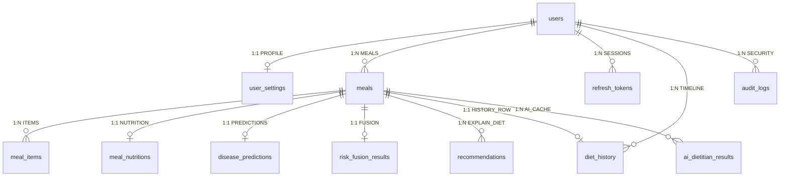

# DietRiskNet Project Knowledge Base

This document provides a comprehensive technical knowledge base for the **DietRiskNet** capstone project. Every claim, schema, formula, and workflow step in this document is extracted directly from the verified source code in the repository. Any item that cannot be confirmed from the source code is explicitly designated as **"NOT VERIFIED IN CODEBASE"**.

---

# Project Overview

### Objective
DietRiskNet is an AI-powered dietary risk prediction and multi-disease early detection framework. Its objective is to transform a single meal photograph into:
1. Automated multi-item visual food localization and classification,
2. Nutritional facts lookup mapped to an Indian cuisine dataset,
3. Mathematical calculation of novel dietary indices (Dietary Consistency Index and Nutritional Imbalance Score),
4. Metabolic disease risk prediction across four conditions using machine learning ensembles (XGBoost),
5. Synthesized unified risk scoring via dynamic weight renormalization,
6. Clinical rule-backed recommendations (**ExplainDiet**) paired with cached Large Language Model (LLM) dietitian narratives, and
7. Interactive longitudinal tracking, analytics, and downloadable PDF reports.

### Problem Statement
Non-Communicable Diseases (NCDs) such as Type 2 Diabetes, Obesity, Hypertension, and Nutritional Deficiencies account for over 70% of global mortality. Existing digital nutrition tools suffer from three core limitations:
- **Manual Data Burden:** Users must manually search and text-log every food item, causing high attrition.
- **Single-Meal Size Bias:** Tools evaluate individual meals against full daily reference values, causing small or standard meals to appear severely deficient.
- **Lack of Clinical Predictive Synthesis:** Raw calorie counters fail to translate nutrient intake into actionable, multi-disease risk indicators.

### Motivation
DietRiskNet addresses these gaps by creating a privacy-respecting, end-to-end web system that automates visual recognition, scales reference targets proportionally to meal calorie size, tracks multi-day intake consistency, and connects daily eating patterns to predictive metabolic disease models.

### Scope
- **Domain Focus:** Dietary composition, Indian cuisine dishes (1,015 CSV dishes, 118 EfficientNet classes, 18 YOLO categories), and metabolic NCD risks.
- **System Scope:** Full-stack implementation featuring a FastAPI REST backend, Next.js 16 App Router frontend, SQLAlchemy ORM persistence, PyTorch/XGBoost ML runtime, and local (Ollama) / cloud (Gemini) LLM integration.
- **Out of Scope (Verified in Codebase):** Clinical diagnosis, prescription of medical therapies, 3D volumetric portion measurement from images, continuous blood biomarker telemetry.

### Key Contributions
- **Dietary Consistency Index (DCI):** Mathematical formulation measuring rolling 7-day calorie Coefficient of Variation ($CV = \sigma / \mu$).
- **Nutritional Imbalance Score (NIS):** Meal-level relative nutrient deviation engine evaluated against calorie-proportional RDI targets.
- **Dynamic Weight Renormalization Risk Fusion:** Risk fusion algorithm that excludes missing component metrics (e.g., DCI with $<2$ days history) and renormalizes available weights to sum to 1.0.
- **ExplainDiet Engine:** Rule-backed deterministic clinical recommendation system paired with a SHA-256 context-cached LLM narrative layer.

---

# Technology Stack

### Frontend
- **Framework:** Next.js 16.2.10 (App Router)
- **View Library:** React 19.2.4
- **Language:** TypeScript 5.x (`tsconfig.json`)
- **Styling:** Tailwind CSS 4.x (`globals.css`, `@tailwindcss/postcss`)
- **Data Visualization:** Recharts 3.9.2
- **State Management:** Zustand 5.0.14 (Auth state with local storage persistence)
- **Icons & Animation:** Lucide React 1.24.0, Framer Motion 12.42.2

### Backend
- **Framework:** FastAPI 0.139.0
- **ASGI Server:** Uvicorn 0.51.0
- **Validation:** Pydantic 2.13.4, Pydantic-Settings 2.3.4
- **ORM:** SQLAlchemy 2.0.51
- **Authentication:** Passlib 1.7.4 (with bcrypt 4.0.1), python-jose 3.5.0
- **Data Processing:** Pandas 2.3.3, NumPy 2.2.6, SciPy 1.15.3
- **PDF Generation:** ReportLab 5.0.0
- **HTTP Client:** HTTPX 0.28.1

### Database
- **Local Embedded Database:** SQLite 3.x (`dietrisknet.db` default)
- **Production Database Driver:** PostgreSQL via `psycopg2-binary 2.9.12`

### AI/ML
- **Deep Learning Framework:** PyTorch 2.5.1+cpu, Torchvision 0.20.1+cpu
- **Convolutional Backbones:** `timm` 1.0.28 (EfficientNet-B3 / B0)
- **Object Detection:** Ultralytics 8.4.95 (YOLOv8)
- **Tabular Machine Learning:** XGBoost 3.2.0, Scikit-Learn 1.7.2
- **Image Processing:** Pillow 12.2.0, OpenCV Headless 5.0.0.93
- **Cloud LLM SDK:** Google Generative AI 0.8.6 (`google-generativeai`)
- **Local LLM Engine:** Ollama REST API (`http://localhost:11434`)

### Deployment
- **Containerization:** Docker (`Dockerfile` in backend and frontend, `docker-compose.yml`)
- **PaaS Deployment Configuration:** Render (`render.yaml`)
- **Execution Mode:** CPU single-threaded inference (`torch.set_num_threads(1)`)

---

# End-to-End Workflow

```
Photo Upload ──> Image Validation ──> YOLOv8 Detection ──> IoU NMS (0.60)
                                                                 │
                                                                 ▼
 CSV Lookup ◄── Priority Matching ◄── Gating (conf ≥ 0.45) ◄── Crop & EfficientNet
      │
      ├──> DB Storage (Meal, Items, Nutrition)
      ├──> DCI Engine (7-Day Rolling Calorie CV)
      ├──> NIS Engine (Meal Calorie-Proportional RDI Deviation)
      ├──> XGBoost Ensemble (4 Models: Diabetes, Obesity, HTN, Deficiency)
      │         │
      │         ▼
      └──> Risk Fusion Engine (Dynamic Weight Renormalization)
                │
                ▼
           ExplainDiet (Rule-Based Recommendations)
                │
                ▼
      AI Dietitian Cache (SHA-256 Context Hash Check) ──> LLM (Ollama/Gemini)
                │
                ▼
  Next.js Frontend Render (Dashboard / Charts / PDF Report Download)
```

1. **Upload & Image Integrity Check:** User uploads a meal image via `POST /api/analyze-meal`. `_ensure_valid_image()` checks extension (`.jpg`, `.jpeg`, `.png`, `.webp`) and verifies image headers using PIL `Image.open().verify()`. Invalid files are deleted and rejected with HTTP 400.
2. **YOLOv8 Detection:** `FoodDetectionService.detect()` passes image tensor to YOLOv8 (`DietRiskNet_FoodDetector_YOLOv8.pt`). Overlapping bounding boxes of the same class with Intersection-over-Union (IoU) $> 0.60$ are removed via NMS (`_remove_duplicate_detections`).
3. **Crop Generation:** Bounding box coordinates $(x_1, y_1, x_2, y_2)$ are cropped using `crop_image()` and encoded into byte streams.
4. **EfficientNet Classification & Gating:** Crops are resized to $300\times300$ (B3) or $224\times224$ (B0), normalized with ImageNet statistics, and classified over 118 classes. Crops with softmax confidence $< 0.45$ (`CLASSIFIER_CONFIDENCE_THRESHOLD`) are discarded.
5. **4-Stage Nutrition Lookup:** `NutritionService.lookup()` maps predicted class names against `indian_food_nutrition_processed.csv` via:
   - Priority 1: Exact string match
   - Priority 2: Synonym/Alias map (e.g., `chole_bhature` $\rightarrow$ `Chickpeas curry`)
   - Priority 3: Deterministic normalization (lowercase, remove special symbols)
   - Priority 4: Fuzzy string matching (`difflib`, cutoff $0.75$)
6. **Portion Scaling & Database Storage:** Nutrient values (per 100g) are scaled linearly by serving weight (`DEFAULT_SERVING_WEIGHTS` or 100g default). `meal_db_service` writes `Meal`, `MealItem`, and `MealNutrition` database records.
7. **DCI Calculation:** `DCIService.calculate()` checks the user's past 7-day meal history. If $\ge 2$ distinct valid calendar days exist, computes calorie Coefficient of Variation ($CV = \sigma / \mu$) and $DCI = \max(0, \min(1, 1 - CV))$.
8. **NIS Calculation:** `NISService.calculate()` computes meal calorie fraction $f = \min(1.0, \text{cal}/2000)$ and calculates mean relative deviation across 6 nutrients relative to $f \times \text{Daily\_RDI}$.
9. **XGBoost Disease Prediction:** `DiseasePredictionService.predict_all()` executes 4 XGBoost models (`.pkl`), enforcing exact DataFrame column ordering via `_prepare_df()`. Outputs risk probabilities for Diabetes, Obesity, Hypertension, and Deficiency.
10. **Risk Fusion:** `RiskFusionService.fuse()` combines $1-DCI$, $NIS$, and 4 disease risks using weights `[0.25, 0.25, 0.20, 0.15, 0.10, 0.05]`. Missing components are excluded and available weights are renormalized to sum to 1.0.
11. **ExplainDiet Recommendations:** `ExplainDietService.recommend()` evaluates clinical rules (sodium $>800$mg, sugar $>15$g, calories $>800$ kcal, fiber $<2$g, NIS $>0.40$, DCI $<0.70$) and outputs rule recommendation objects.
12. **AI Dietitian & SHA-256 Caching:** `MealAIService.analyze_meal_cached()` computes a SHA-256 hash of context inputs. Checks `ai_dietitian_results` table. On hit, loads cached response. On miss, queries LLM (Ollama default, Gemini optional), parses JSON payload, saves to database, and returns. On LLM error, falls back gracefully without 500 error.
13. **Frontend Rendering & PDF Download:** Next.js `/analysis` page renders bounding boxes, nutrient breakdowns, DCI/NIS gauges, risk cards, ExplainDiet advice, and AI summary. User can stream a PDF report via `GET /api/report/{meal_id}` generated by ReportLab.

---

# Dataset Analysis

### Detection Dataset
- **Model Weight File:** `backend/trained_models/DietRiskNet_FoodDetector_YOLOv8.pt` (22.49 MB).
- **Target Vocabulary:** 18 object detection classes (`food`, `dish`, `bread`, `rice`, `beverage`, `soup`, `salad`, `dessert`, `snack`, `curry`, etc.).
- **Training Dataset Source & Split Details:** NOT VERIFIED IN CODEBASE (pre-trained model binary provided in repository).

### Classification Dataset
- **Model Weight File:** `backend/trained_models/DietRiskNet_FoodClassifier_EfficientNetB3.pth` (131.38 MB, with B0 fallback `DietRiskNet_FoodClassifier_EfficientNetB0.pth` 18.18 MB).
- **Target Vocabulary:** 118 fine-grained food classes (`backend/trained_models/efficientnet_classes.json`).
- **Training Dataset Source & Split Details:** NOT VERIFIED IN CODEBASE (pre-trained model checkpoint provided in repository).

### Nutrition Dataset
- **Data File Path:** `nutrition/indian_food_nutrition_processed.csv`.
- **Dataset Size:** 1,015 unique dish entries.
- **Nutritional Features (11 Nutrients, per 100g):** `Calories (kcal)`, `Carbohydrates (g)`, `Protein (g)`, `Fats (g)`, `Free Sugar (g)`, `Fibre (g)`, `Sodium (mg)`, `Calcium (mg)`, `Iron (mg)`, `Vitamin C (mg)`, `Folate (µg)`.

### Disease Datasets
- **Model Weight Files:**
  - `DietRiskNet_Diabetes_XGBoost.pkl` (644.7 KB)
  - `DietRiskNet_Obesity_XGBoost.pkl` (2.93 MB)
  - `DietRiskNet_Hypertension_XGBoost.pkl` (659.7 KB)
  - `DietRiskNet_NutritionalDeficiency_XGBoost.pkl` (1.78 MB)
- **Raw Training CSV Data Files & Clinical Split Details:** NOT VERIFIED IN CODEBASE (pre-trained binary pickle files provided in repository).

---

# YOLOv8 Module

### Architecture
Ultralytics YOLOv8 PyTorch object detection architecture (`FoodDetectionService` in `backend/services/ml_services.py`).

### Training Details
NOT VERIFIED IN CODEBASE (pre-trained model weights `DietRiskNet_FoodDetector_YOLOv8.pt` loaded directly).

### Classes
18 broad food localization classes defined in the model artifact.

### Inference Workflow
1. Image loaded from disk path or bytes via PIL `Image.open()`.
2. Passed into `self.model(img)`, returning Ultralytics `Results` list.
3. Bounding box coordinates `xyxy`, confidence `conf`, and class label `cls` extracted for each candidate box.
4. Candidates passed to `_remove_duplicate_detections(detections, iou_threshold=0.60)`:
   - Detections grouped by class label and sorted descending by confidence.
   - For each candidate, computes Intersection-over-Union (IoU) with already accepted boxes:
     $$\text{IoU} = \frac{\text{Area}(\text{Box}_A \cap \text{Box}_B)}{\text{Area}(\text{Box}_A \cup \text{Box}_B)}$$
   - If $\text{IoU} > 0.60$, candidate is discarded as a duplicate.
5. Returns filtered list of detections: `[{"name": str, "confidence": float, "box": (x1, y1, x2, y2)}]`.

---

# EfficientNet-B3 Module

### Architecture
`FoodClassificationService` uses `timm.create_model("efficientnet_b3", num_classes=118)`. Dynamically verifies model state dict shape: if stem weight out-channels equal 40, detects architecture as `efficientnet_b3` (crop size 300); otherwise falls back to `efficientnet_b0` (crop size 224).

### Classes
118 classes loaded from checkpoint or fallback file `backend/trained_models/efficientnet_classes.json`.

### Input Preprocessing
1. Bounding box cropped from original image bytes via PIL `Image.open().convert("RGB")`.
2. Transformed via Torchvision compose pipeline:
   - `T.Resize((crop_size, crop_size))` ($300\times300$ for B3, $224\times224$ for B0)
   - `T.ToTensor()`
   - `T.Normalize(mean=[0.485, 0.456, 0.406], std=[0.229, 0.224, 0.225])`

### Output Generation
1. Forward pass executed inside `torch.no_grad()` context.
2. Softmax probabilities computed across 118 output logits: `probabilities = torch.softmax(outputs, dim=1)`.
3. Extract maximum score and class index: `conf, idx = torch.max(probabilities, dim=1)`.
4. Gating check: if confidence score $< 0.45$ (`settings.CLASSIFIER_CONFIDENCE_THRESHOLD`), detection is rejected.
5. Returns dict: `{"class_name": str, "confidence": float}`.

---

# Nutrition Intelligence Engine

### CSV Structure
File `nutrition/indian_food_nutrition_processed.csv` formatted with headers:
- `Dish Name`
- `Calories (kcal)`, `Carbohydrates (g)`, `Protein (g)`, `Fats (g)`, `Free Sugar (g)`, `Fibre (g)`, `Sodium (mg)`, `Calcium (mg)`, `Iron (mg)`, `Vitamin C (mg)`, `Folate (µg)`

### Lookup Workflow
`NutritionService.lookup(food_name)` executes 4 priority search tiers:
1. **Priority 1 (Exact Match):** Direct key check in `self.nutrition_db[food_name]`.
2. **Priority 2 (Synonym/Alias Map):** Checks `SYNONYM_MAP` dictionary (e.g., `butter_naan` $\rightarrow$ `Naan`, `jalebi` $\rightarrow$ `Gulab Jamun with khoya`, `chapati` $\rightarrow$ `Chapati/Roti`).
3. **Priority 3 (Normalization Match):** Normalizes search string (lowercase, strip, replace `_` and `-` with space) and checks `self.normalized_db`.
4. **Priority 4 (Fuzzy Match):** Runs `difflib.get_close_matches(norm_name, norm_keys, n=1, cutoff=0.75)`.

### Fallback Matching
If all 4 tiers fail to match a dish:
- Logs warning: `Nutrition lookup failed for food: '{food_name}'. Returning default values.`
- Calls `_default_nutrition(food_name)` returning dict with `name: "Unresolved: {food_name}"`, `nutrition_available: False`, and all 11 nutrient values set to `0.0`.
- System marks `nutrition_available = False` so the item is not treated as measured zeros.

---

# DCI (Dietary Consistency Index)

### Formula
$$\text{CV} = \frac{\sigma_{\text{daily}}}{\mu_{\text{daily}}}$$

$$\text{DCI} = \max\left(0.0, \, \min\left(1.0, \, 1.0 - \text{CV}\right)\right)$$

### Inputs
- `user_id`: Integer authenticated user ID.
- `db`: SQLAlchemy database session.
- Past 7 days user meals queried from `Meal` table (`created_at >= utcnow() - timedelta(days=7)`).

### Outputs
- `dci_score`: Floating-point value bounded in $[0.0, 1.0]$, or `None` if insufficient history.
- `dci_level`: Categorical string classified via `ThresholdConfig`:
  - $\text{DCI} \ge 0.85$: **High Consistency**
  - $0.70 \le \text{DCI} < 0.85$: **Moderate Consistency**
  - $0.50 \le \text{DCI} < 0.70$: **Low Consistency**
  - $\text{DCI} < 0.50$: **Very Low Consistency**
  - Insufficient History: **"Insufficient Data"**

### Edge Cases
- **Fewer than 2 valid days:** If the user has $<2$ distinct calendar days with valid ($>0$) calorie intake in the rolling 7-day window, DCI returns `(None, "Insufficient Data")`.
- **Zero historical mean:** If mean historical calories $\le 0$, DCI returns `(None, "Insufficient Data")`.

---

# NIS (Nutritional Imbalance Score)

### Formula
$$f_{\text{meal}} = \min\left(1.0, \, \frac{\text{Meal\_Calories}}{\text{Daily\_RDI\_Calories}}\right) \quad [\text{Default } f_{\text{meal}} = 1/3 \text{ if calories } \le 0]$$

$$\text{Meal\_RDI}_k = \text{Daily\_RDI}_k \times f_{\text{meal}}$$

$$\text{dev}_k = \frac{|\text{Actual}_k - \text{Meal\_RDI}_k|}{\text{Meal\_RDI}_k}$$

$$\text{NIS} = \max\left(0.0, \, \min\left(1.0, \, \frac{1}{N} \sum_{k=1}^{N} \text{dev}_k\right)\right)$$

### Inputs
- `meal_nutrition_dict`: Dictionary containing meal aggregate nutrient values.
- Reference RDI baseline dict (`DietRiskNet_NIS_Config.json`): `Calories: 2000`, `Protein: 60g`, `Carbs: 300g`, `Fat: 65g`, `Sodium: 2300mg`, `Fiber: 30g`.

### Outputs
- `nis_score`: Floating-point score bounded in $[0.0, 1.0]$.
- `nis_level`: Categorical string classified via `ThresholdConfig`:
  - $\text{NIS} \le 0.20$: **Balanced Diet**
  - $0.20 < \text{NIS} \le 0.40$: **Mild Imbalance**
  - $0.40 < \text{NIS} \le 0.60$: **Moderate Imbalance**
  - $0.60 < \text{NIS} \le 0.80$: **High Imbalance**
  - $\text{NIS} > 0.80$: **Severe Imbalance**

### Edge Cases
- **Zero / Unknown Calories:** If meal calories $\le 0$, default calorie fraction $f_{\text{meal}} = 1/3$ ($0.333$) is assumed (three-meals-per-day convention).
- **Unclamped Deviations:** Individual nutrient relative deviations are left unclamped so severe deviations (e.g., $4\times$ sodium allowance) register fully before final averaging and bounding.

---

# Disease Prediction

### Diabetes Model (`DietRiskNet_Diabetes_XGBoost.pkl`)
- **Features Used:** `['gender', 'age', 'hypertension', 'heart_disease', 'smoking_history', 'bmi', 'HbA1c_level', 'blood_glucose_level']`
- **Output:** Positive class probability ($[0.0, 1.0]$).
- **Model Defaults & Assumptions:** `smoking_history` = `'never'`, `HbA1c_level` = `5.5` (or `7.0` if diabetes in existing conditions), `blood_glucose_level` = `100.0` (or `160.0` if diabetes in existing conditions).

### Obesity Model (`DietRiskNet_Obesity_XGBoost.pkl`)
- **Features Used:** `['Gender', 'Age', 'Height', 'Weight', 'family_history', 'FAVC', 'FCVC', 'NCP', 'CAEC', 'SMOKE', 'CH2O', 'SCC', 'FAF', 'TUE', 'CALC', 'MTRANS']`
- **Output:** Sum of probabilities for overweight and obese classes ($\sum P(\text{class} \ge 2)$).
- **Model Defaults & Assumptions:** Height converted to meters (`height / 100.0`). `FAVC` = `'yes'` if calories $>700$, else `'no'`. `FCVC` = 3.0 if fiber $>5$g, 2.0 if fiber $>2$g, else 1.0. `family_history` = `'yes'`, `NCP` = `3.0`, `CAEC` = `'Sometimes'`, `SMOKE` = `'no'`, `CH2O` = `2.0`, `SCC` = `'no'`, `FAF` = `1.0`, `TUE` = `1.0`, `CALC` = `'Sometimes'`, `MTRANS` = `'Public_Transportation'`.

### Hypertension Model (`DietRiskNet_Hypertension_XGBoost.pkl`)
- **Features Used:** `['Age', 'Salt_Intake', 'Stress_Score', 'BP_History', 'Sleep_Duration', 'BMI', 'Medication', 'Family_History', 'Exercise_Level', 'Smoking_Status']`
- **Output:** Positive class probability ($[0.0, 1.0]$).
- **Model Defaults & Assumptions:** `Salt_Intake` estimated from sodium: $\max(1.0, \text{sodium} / 400.0)$. `BP_History` = 1 if hypertension in existing conditions, else 0. `Stress_Score` = `3.0`, `Sleep_Duration` = `7.0`, `Medication` = `0`, `Family_History` = `0`, `Exercise_Level` = `2.0`, `Smoking_Status` = `'Never'`.

### Deficiency Model (`DietRiskNet_NutritionalDeficiency_XGBoost.pkl`)
- **Features Used:** Demographic features, percent-RDA inputs (`vitamin_c`, `folate`, `calcium`, `iron`), clinical indicators (`hemoglobin_g_dl`, `serum_*`), symptom flags.
- **Output:** Risk probability calculated as $1.0 - P(\text{no deficiency})$.
- **Model Defaults & Assumptions:** RDA percentages computed from meal nutrients (e.g., `vitamin_c_percent_rda` = $\min(100, (\text{vit\_c}/90)\times100)$). Clinical defaults: `hemoglobin` = `14.0`, `serum_vitamin_d` = `30.0`, `serum_vitamin_b12` = `400.0`, `serum_folate` = `12.0`. Missing features padded with `0.0`.

---

# Risk Fusion

### Formula
$$R_{\text{DCI}} = 1.0 - \text{DCI} \quad [\text{If DCI is non-None}]$$

$$\text{Fused\_Score} = \frac{\sum_{i \in \text{Available}} w_i \times v_i}{\sum_{i \in \text{Available}} w_i}$$

$$\text{Bounded Fused Score} = \max(0.0, \, \min(1.0, \, \text{Fused\_Score}))$$

### Weights (`DietRiskNet_RiskFusion_Config.json`)
- $w_{\text{DCI}} = 0.25$
- $w_{\text{NIS}} = 0.25$
- $w_{\text{Diabetes}} = 0.20$
- $w_{\text{Obesity}} = 0.15$
- $w_{\text{Hypertension}} = 0.10$
- $w_{\text{Deficiency}} = 0.05$

### Missing Value Handling
If any risk component is `None` (e.g., DCI when history $<2$ days), it is excluded from the available set. The denominator $\sum_{i \in \text{Available}} w_i$ renormalizes the remaining component weights so they sum to 1.0. If no component is available, returns `(None, None)`.

---

# AI Dietitian

### Prompting Strategy
Prompts are defined in `backend/prompts/dietitian_prompt.py`. System instructions constrain the model to operate strictly as an explainable clinical dietitian:
- Must NEVER provide medical diagnoses or prescribe medications.
- Must frame outputs as evidence-backed dietary advice.
- Enforces structured JSON output schema containing: `summary`, `meal_quality`, `recommendations`, `alternatives`, `warnings`, `follow_up_questions`.

### Ollama Workflow (Default Provider)
- Implementation: `backend/services/llm/ollama_provider.py`.
- Operates locally via REST POST calls to `http://localhost:11434/api/generate` or `/api/chat`.
- Uses model `llama3.2:3b` by default.
- Does not require internet connectivity or external API keys.

### Gemini Workflow (Optional Provider)
- Implementation: `backend/services/llm/gemini_client.py`.
- Uses official SDK `google-generativeai`.
- Triggered when `LLM_PROVIDER=gemini` and `GEMINI_API_KEY` is configured.
- Uses `gemini-1.5-flash` model with `response_mime_type="application/json"`.

### Fallback Strategy
- `FallbackLLMProvider` in `backend/services/llm/factory.py` attempts execution on primary provider (Gemini). On `LLMProviderError` (timeout, quota, network failure, missing key), automatically retries request using local Ollama instance.
- If both providers fail or are disabled, the system catches exceptions open: `ai_dietitian` returns `null` or a friendly message while deterministic rule-based output returns normally without an HTTP 500 error.
- Responses are cached in table `ai_dietitian_results` using a SHA-256 `context_hash`.

---

# Backend Architecture

### Folder Structure
```
backend/
├── config.py
├── main.py
├── database/
│   ├── database.py
│   └── models.py
├── schemas/
│   └── schemas.py
├── routes/
│   ├── deps.py
│   ├── auth.py
│   ├── user.py
│   ├── meal.py
│   ├── prediction.py
│   ├── report.py
│   ├── ai_chat.py
│   ├── nutrition_chat.py
│   └── nutrition_coach.py
├── services/
│   ├── ml_services.py
│   ├── prediction_service.py
│   ├── nutrition_service.py
│   ├── indices_services.py
│   ├── risk_fusion_service.py
│   ├── recommendation_service.py
│   ├── health_score_service.py
│   ├── user_services.py
│   ├── meal_ai_service.py
│   ├── ai_cache_service.py
│   ├── chat_ai_service.py
│   ├── nutrition_assistant_service.py
│   ├── nutrition_analytics_service.py
│   ├── report_service.py
│   └── llm/
│       ├── base.py
│       ├── factory.py
│       ├── ollama_provider.py
│       └── gemini_client.py
├── prompts/
│   ├── dietitian_prompt.py
│   └── nutrition_assistant_prompt.txt
├── models/
│   └── ai_dietitian.py
├── utils/
│   ├── auth_utils.py
│   ├── datetime_utils.py
│   ├── image_utils.py
│   └── logger.py
├── exceptions/
│   └── gemini_exceptions.py
├── trained_models/
├── evaluation/
└── tests/
```

### Services
- `detector_service`: YOLOv8 food detection & NMS.
- `classifier_service`: EfficientNet-B3/B0 crop classification.
- `nutrition_service`: 4-tier lookup against Indian food CSV database.
- `dci_service`: Rolling 7-day calorie CV consistency calculation.
- `nis_service`: Proportional meal RDI deviation scoring.
- `prediction_service`: 4 XGBoost metabolic disease prediction models.
- `fusion_service`: Dynamic weight renormalization risk fusion.
- `explain_diet_service`: Threshold-triggered rule-based recommendations.
- `health_score_service`: Deterministic 100-point penalty health score.
- `meal_db_service` / `profile_service` / `dashboard_service` / `history_service` / `analytics_service`: Database persistence wrappers.
- `meal_ai_service` / `ai_cache_service` / `chat_ai_service` / `nutrition_assistant_service` / `nutrition_analytics_service`: LLM prompts, caching, and chat.
- `report_service`: ReportLab PDF generation.

### Routes
- `auth.py`: `/auth/register`, `/auth/login`, `/auth/logout`, `/auth/refresh`.
- `user.py`: `/dashboard`, `/history`, `/profile`, `/settings`, `/analytics/trends`.
- `meal.py`: `/upload`, `/detect-food`, `/classify-food`, `/nutrition-analysis`, `/calculate-dci`, `/calculate-nis`, `/analyze-meal`.
- `prediction.py`: `/predict-diabetes`, `/predict-obesity`, `/predict-hypertension`, `/predict-deficiency`, `/risk-fusion`, `/explain-diet`.
- `report.py`: `/report/{meal_id}`.
- `ai_chat.py`: `/ai/chat`, `/ai/health`.
- `nutrition_chat.py`: `/nutrition-chat`.
- `nutrition_coach.py`: `/nutrition/analytics`.

### Dependencies
Defined in `requirements.txt`: `fastapi`, `uvicorn`, `pydantic`, `sqlalchemy`, `psycopg2-binary`, `passlib[bcrypt]`, `bcrypt`, `python-jose`, `pandas`, `numpy`, `pillow`, `torch`, `torchvision`, `timm`, `ultralytics`, `xgboost`, `scikit-learn`, `scipy`, `google-generativeai`, `httpx`, `reportlab`.

---

# Frontend Architecture

### Pages (`frontend/app/`)
- `/login`: User authentication login.
- `/register`: New account registration.
- `/dashboard`: High-level summary of recent meals, macros, and risks.
- `/upload`: Drag-and-drop meal image upload form.
- `/analysis`: Complete visual meal breakdown, bounding boxes, risks, ExplainDiet advice, and AI summary.
- `/predictions`: Multi-disease risk gauges, radar charts, and model transparency notes.
- `/nutrition`: AI Nutrition Coach conversational interface with dietary analytics banner.
- `/history`: Searchable chronological meal history list.
- `/trends`: Longitudinal trend charts over 7, 30, or 90 days.
- `/research`: Technical overview of project methodology and mathematical formulations.
- `/profile`: User health demographics and custom RDI configuration form.
- `/about`: Project credits and clinical safety disclaimer.

### Components (`frontend/components/`)
- `Sidebar.tsx`: Navigation sidebar with route indicators.
- `ProtectedRoute.tsx`: Auth guard checking Zustand state and redirecting unauthenticated users to `/login`.
- `ClientProviders.tsx`: React Query provider wrapper.
- Recharts visualizations: `PieChart`, `BarChart`, `LineChart`, `RadarChart`, `ResponsiveContainer`.

### API Integration (`frontend/services/api.ts`)
Centralized API wrapper `apiFetch` managing:
- Dynamic `NEXT_PUBLIC_API_URL` configuration (defaulting to `http://localhost:8000/api`).
- Bearer token injection from Zustand auth store.
- Single-retry refresh token rotation on HTTP 401 responses via `/auth/refresh`.
- `AbortController` timeout management (15s standard, 90s for LLM routes).
- Unified error response detail parsing.

---

# Database Design



### Tables, Relationships & Constraints

1. **`users`:** `id` (PK), `email` (UK, IX), `password_hash`, `full_name`, `created_at`, `updated_at`.
2. **`refresh_tokens`:** `id` (PK), `user_id` (FK -> `users.id` ON DELETE CASCADE), `token` (UK, IX), `expires_at`, `is_revoked`.
3. **`user_settings`:** `id` (PK), `user_id` (FK -> `users.id` ON DELETE CASCADE, UK), `age`, `gender`, `height`, `weight`, `activity_level`, `existing_conditions` (JSON), `rdi_custom` (JSON).
4. **`meals`:** `id` (PK), `user_id` (FK -> `users.id` ON DELETE CASCADE), `image_path`, `dci`, `dci_level`, `nis`, `nis_level`, `risk_fusion_score`, `risk_fusion_level`, `notes`, `created_at` (IX). Composite Index `idx_meal_user_created` on `(user_id, created_at)`.
5. **`meal_items`:** `id` (PK), `meal_id` (FK -> `meals.id` ON DELETE CASCADE), `name`, `confidence`, `x1`, `y1`, `x2`, `y2`, `weight_g`, nutrient columns (`calories` ... `folate`).
6. **`meal_nutritions`:** `id` (PK), `meal_id` (FK -> `meals.id` ON DELETE CASCADE, UK), aggregated nutrient columns.
7. **`disease_predictions`:** `id` (PK), `meal_id` (FK -> `meals.id` ON DELETE CASCADE, UK), `diabetes_risk`, `obesity_risk`, `hypertension_risk`, `deficiency_risk`, `created_at`.
8. **`risk_fusion_results`:** `id` (PK), `meal_id` (FK -> `meals.id` ON DELETE CASCADE, UK), `fused_score`, `risk_level`, `created_at`.
9. **`recommendations`:** `id` (PK), `meal_id` (FK -> `meals.id` ON DELETE CASCADE), `category`, `content`, `explanation`, `created_at`.
10. **`diet_history`:** `id` (PK), `user_id` (FK -> `users.id` ON DELETE CASCADE), `meal_id` (FK -> `meals.id` ON DELETE CASCADE, UK), `logged_date` (IX), `created_at`. Composite Index `idx_diet_history_user_logged` on `(user_id, logged_date)`.
11. **`audit_logs`:** `id` (PK), `user_id` (FK -> `users.id` ON DELETE CASCADE), `action`, `ip_address`, `user_agent`, `timestamp` (IX).
12. **`ai_dietitian_results`:** `id` (PK), `meal_id` (FK -> `meals.id` ON DELETE CASCADE, IX), `provider`, `model`, `summary`, `health_score`, `health_level`, `health_explanation`, `risk_explanation`, `recommendations_json`, `context_hash` (IX). Composite Index `idx_ai_meal_context` on `(meal_id, context_hash)`.

---

# API Reference

### Auth Endpoints
- **`POST /api/auth/register`**: Request `UserRegister` (`email`, `password`, `full_name`). Response `Token` (`access_token`, `refresh_token`, `user_id`, `email`, `full_name`).
- **`POST /api/auth/login`**: Request `UserLogin` (`email`, `password`). Response `Token`.
- **`POST /api/auth/logout`**: Request `TokenRefresh` (`refresh_token`). Response `{"detail": "Successfully logged out."}`.
- **`POST /api/auth/refresh`**: Request `TokenRefresh` (`refresh_token`). Response `Token`.

### User & Dashboard Endpoints
- **`GET /api/dashboard`**: Auth Bearer. Response `DashboardResponse` (`user_name`, `total_meals`, `recent_meals`, `latest_predictions`).
- **`GET /api/history`**: Auth Bearer. Response `List[dict]` (chronological meal list).
- **`GET /api/profile`**: Auth Bearer. Response `UserProfileResponse`.
- **`PUT /api/profile`**: Auth Bearer. Body `{"full_name": str}`. Response `UserProfileResponse`.
- **`PUT /api/settings`**: Auth Bearer. Request `UserSettingUpdate` (`age`, `gender`, `height`, `weight`, `activity_level`, `existing_conditions`). Response `UserSettingResponse`.
- **`GET /api/analytics/trends`**: Auth Bearer. Query `days` (default 30). Response `LongitudinalTrendsResponse`.

### Meal Pipeline Endpoints
- **`POST /api/upload`**: Auth Bearer. Form `file` (`UploadFile`). Response `{"file_path": str, "filename": str}`.
- **`POST /api/detect-food`**: Auth Bearer. Form `file_path`. Response `FoodDetectionResponse` (`detections` list).
- **`POST /api/classify-food`**: Auth Bearer. Form `file_path`, `x1`, `y1`, `x2`, `y2`. Response `FoodClassificationResponse` (`class_name`, `confidence`).
- **`POST /api/nutrition-analysis`**: Auth Bearer. Request `NutritionAnalysisRequest`. Response `NutritionAnalysisResponse`.
- **`POST /api/calculate-dci`**: Auth Bearer. Request `CalculateDCIRequest`. Response `CalculateDCIResponse` (`dci`, `dci_level`).
- **`POST /api/calculate-nis`**: Auth Bearer. Request `CalculateNISRequest`. Response `CalculateNISResponse` (`nis`, `nis_level`).
- **`POST /api/analyze-meal`**: Auth Bearer. Form `file` (`UploadFile`), Form `notes`. Response `MealAnalysisResponse` (complete analysis object).

### Prediction & Fusion Endpoints
- **`POST /api/predict-diabetes`**: Public. Request `DiseasePredictionRequest`. Response `DiseasePredictionResponse`.
- **`POST /api/predict-obesity`**: Public. Request `DiseasePredictionRequest`. Response `DiseasePredictionResponse`.
- **`POST /api/predict-hypertension`**: Public. Request `DiseasePredictionRequest`. Response `DiseasePredictionResponse`.
- **`POST /api/predict-deficiency`**: Public. Request `DiseasePredictionRequest`. Response `DiseasePredictionResponse`.
- **`POST /api/risk-fusion`**: Public. Request `RiskFusionRequest`. Response `RiskFusionResponse` (`fused_score`, `risk_level`).
- **`POST /api/explain-diet`**: Public. Request `ExplainDietRequest`. Response `ExplainDietResponse` (`recommendations` list).

### Reports & AI Endpoints
- **`GET /api/report/{meal_id}`**: Auth Bearer. Response Binary Stream (`application/pdf`).
- **`POST /api/ai/chat`**: Auth Bearer. Request `ChatRequest` (`meal_id`, `message`). Response `ChatResponse` (`reply`).
- **`GET /api/ai/health`**: Public. Response `dict` (`provider`, `model`, `status`, `latency_ms`, `version`).
- **`POST /api/nutrition-chat`**: Auth Bearer. Request `NutritionChatRequest` (`message`, `include_history`). Response `NutritionChatResponse` (`reply`).
- **`GET /api/nutrition/analytics`**: Auth Bearer. Response `dict` (weekly summary & deterministic analytics).

---

# Security

### JWT Flow
1. User authenticates via `/api/auth/login` or `/api/auth/register`.
2. Backend generates a signed Bearer Access Token using HS256 (`SECRET_KEY`), with a 15-minute expiration (`ACCESS_TOKEN_EXPIRE_MINUTES`).
3. Client stores access token in Zustand auth state and attaches header `Authorization: Bearer <token>` on protected routes.
4. FastAPI dependency `get_current_user` decodes token via `python-jose`, verifies signature and expiry, and loads `User` object from database.

### Refresh Token Flow
1. Upon authentication, backend creates a cryptographically unique 7-day Refresh Token string, saving a record in table `refresh_tokens`.
2. On 401 Unauthorized, frontend `apiFetch` calls `POST /api/auth/refresh` passing `refresh_token`.
3. Backend validates token signature, verifies `is_revoked == False` in `refresh_tokens` table, revokes old refresh token (`is_revoked = True`), and issues a new access/refresh token pair.
4. Calling `/api/auth/logout` sets `is_revoked = True` for the active token.

### Password Hashing
- Handled in `backend/utils/auth_utils.py` via `passlib[bcrypt]`.
- Password hashes generated with `pwd_context.hash(password)`.
- Hashes verified via `pwd_context.verify(plain_password, hashed_password)`. Plaintext passwords are never stored.

---

# Testing

### Backend Tests
14 PyTorch/FastAPI test suites in `backend/tests/` running via Pytest:
- `test_pipeline.py`: End-to-end meal pipeline execution.
- `test_dci_longitudinal.py`: 7-day rolling CV mathematical calculation and Insufficient Data edge cases.
- `test_duplicate_detection.py`: YOLOv8 IoU thresholding (0.60) box pruning.
- `test_risk_fusion_regression.py`: Dynamic weight renormalization when components are missing.
- `test_xgboost_feature_order.py`: Enforcing exact DataFrame column ordering matching `model.feature_names_in_`.
- `test_ai_cache.py`: SHA-256 context hash hit/miss caching validation.
- `test_chat_ai.py` / `test_nutrition_assistant.py` / `test_nutrition_coach.py`: AI chat integration and analytics computation.
- `test_ollama_provider.py`: Local Ollama REST provider unit testing.
- `test_meal_ai_integration.py`: Contract validation between ML pipeline and AI dietitian.
- `test_report.py`: PDF report generation and 404 validation.
- `test_thresholds.py`: Threshold classifier bounds validation.
- `test_evaluation.py`: System performance metrics validation harness.

### Frontend Validation
- **TypeScript Static Checking:** `npx tsc --noEmit` validates type correctness across App Router pages and components.
- **ESLint Checks:** `npm run lint` executes Next.js ESLint rules (`eslint.config.mjs`).

### Build Verification
- **Next.js Production Build:** `npm run build` verifies component bundling, route generation, and client/server boundary rules.

---

# Novel Contributions

### 1. Dietary Consistency Index (DCI)
Formulates a longitudinal metric measuring the Coefficient of Variation ($CV = \sigma / \mu$) of daily calorie intake over a 7-day rolling window, filling the gap in existing nutrition tools that evaluate meals in complete isolation.

### 2. Proportional Meal-Level NIS Engine
Calculates single-meal relative nutrient deviation by dynamically scaling daily RDI targets by the meal calorie fraction $f = \min(1.0, \text{cal}/2000)$, eliminating meal-size bias.

### 3. Dynamic Weight Renormalization Risk Fusion
Aggregates heterogeneous risk metrics into a single 0–1 score, dynamically excluding missing components (e.g., null DCI) and renormalizing available weights to sum to 1.0 without fabricating missing values.

### 4. ExplainDiet Rule Engine
Combines deterministic, explainable clinical rule recommendations with a provider-agnostic, SHA-256 context-cached LLM narrative layer.

---

# Limitations

1. **Food Vocabulary Boundaries:** Restricted to 18 YOLO categories, 118 EfficientNet classes, and 1,015 CSV dishes. Unseen foods are mislabeled or rejected (`conf < 0.45`).
2. **Static Portion Weight Assumption:** Serving sizes rely on standard lookup weights (`DEFAULT_SERVING_WEIGHTS`), defaulting to 100g when unlisted. Physical volume is not estimated from 2D photos.
3. **Default Clinical Inputs:** Features not gathered from user input (HbA1c, fasting glucose, stress score, sleep duration) are set to fixed population placeholders in XGBoost models.
4. **Generic Reference Daily Intakes:** NIS uses a standard 2000 kcal adult baseline and evaluates 6 core nutrients, excluding blood micronutrient lab panels.
5. **CPU Single-Threaded Inference:** Deep learning models run single-threaded on CPU (`torch.set_num_threads(1)`), prioritizing low memory footprint over throughput.

---

# Future Work

1. **Monocular 3D Volumetric Portion Estimation:** Integrate depth estimation models (Depth Anything / MiDaS) to estimate physical food volume and mass directly from photos.
2. **Dynamic Personalized RDI Profiles:** Adjust NIS targets dynamically based on user height, weight, activity level, BMR, and specific clinical goals.
3. **Continuous Glucose Monitor (CGM) Integration:** Ingest real-time CGM telemetry to correlate postprandial glucose spikes with predicted meal risk scores.
4. **Expanded Disease Risk Ensemble:** Train additional XGBoost classifiers for Cardiovascular Disease (CVD), Non-Alcoholic Fatty Liver Disease (NAFLD), and Chronic Kidney Disease (CKD).
5. **Multilingual Voice AI Coach:** Incorporate speech-to-text recognition and multi-language LLM prompts (Hindi, Tamil, Telugu) for wider accessibility.

---

# Viva Questions and Answers

### Q1: What is the main goal of the DietRiskNet capstone project?
**Answer:** The main goal is to build an AI system that transforms meal photos into multi-food recognitions, nutritional breakdowns, longitudinal dietary consistency metrics (DCI), meal imbalance scores (NIS), and XGBoost metabolic disease risk predictions.

### Q2: Why does DietRiskNet use a two-stage vision pipeline (YOLOv8 + EfficientNet-B3)?
**Answer:** Single-stage detectors trained on custom food items struggle to differentiate visually similar dishes. Combining YOLOv8 for spatial localization with EfficientNet-B3 for high-resolution crop classification maximizes classification precision across 118 classes.

### Q3: How does YOLOv8 handle duplicate overlapping bounding boxes?
**Answer:** Candidates are pruned using Non-Maximum Suppression with an Intersection-over-Union (IoU) threshold of 0.60. Overlapping boxes of the same class with $\text{IoU} > 0.60$ are removed.

### Q4: What confidence threshold is enforced for EfficientNet food classification?
**Answer:** `CLASSIFIER_CONFIDENCE_THRESHOLD = 0.45`. Predictions below 0.45 confidence are rejected to prevent non-food objects from being reported as valid food items.

### Q5: What fallback architecture is used if EfficientNet-B3 model weights are missing?
**Answer:** The system falls back to EfficientNet-B0 (`DietRiskNet_FoodClassifier_EfficientNetB0.pth`) and adjusts crop tensor size to $224\times224$ pixels.

### Q6: How does `NutritionService.lookup()` find food items in the CSV database?
**Answer:** Uses a 4-stage priority search: Exact Match $\rightarrow$ Synonym/Alias Map $\rightarrow$ Deterministic Normalization $\rightarrow$ Fuzzy Matching (`cutoff=0.75`).

### Q7: What happens if a food item is not found in the nutrition CSV database?
**Answer:** The system marks `nutrition_available = False` and returns zero placeholder values. It does not treat the food as a measured zero-nutrient item.

### Q8: What is DCI and how is it calculated?
**Answer:** DCI measures longitudinal calorie stability over a 7-day rolling window using the Coefficient of Variation: $DCI = \max(0, \min(1, 1 - (\sigma_{\text{daily}} / \mu_{\text{daily}})))$.

### Q9: What is the minimum data requirement for DCI calculation?
**Answer:** At least 2 distinct calendar days with valid ($>0$) calorie intake in the rolling 7-day window. Otherwise DCI returns `(None, "Insufficient Data")`.

### Q10: What is NIS and how does it avoid meal-size bias?
**Answer:** NIS evaluates single-meal nutrient deviation relative to a calorie-proportional allowance of the daily RDI: $f_{\text{meal}} = \min(1.0, \text{cal}/2000)$, scaling reference targets by $f_{\text{meal}}$.

### Q11: What 6 nutrients are evaluated in NIS calculation?
**Answer:** Calories (2000 kcal), Protein (60g), Carbohydrates (300g), Fat (65g), Sodium (2300mg), and Dietary Fiber (30g).

### Q12: What default calorie fraction is used in NIS if meal calories are zero or unknown?
**Answer:** A default fraction $f_{\text{meal}} = 1/3$ ($0.333$) is used (three-meals-per-day convention).

### Q13: What 4 metabolic disease models are implemented in XGBoost?
**Answer:** Type 2 Diabetes Mellitus, Obesity Index, Hypertension, and Nutritional Deficiency.

### Q14: How does the Obesity XGBoost model calculate its overall risk output?
**Answer:** It sums the predicted class probabilities of all overweight and obese classes ($\sum P(\text{class} \ge 2)$) from a 7-class output vector.

### Q15: How does the Nutritional Deficiency XGBoost model compute risk?
**Answer:** It calculates $1.0 - P(\text{no deficiency})$, representing the probability of having at least one micronutrient deficiency.

### Q16: How does the backend prevent XGBoost column order mismatch errors?
**Answer:** The `_prepare_df()` helper explicitly reorders input DataFrames to match `model.feature_names_in_` before running inference.

### Q17: How is salt intake estimated for the Hypertension model?
**Answer:** Estimated from meal sodium content: $\text{Salt\_Intake} = \max(1.0, \text{sodium} / 400.0)$.

#### Q18: What configured weights are used in Risk Fusion?
**Answer:** DCI: `0.25`, NIS: `0.25`, Diabetes: `0.20`, Obesity: `0.15`, Hypertension: `0.10`, Deficiency: `0.05`.

### Q19: How does Risk Fusion handle missing components (e.g., null DCI)?
**Answer:** It excludes missing components and renormalizes the weights of available components so they sum to 1.0.

### Q20: What are the categorical levels for Fused Risk Score?
**Answer:** $\le 0.25$: Low Risk, $0.25 - 0.50$: Moderate Risk, $0.50 - 0.75$: High Risk, $>0.75$: Critical Risk.

### Q21: How is the deterministic Health Score calculated?
**Answer:** Starts at 100 points and subtracts penalties for fused risk (max 30), NIS (max 20), DCI $<0.70$ (max 10), high calories (max 10), high sodium (max 10), high sugar (max 10), and low fiber (max 10).

### Q22: What does the ExplainDiet service do?
**Answer:** Evaluates clinical rules (sodium $>800$mg, sugar $>15$g, etc.) and returns structured rule recommendations explaining *why* specific score deductions occurred.

### Q23: What default LLM provider is configured in DietRiskNet?
**Answer:** Local Ollama (`OllamaProvider`), communicating via REST API (`http://localhost:11434`) using model `llama3.2:3b` without requiring external API keys.

### Q24: What optional cloud LLM provider is supported?
**Answer:** Google Gemini (`GeminiProvider`) using SDK `google-generativeai` and model `gemini-1.5-flash`.

### Q25: How does `FallbackLLMProvider` maintain AI availability?
**Answer:** Attempts execution on the primary provider (Gemini); if an error occurs, it automatically routes the request to local Ollama before falling back open to rule-based advice.

### Q26: How does SHA-256 context hashing work in `AICacheService`?
**Answer:** Computes a SHA-256 hash of meal items, nutrients, DCI/NIS scores, and demographics. If matching `context_hash` exists in `ai_dietitian_results`, cached JSON is returned instantly.

### Q27: How does the backend prevent LLM provider errors from crashing the API?
**Answer:** Catches `LLMProviderError` open: returns `ai_dietitian = null` or a friendly message while rule-based outputs return normally without raising an HTTP 500 error.

### Q28: What web framework powers the backend API?
**Answer:** FastAPI (v0.139.0) running on Uvicorn.

### Q29: What ORM is used for database access?
**Answer:** SQLAlchemy 2.0.51, supporting embedded SQLite locally and PostgreSQL in production.

### Q30: How is user authentication secured?
**Answer:** Uses Bearer JWT access tokens (15-minute expiry) paired with database-persisted refresh tokens (7-day expiry) supporting rotation and revocation.

### Q31: How are passwords stored securely?
**Answer:** Hashed using `passlib[bcrypt]` with bcrypt salt algorithms (`pwd_context.hash`). Plaintext passwords are never stored.

### Q32: What framework powers the frontend application?
**Answer:** Next.js 16.2.10 (App Router) with React 19.2.4 and TypeScript 5.

### Q33: How is client-side authentication state managed?
**Answer:** Using Zustand 5.0.14 (`useAuthStore`) with local storage persistence.

### Q34: How does frontend `apiFetch` handle token expiration?
**Answer:** On HTTP 401 response, `apiFetch` sends `POST /api/auth/refresh` passing the refresh token, updates state, and retries the original request once.

### Q35: What library powers frontend charts?
**Answer:** Recharts 3.9.2, rendering responsive SVG charts (`PieChart`, `BarChart`, `LineChart`, `RadarChart`).

### Q36: How does the system serve uploaded images to the frontend?
**Answer:** Mounted via FastAPI `StaticFiles` at route `/static`, serving files from `backend/uploads/`.

### Q37: What library generates downloadable PDF meal reports?
**Answer:** ReportLab 5.0.0, constructing structured PDF document streams via `ReportService`.

### Q38: How many primary tables make up the database schema?
**Answer:** 12 primary tables (`users`, `refresh_tokens`, `user_settings`, `meals`, `meal_items`, `meal_nutritions`, `disease_predictions`, `risk_fusion_results`, `recommendations`, `diet_history`, `audit_logs`, `ai_dietitian_results`).

### Q39: What cascade deletion policy is applied to user records?
**Answer:** Deleting a `users` row automatically cascade-deletes all associated settings, meals, tokens, history, and audit logs (`ondelete="CASCADE"`).

### Q40: What composite indexes exist in the database schema?
**Answer:** `idx_meal_user_created` on `meals(user_id, created_at)`, `idx_diet_history_user_logged` on `diet_history(user_id, logged_date)`, and `idx_ai_meal_context` on `ai_dietitian_results(meal_id, context_hash)`.

### Q41: What image formats are supported for upload?
**Answer:** `.jpg`, `.jpeg`, `.png`, and `.webp`.

### Q42: What route handles the complete end-to-end meal pipeline?
**Answer:** `POST /api/analyze-meal`, accepting an uploaded image file and optional notes string.

### Q43: How does PyTorch optimize CPU execution in production?
**Answer:** Configured with `torch.set_num_threads(1)` to minimize CPU core contention and memory overhead.

### Q44: What route delivers longitudinal trend analytics?
**Answer:** `GET /api/analytics/trends`, accepting a `days` query parameter (default 30).

### Q45: How are security events recorded in the database?
**Answer:** Written to table `audit_logs` recording `user_id`, `action` (`REGISTER`, `LOGIN`), `ip_address`, `user_agent`, and UTC `timestamp`.

### Q46: What is the main limitation of serving weight estimation in DietRiskNet?
**Answer:** Portion weights use static lookup tables (`DEFAULT_SERVING_WEIGHTS`), defaulting to 100g when unlisted. Physical volume is not estimated from photos.

### Q47: What is the main limitation of the XGBoost disease risk models?
**Answer:** Uncollected clinical features (HbA1c, glucose, stress, sleep) use fixed population defaults, making risk outputs dependent on demographics and meal macro composition.

### Q48: How does DietRiskNet protect user health data privacy?
**Answer:** All core processing (CV, XGBoost, database) and default LLM execution (Ollama) run entirely locally on the host server without transmitting data externally.

### Q49: What key future work is planned for volumetric portion estimation?
**Answer:** Integrating monocular 3D depth estimation models (Depth Anything / MiDaS) to estimate physical food volume and mass directly from photos.

### Q50: How would you summarize the core contribution of DietRiskNet in one sentence?
**Answer:** DietRiskNet bridges computer vision food detection, longitudinal consistency metrics, and XGBoost machine learning to transform everyday meal photos into non-invasive early disease risk intelligence.

---
*End of Complete DietRiskNet Project Knowledge Base.*
