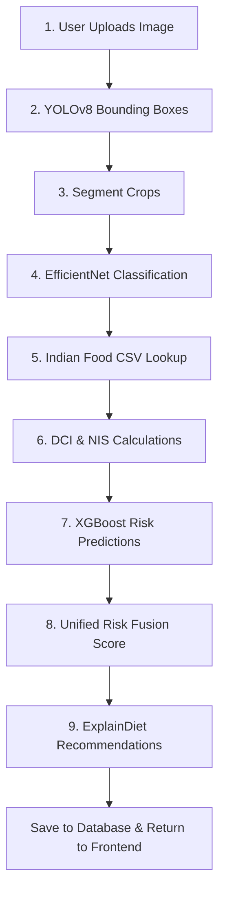

# DietRiskNet Project Structure & Architecture

This document describes the codebase directory layout, architecture, pipeline execution stages, and data flows of the **DietRiskNet** system.

---

## 1. Directory Tree Overview

```text
DietRiskNet/
├── .gitignore                   # Consolidates all root-level file exclusions
├── docker-compose.yml           # Multi-service container orchestration config
├── requirements.txt             # Pinned Python package specifications
├── README.md                    # Core overview and project index
├── dietrisknet.db               # Local SQLite database (git-ignored)
│
├── backend/                     # Python FastAPI Service
│   ├── config.py                # Pydantic Settings management
│   ├── main.py                  # Entrypoint, CORS config, database initialization
│   ├── Dockerfile               # Production multi-stage python build
│   ├── database/                # SQLAlchemy session & DB models schema
│   │   ├── database.py          # Session local config
│   │   └── models.py            # User, Setting, Meal, MealItem, Predictions models
│   ├── routes/                  # API router handlers
│   │   ├── auth.py              # Login & registration endpoints
│   │   ├── meal.py              # Photo analysis, logs, history, upload endpoints
│   │   ├── prediction.py        # Historical risk assessment endpoint
│   │   └── user.py              # Patient profile & demographics endpoints
│   ├── schemas/                 # Pydantic validation request/response schemas
│   ├── trained_models/          # YOLOv8, EfficientNet, and XGBoost weight models
│   ├── uploads/                 # Storage for scanned meal photos (git-ignored)
│   ├── services/                # Clinical business logic & inference engines
│   │   ├── ml_services.py       # YOLO detector & EfficientNet classifiers
│   │   ├── nutrition_service.py # Indian Food Nutrition mapping lookup
│   │   ├── indices_services.py  # DCI and NIS calculators
│   │   ├── prediction_service.py# XGBoost disease forecasting models
│   │   ├── risk_fusion_service.py # Risk fusion calculator
│   │   ├── user_services.py     # Meal session DB mapping service
│   │   └── recommendation_service.py # ExplainDiet suggestion matrix
│   └── tests/
│       └── test_pipeline.py     # End-to-end local integration tests
│
├── frontend/                    # Next.js Frontend SPA (TypeScript/Tailwind CSS v4)
│   ├── package.json             # Pinned node modules configuration
│   ├── tsconfig.json            # Strict TypeScript configuration
│   ├── Dockerfile               # Node builder container configuration
│   ├── components/              # Shared UI components
│   │   ├── Sidebar.tsx          # Glassmorphic side navigation panel
│   │   └── ProtectedRoute.tsx   # Client session gatekeeper loading layout
│   ├── lib/
│   │   └── store.ts             # Zustand global state (Auth and App store)
│   ├── services/
│   │   └── api.ts               # Rest API fetch services with interceptors
│   └── app/                     # Page routing folders (App Router)
│       ├── page.tsx             # Clinical Landing Page
│       ├── layout.tsx           # Global font imports & layouts
│       ├── globals.css          # Design theme configuration variables
│       ├── login/               # Authorization entry
│       ├── register/            # Patient account setup
│       ├── dashboard/           # Real-Time Diagnostic Dashboard
│       ├── upload/              # AI Food Scan drag-and-drop ingestion view
│       ├── analysis/            # Bounding Box Localizer & biochemical report
│       ├── predictions/         # XGBoost Metabolic Risk circular gauges
│       ├── recommendations/     # ExplainDiet personalized advisories
│       ├── history/             # Historical diagnostic meal logs list
│       ├── trends/              # Longitudinal Recharts graphs
│       └── profile/             # Apple Health demographics records page
│
├── nutrition/                   # CSV tables matching 1014 Indian dishes
└── datasets/                    # Standard meal images for pipeline testing
```

---

## 2. System Architecture

DietRiskNet operates on a secure service-oriented model:

### Frontend Layer
* Built using **Next.js (App Router)** and **TypeScript**.
* Styling utilizes **Tailwind CSS v4** variables mapped to a dark healthcare theme.
* State is managed on the client side via **Zustand** (for auth tokens, user state, and current scan cache) and **TanStack React Query** (for data fetching, caching, and server state synchronizations).

### Backend Layer
* Powered by **FastAPI** to support rapid, asynchronous REST APIs.
* **SQLAlchemy** ORM connects to the SQL database engine (SQLite locally, PostgreSQL in container/production).
* Python **jose** handles JWT validation, token sign-in, and refresh lifecycles.

---

## 3. The 9-Stage ML & Clinical Pipeline

When a patient uploads a food photo, the system executes an integrated 9-stage pipeline:



1. **Photo Upload**: The FastAPI `/analyze-meal` endpoint receives the meal image.
2. **YOLOv8 Detection**: The system runs object detection using `DietRiskNet_FoodDetector_YOLOv8.pt` to detect regions of food.
3. **Segmentation**: Detected regions are cropped from the original image in memory.
4. **EfficientNet-B0 Classification**: Each cropped image is classified using `DietRiskNet_FoodClassifier_EfficientNetB0.pth` into one of 360 food classes.
5. **Nutrition Mapping**: The database matches the food class name using fuzzy search to find macronutrients per gram.
6. **Clinical Indices (DCI & NIS)**:
   * **DCI (Dietary Consistency Index)**: Measures portion size consistency against historical records.
   * **NIS (Nutrient Imbalance Score)**: Measures nutrient deviation from Recommended Daily Allowances (RDA).
7. **XGBoost Disease Risk Forecast**: Demographic variables (age, gender, height, weight, activity level) and nutrition values are fed to four separate XGBoost models:
   * **Diabetes Risk**
   * **Obesity Risk**
   * **Hypertension Risk**
   * **Nutritional Deficiency Risk**
8. **Risk Fusion**: Fuses risks into a single score:
   `Fused Score = 0.25*(1-DCI) + 0.25*NIS + 0.20*Diabetes + 0.15*Obesity + 0.10*Hypertension + 0.05*Deficiency`
9. **ExplainDiet Suggestion Engine**: Translates calculations into readable clinical justifications and priority dietary adjustment advice.
