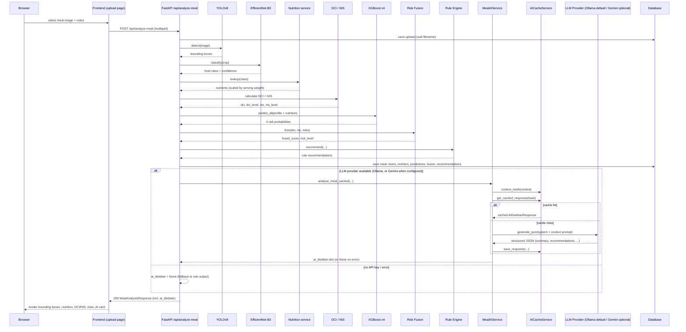

# 02 — Sequence Diagram: Meal Analysis

The following UML sequence diagram shows the complete end-to-end meal
analysis flow for `POST /api/analyze-meal`. The deterministic ML core
runs first and persists results; the AI Dietitian runs only after the
meal is saved, and its failure never breaks the pipeline.

## Notes

- Every ML stage is deterministic and independent of the AI layer.
- The AI Dietitian (Ollama default, Gemini optional) runs **only after**
  the meal + nutrition + predictions are persisted (requirement: the
  pipeline never fails because of the LLM provider).
- On any LLM provider error the response contains `"ai_dietitian": null`
  and the rule-based recommendations remain intact.
