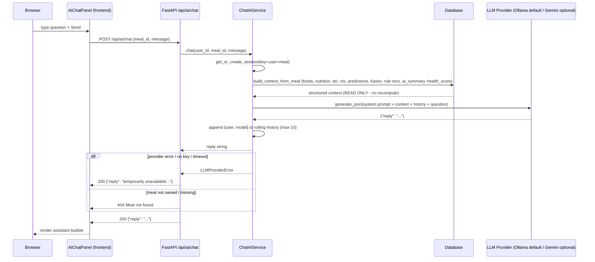

# 03 — Sequence Diagram: AI Chat

The meal-specific AI chat (`POST /api/ai/chat`) loads the PERSISTED meal
analysis (no ML re-computation), maintains an in-memory rolling
conversation (max 10 messages), and answers via the LLM provider.

## Notes

- The session key is `(user_id, meal_id)` — the conversation remembers
  the previous meal within the session.
- History is **in-memory only** (never persisted to the database) and
  truncated to the most recent 10 messages.
- The service reads the meal from the DB; it never re-runs YOLO,
  EfficientNet, nutrition, or disease prediction.
